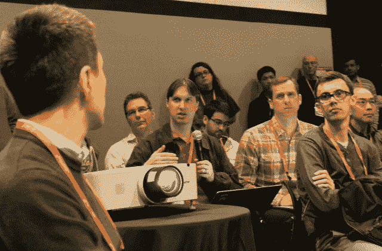

# OpenStack 波士顿 2017: OpenStack 在其他堆栈中找到了新的位置

> 原文：<https://thenewstack.io/openstack-boston-2017-finding-new-place-among-stacks/>

对任何技术、任何组织、甚至任何人群来说，开放的真正考验是超越如何包容，拥抱如何最好地被包容。创造技术的人，以及他们周围的信息，通常会将他们的主题构建到构成时代的材料中。但是，对于技术背后的人们来说，找到一种合理的方式成为比技术本身更大的东西的一部分，需要真正的智慧。

毫无疑问，今年在美国波士顿举行的主要 OpenStack 峰会与去年在奥斯汀举行的会议相比规模有所缩小。因此，虽然有些人可能错过了去年让奥斯汀秀生动活泼的现场音乐家，但今年是时候认真对待了。这是泼了一盆冷水，但这是必要的。

在我们上周的预览文章中，我们提出了三个关键问题，这将是我们本周在波士顿调查的重点。正如我所承诺的，这些问题又出现了，我们从回答这些问题中学到了什么:

**1。Kubernetes 真的已经成为 OpenStack 事实上的应用服务管理组件了吗？**还没有，特别是因为这个问题一开始就不应该这样问。

OpenStack 在不同的层上感知应用和服务。Kubernetes 已经成为在 OpenStack 资源上管理用户应用程序的最有吸引力的方式。对于为 OpenStack 构建独立的容器管理器仍然有一些兴趣——例如，[Zun 项目](https://github.com/openstack/zun)，以及来自 Juniper Networks 工程师的一个非常新的项目，名为 App Infra API。在接下来的几天里，你会在新的堆栈中读到更多关于它们的内容。

然而，Kubernetes 似乎赢得了大多数 OpenStack 工程师的喜爱……但并不是因为我们最初被告知的原因。

“还有其他选择。Docker Swarm 和其他一些生态系统已经能够实现良好的增长和良好的前景，”美国电话电报公司高级首席云工程师 Amit Tank 周二告诉我。他指的是一个非常严肃的计划，旨在解决 OpenStack 在多种硬件类型上安装和管理的众所周知的复杂性，方法是将 OpenStack 容器化，并设置 Kubernetes 从底层进行设置和管理。

“然而，我们看到了 Kubernetes 赢得关注的一个非常明显的趋势，”Tank 继续说道，“特别是因为它是一个开源项目，并且它在做一些事情时非常有效。它不会尝试做太多事情。它试图做一些事情，但做得很好，比如声明式计算和以非常非常简单的方式处理容器调度的能力，而不假设这是一个 Docker 容器。您也可以使用 rkt。我认为 Kubernetes 带来的价值主张使它成为我们考虑的一个非常有吸引力的选择，作为一种描述关系中的[*网络*图表的方式，然后可以作为 OpenStack 服务运行。”

Tank 和他的同事 [Kandan Kathirvel](https://twitter.com/kandankathirvel) 想出了一种方法来将 OpenStack 网络的组件声明为一个*图表*，它充当了 Kubernetes 的一种模板。他们认为 Kubernetes 提供的一个关键好处是在每个系统上以同质的方式声明和实例化相同的服务。即使是 OpenStack 最热心的支持者对该系统也有一个困扰，那就是必须根据运行该系统的基础设施的特定需求对其进行不同的配置。如果 Kubernetes 能够抽象出底层的基础设施，让每一台安装了 Kubernetes 的机器看起来都像是同一台机器……那么整个问题都会消失在技术历史的蒸汽中。

那么，Kubernetes 为什么不干脆接管整个基础设施管理领域呢？OpenStack 的工程师可以提供一系列的答案，但是主要的答案是唯一重要的。正如 Rackspace 杰出的工程师 Adrian Otto 在周三提醒与会者的那样，“大多数人没有意识到今天，容器编排系统在其网络中没有多租户。它只是不存在，而且可能在一段时间内不会存在。”

**2。OpenStack 是否配得上其难以部署和管理的名声？**多个 OpenStack 工程团队(包括 AT & T、威瑞森、Red Hat 和 Rackspace)正在考虑或实施的倒数第二个(如果不是最终的)解决方案涉及将 Magnum 组件转向将 orchestrator 驱动的环境(主要是 Kubernetes)作为资源进行管理。一些人现在积极倡导我们上周推出的“俱乐部三明治”方法，其中*两个* Kubernetes 层为下面的 OpenStack 提供底层支持，为上面的租户提供应用支持。

所有这些都是为了解决挥之不去的问题，OpenStack 官员在周一的主题演讲中公开承认，如何使 OpenStack 的多个组件的安装和管理更加简单。所以…显然，*是的。*

Juniper Networks 架构和技术营销副总裁 Jason Venner 在周四的一次会议上表示:“这是托管 OpenStack 的峰会。

“我参与过许多云项目，”他继续说道，“从最初的‘我想做这个 OpenStack 项目’到真正的第一个客户生产工作负载，可能需要数年时间来整理所有硬件、物理基础设施和运营问题。借助托管 OpenStack，我们看到人们在一天之内就可以投入使用。”

这直接把我们带到了上周的第三个问题:

**3。谁领导 OpenStack？**以前有人说过(不止一次，是我说的)，任何协作项目都需要一个冠军。当然，Rackspace 是最初的 OpenStack 冠军。但分析师和一些记者一直希望有一个“真正的”供应商，而不是一些云公司——尽管 OpenStack 是一种云技术。

传统的期望总是为了传统，或者在没有传统的情况下，一些模糊地类似于传统的东西。2016 年 6 月，分析集团 Gartner 将 HPE 评为私有云领域的领导者，并将 Helion OpenStack 产品列为主要贡献者。不到两个月后，HPE 开始重组该集团。10 月，裁员；11 月，[它将 OpenStack 部门卖给了 SUSE](https://thenewstack.io/suse-add-hpes-openstack-cloud-foundry-portfolio-boost-kubernetes-investment/) 。

正如我本周直接从几位与会者那里听到的，他们期望 SUSE 代表 OpenStack，拥有 HPE 级别的营销实力，但事实并非如此。但这并不是 SUSE 真正做的。SUSE 完全参与了重要的小组讨论和周二的互操作挑战。它以一个开源开发组织需要的各种方式出现。

然而，我仍然听到有人认为苏塞不是 HPE。负责做出购买决策或评估技术投资选项的人正在寻找像供应商一样的冠军。有些传统永远不会消失。

与此同时，*开发* OpenStack 的领导们聚在一起，做着更少的科技会议给人们时间或空间去做的事情:*商议*。

周三，米兰蒂斯的工程总监杰伊·皮普斯(Jay Pipes)在底层召开了一次会议，讨论采用 Kubernetes 的复杂细节。这是一个开放的论坛，就像一百个人的敏捷争夺战，每个人都有公开的机会说出自己的想法，而不用举手……每个人都有，除了某个媒体人，这一次他被迫闭上他的嘴，听着。

“我希望一些 Kubernetes 专家在房间里，我们可以做一些笔记，如果我错了，请纠正我，”Pipes 在呼吁论坛秩序时说。“因为我基本上一直在挖掘 Kubernetes 文档，试图弄清楚一些事情…我希望能够看到我们可以从 Kubernetes 学到什么，一些最佳实践，以及资源是如何表示、请求和管理的，并将这些经验教训纳入 Nova 和 Placement [API]。”

Kubernetes 的工程师们采用了与 OpenStack 工程师们非常不同的术语来描述资源，当它们相互连接时，会变成同样的东西。人们希望公平地决定哪些术语保留下来，只是 Kubernetes 的一些选择背后的逻辑——例如，将资源产生的东西称为“资源”——让 Pipes 和 OpenStack 的人感到困惑。由于 API 是缝合在一起的，并且组件相互请求资源(或者其他——或者更确切地说),所以每个人都说同一种语言是至关重要的。

这就是开源的真正含义:无畏地拥抱软件的不完整性及其背后的努力。

在这场讨论中，观众中带头的是[凯文·福克斯](http://stackalytics.com/?company=*independent&module=kolla&user_id=kevpn)，他是 [OpenStack 的 Kolla 组件](https://wiki.openstack.org/wiki/Kolla)的贡献者。它实际上是 OpenStack 的容器化部署选项，Fox 一直利用它在 Kubernetes 上部署 OpenStack。事实上，福克斯可能是 AT & T 的灵感来源。

在某一点上，Fox 解释了 Kubernetes 的一个令他着迷的架构特性:一种构建 pod 描述的方法，将它包含在 Kubernetes manifest YAML 文件中，并触发另一个 Kubernetes 实例的实例化。“这非常有用，”小狐向 Pipes 解释道。“你可以用它从 Kubernetes 中造出 Kubernetes！

“在 OpenStack-speak 中，您使用 Nova Compute 来启动 Nova API，”Fox 以类似方式继续说道。"然后你使用 Nova API 来部署 OpenStack 的其余部分."不，这不是 OpenStack 真正的工作方式，但这相当于如果像 Kubernetes 一样工作的话*将*如何工作*。这是一种自我复制、自我引导的行为，它成为了 Pipes 的讨论主题，因为它意味着被引导的东西(OpenStack 本身，如果事情证明是正确的话)将不仅仅是一个资源提供者，而是一种资源。*

房间里的几十个人坐在一起做笔记，戴着红帽子，有谷歌的，有华为的，有苏斯的，有威瑞森的，还有米兰蒂斯的工程师，看起来凯文·福克斯是一个真正的 OpenStack 领导者。也许他的公司也是 OpenStack 的领导者。福克斯是美国能源部清洁能源研究机构太平洋西北国家实验室的行政人员。

谁领导 OpenStack？站出来宣称领先的人，就是他。

斯科特富尔顿的照片。

<svg xmlns:xlink="http://www.w3.org/1999/xlink" viewBox="0 0 68 31" version="1.1"><title>Group</title> <desc>Created with Sketch.</desc></svg>