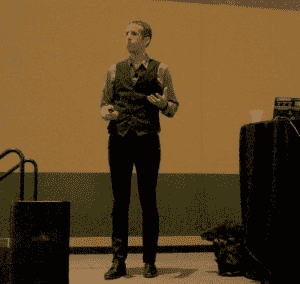

# OpenStack:“我们继续受到复杂性的困扰”

> 原文：<https://thenewstack.io/openstack-continue-get-dinged-complexity/>

在周一波士顿 2017 年 OpenStack 峰会开幕日的与会人群中，这只是一件 t 恤，但它代表了许多其他人的心声:“让 OpenStack 再次伟大。”与前一年的奥斯汀展会相比，观众人数明显减少，组织者表示，这在一定程度上是因为各种活动相互分离，以及其他波士顿科技活动(其中包括红帽峰会)在短短几周内汇聚一堂。

但是缩减规模可能不是一件坏事。事实上，对于这个已经以直言不讳和最少的营销语言而闻名的组织来说，后退一步可能是向前迈出两步的第一步。

“我们继续受到运营 OpenStack 的复杂性的困扰，”在主题会议开始不到 11 分钟的时候， [OpenStack 基金会](https://www.openstack.org/foundation/)的营销副总裁[劳伦·塞尔](https://www.linkedin.com/in/laurensell/)说道。Sell 谈到了基金会从用户那里收到的反馈，因为该系统的几个贡献者最近一起参加了一系列广泛的研讨会。

“这是我们非常重视的事情，”基金会的工程副总裁蒂埃里·卡雷兹继续说道。“研讨会结束后不久，我们开始更积极地确定我们可以解决项目中这种复杂性的领域，方法是删除未使用的功能，修剪无关的配置选项，或削减没有任何用途的项目。”

## **响亮清晰**

基金会领导人承认，他们从用户和捐助者那里获得了响亮而清晰的信息，这一点并不微妙。尽管执行董事乔纳森·布莱斯(Jonathan Bryce)引用了上个月 OpenStack 用户调查(open stack users’s survey)的数据，并认为其死亡的传言被大大夸大了，但他还是很快将发言权让给了卡雷兹和塞尔。他们立即解决了关于基础设施软件发展道路的紧迫问题。

“我们发现的另一个观点是，OpenStack 是一个要么全有要么全无的整体，”Carrez 说，“你必须实际安装所有 OpenStack 项目，或者你不能真正将任何其他技术插入 OpenStack 部署。如果你仔细想想，这很奇怪，因为 OpenStack 一直是一个开放的堆栈。我们总是集成许多不属于 OpenStack 社区的不同技术。”

在道格拉斯·亚当斯的《银河系漫游指南》中，一种常用的惩罚公民的方式是让他们的大脑暴露在全尺寸的宇宙地图上，上面有一个标有“你在这里”的小点——从而揭示了他们的渺小。

揭示了 OpenStack 在现代网络部署中的作用的类似地图， [Mirantis](https://www.mirantis.com/) 首席营销官 [Boris Renski](https://twitter.com/zer0tweets) 将 OpenStack 描述为联网系统中名副其实的蛋糕蛋奶酥中的一个水平层——open stack 甚至不是一个堆栈。

Renski 的案例是，供应商——即使是为 OpenStack 做出贡献的供应商——都将他们的客户分布在其市场的给定水平层(如网络、应用或管理层)作为他们的主要目标。OpenStack 扮演了基础设施的角色，但这只是一个层面。相比之下，在企业 IT 部门工作的个人的目标可能是交付*一个超越所有这些层的功能*。

他认为，通过这种方式，供应商和服务提供商的目标往往与 IT 管理员和集成商的目标正交。OpenStack 经常被描绘成考虑了其贡献者的观点——贡献者包括被归入单一职能的 IT 人员。在这里，伦斯基没有说基金会自己的营销是自相矛盾的。值得称赞的是，供应商确实试图通过开发互操作性模式来解决这个问题。但是，他说，所有这些开发试验和实验最终都相互冲突。

“如果我是一个企业虚拟机管理程序供应商，”Renski 说，“或者是一个企业 Linux 供应商，企业的一部分实际上是要确保我的企业内容与堆栈中的所有其他企业元素良好地互操作。”这一壮举通常是通过认证来实现的，认证让购买者确信一系列产品应该能够很好地协同工作。

“当然，所有的互操作性测试工作，然后将所有的互操作性与优雅的产品营销宣传材料包装在一起，都是要花钱的，”Renski 继续说道。“企业网络也是如此，企业存储也是如此，等等。等。

“现在，如果我是一名企业系统管理员或企业 Linux 管理员，这很好，因为这意味着我可以从排名第一的供应商那里学习一个 SDN，它可以与所有其他企业的东西互操作，我可以获得认证放在我的简历上，我的技能集适用于所有不同的孤岛，甚至在我工作的地方之外。因此，我自然会将这种水平设计模式推广到堆栈的所有元素，以构建这种私有云。”

他指出，当供应商认证一名 IT 专业人员时，这些认证通常与构成该供应商给定水平层的产品链相匹配。但是以那个单一功能的家伙为例，他被要求建立一个企业云。

“这个人有责任交付业务成果，业务成果。这个人并不真正关心 SDN 或存储是否能与所有不同类型的东西互操作。对这个人来说，最重要的是存储、SDN 和进入堆栈的所有其他元素能够很好地协同工作，”他说。“这是唯一重要的事情。但不幸的是，如果我是传统企业中的这个[*other*]家伙，我不能只是说，‘嘿，我要用我会在某个地方找到的开源来构建我自己的东西。我必须应对不幸的企业模式，这种模式主要被出售企业软件许可证或企业软件订阅的观念所主导。"

这个演讲总结了任何一个组织所面临的问题的严重性，这个组织的目标是把领先的工程师和领先的供应商聚集在一起。它揭示了为什么这两个领域对他们的目标有所不同。伦斯基确实提出了一个解决方案的*开头*，他将其描述为改变 Rackspace 的“以客户为中心”的口号，以反映出对客户是谁的更好理解，以及她在我们认为我们为她构建的世界中所处的位置。

当乔纳森·布莱斯再次走上舞台时，有那么一会儿，他明显地说不出话来。

## 同样由 OpenStack 主演

看一眼本周 OpenStack 峰会的会议列表，你会觉得这是[kube con](https://thenewstack.io/?s=kubecon+europe+2017),[Kubernetes](/category/kubernetes/)开源容器编排软件的用户会议。Kubernetes 可能还没有吸干波士顿海因斯会议中心的所有空气，但有一个非常明显的草案。尽管周二是官方的“Kubernetes 日”，但周一的日程表上有重叠的 Kubernetes 会议，其中一场会议的主讲人建议 orchestrator 可以，也许应该，同时部署在网络的两层*中，中间有 OpenStack。*

“OpenStack 上的 Kubernetes 似乎是一件奇怪的事情，”总部位于多伦多的网络服务提供商 Turbonomic 的解决方案架构师 Eric Wright 解释道，“当你可以在裸机上运行它时。

“这是我们应该经常问自己的问题:我们什么时候从‘我们能做到吗？’“我们应该这样做吗？”那么，为什么你会在 OpenStack 上运行 Kubernetes 呢？"

Wright 给出了三个令人信服的理由，其中之一是需要将应用程序从开发阶段转移到生产阶段，而不必征用半吨的备用硬件。他认为，Kubernetes 可以缓解这种转变，即使 OpenStack 管理底层基础设施层。

Wright 阐述了将 Kubernetes 和 OpenStack 整合到他所谓的“俱乐部三明治”中的好处我们将继续调查与会者和其他演示者是否觉得这是一个令人垂涎的方法。

<svg xmlns:xlink="http://www.w3.org/1999/xlink" viewBox="0 0 68 31" version="1.1"><title>Group</title> <desc>Created with Sketch.</desc></svg>