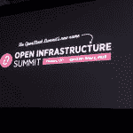

# OpenStack Foundation 扩展到开放式基础设施领域

> 原文：<https://thenewstack.io/openstack-foundation-expands-into-open-infrastructure/>

[OpenStack Foundation](https://www.openstack.org/foundation/) 正在超越其为 [OpenStack](https://www.openstack.org/software/) 私有云软件提供支持的核心使命，旨在促进开放基础设施软件的发展，这一范围不仅包括 OpenStack 本身，还包括与其他开源基础设施项目的集成，甚至可能是其他开源基础设施项目的创建。

OpenStack 基金会执行董事 Jonathan Bryce 在本周于柏林举行的当前 OpenStack 峰会期间指出，展望未来，该组织的旗舰 [OpenStack 峰会](https://www.openstack.org/summit)用户大会将被称为开放基础设施峰会。首届开放基础设施峰会将于 4 月 29 日至 5 月 1 日在丹佛举行。

布莱斯在活动的后续新闻发布会上澄清说，目前没有计划改变基金会的名称。但该组织本身无疑正在承担一项更大的使命。

“这是我们过去几年一直在讨论的事情，”布莱斯谈到范围的扩大。在很大程度上，它源于这样一种认识，即构建 OpenStack 云通常涉及与其他基础架构软件的集成。

“这就是进入生产的许多挑战所在:你如何从许多社区获得开源软件，使其为生产做好准备并运行它。”

该组织在过去的一年中增加了四个额外的非 OpenStack 项目，即由 AT & T 开发的[飞艇](https://github.com/openstack/airship-in-a-bottle)配置软件、 [Kata 容器](https://katacontainers.io/)、StarlingX 边缘计算堆栈和 [Zuul](https://zuul-ci.org/) 持续集成软件(不要与网飞开发的 [Zuul](https://github.com/Netflix/zuul) 路由软件混淆)。

该组织已经确定了五个以 OpenStack 为中心的技术领域/市场，希望专注于:数据中心、混合云、持续集成和交付、包装应用的容器基础设施、边缘计算以及最近的人工智能/机器学习。

布莱斯说:“我们希望在这些领域推动合作，改善集成和测试，在某些情况下，建立新技术，无论是在 OpenStack 中还是作为一个单独的项目。基金会的章程正在更新，以适应更多的项目，它正与其社区合作，以建立战略项目治理。

这种扩张发生在新的以开源为中心的基金会大量出现的时候。本周早些时候，Linux 基金会成立了一个独立的组织来管理[开源 Ceph 分布式文件系统](https://thenewstack.io/linux-foundation-launches-a-foundation-for-the-ceph-file-system/)，这是该组织仅在今年就创建的第 32 个基金会。而 [Kubernetes](https://kubernetes.io/) 挂靠的[云计算原生计算基金会](https://www.cncf.io/)也继续在其旗下积累项目。

尽管如此，OpenStack 基金会并不打算与这些组织直接竞争。“这不是开源的零和游戏。这就是它的美妙之处。布莱斯说:“这是人们共同努力建立的技术。

在会议期间，基金会发布了年度 OpenStack 用户调查。调查发现，目前 OpenStack 在 60 个国家运行超过 1000 万个计算核心。特别是，似乎有越来越多的人采用该软件来运行向用户提供裸机服务器的服务，[通常与 Kubernetes](https://twitter.com/thenewstack/status/1062279917663084549) 结合使用。例如，OpenStack 裸机配置工具 Ironic 在 OpenStack 社区中的使用率从 2016 年的 9%上升到 2018 年的 24%。

在开发方面，OpenStack 在过去一年中收到了来自全球开发者的 70，000 次提交，在其最新版本 [Rocky](https://releases.openstack.org/rocky/) 的开发过程中，平均每天约有 182 次更改。OpenStack 联合创始人兼首席运营官 Mark Collier 表示，在所有开源软件中，只有 Linux 内核和谷歌 Chromium 获得了同样多的贡献。

OpenStack 基金会为记者支付了此次活动的差旅费和住宿费。

云计算原生计算基金会、Linux 基金会、OpenStack 基金会是新堆栈的赞助商。

专题图片:OpenStack 的马克·科利尔(左)和乔纳森·布莱斯。

<svg xmlns:xlink="http://www.w3.org/1999/xlink" viewBox="0 0 68 31" version="1.1"><title>Group</title> <desc>Created with Sketch.</desc></svg>