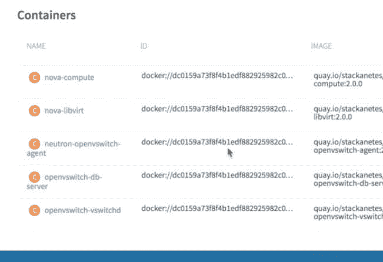
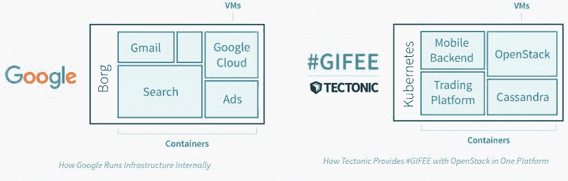

# OpenStack 通过 CoreOS 基于 Kubernetes 的新 Stackanetes 实现“自我修复”

> 原文：<https://thenewstack.io/openstack-gets-self-healing-coreoss-new-kubernetes-based-stackanetes/>

CoreOS 希望在 Kubernetes 的帮助下，让 OpenStack 的部署变得更加简单和持久。

该公司已经启动了一个新的开源项目 Stackanetes，该软件将一个完整的 OpenStack 包打包到 set 容器中，以便它可以跨多个裸机服务器部署，并通过 Kubernetes 进行管理。

“Kubernetes 的核心是应用管理，而 OpenStack 只是一个应用，” CoreOS 的首席执行官 Alex Polvi 说。该公司在本周德克萨斯州奥斯汀举行的 OpenStack 峰会上推出了这款软件。“Kubernetes 和容器使得维护软件变得很容易，所以如果你把 OpenStack 仅仅看作是一个软件，你可以在系统中使用容器来实际管理软件。”

OpenStack 因难以部署和维护而受到批评，并且当其管理组件之一停止工作时，它没有自动或“自我修复”功能来保持运行:如果一台机器停止工作，则管理员必须介入，将服务器上的工作负载重新启动到另一台机器上。大多数工业化部署和升级 OpenStack 的方法都是围绕 Chef、Puppet 和其他配置管理工具构建的，并且需要大量的设置。

Polvi 解释说，Kubernetes 是用于部署和管理大量容器的软件，因此非常适合这项工作。Stackanetes 本身就是将 OpenStack 打包到容器中所需的所有代码，以及部署它们的过程。每当需要部署新版本的 OpenStack 服务时，Stackanetes 会用新版本替换旧容器。

CoreOS 在谷歌诞生的 Kubernetes 方面有很多经验，提供了一个商业支持的集群 orchestrator 发行版，名为[constructive](https://thenewstack.io/coreos-debuts-tectonic-a-commercial-kubernetes-distro/)。当与构造一起使用时，Stackanetes 提供了公司的分布式可信计算框架，提供了从硬件到应用层的安全性。

[https://www.youtube.com/embed/DPYJxYulxO4?feature=oembed](https://www.youtube.com/embed/DPYJxYulxO4?feature=oembed)

视频

每个 OpenStack 组件——如 Nova、Glance、Horizon 或 Neutron——都被打包为 Kubernetes 的 pod。每个 pod 可以有一个或多个容器，这些容器将组件集中包装到一个工作单元中。

如果一个服务停止工作，Kubernetes 可以检测到它并用另一个副本替换它。今天，许多 OpenStack 部署将运行一个组件的多个副本，因此如果一个副本失效，其他副本中的一个可以取代它的位置。

使用 Kubernetes 作为基础，组织还可以在一组服务器上混合 OpenStack 和其他工作负载。

Kubernetes 还可以为 OpenStack 提供自我修复功能。通过一个称为复制控制器的特性，Kubernetes 为管理员提供了设置规则的能力，该规则规定如果一个 pod 的一个副本死亡，Kubernetes 应该用另一个替换它。如果一个节点由于某种原因死亡，Kubernetes 有能力旋转另一个副本。在一次演示中，Polvi 展示了在杀死一个运行 OpenStack Keystone 认证服务的 pod 后，Kubernetes 如何几乎立即重新部署另一个相同的 Keystone pod。

CoreOS 正在通过开源软件复制谷歌的内部堆栈，以便其他组织可以使用。

CoreOS 将针对上游 OpenStack 和 Kubernetes 项目维护 Stackanetes，以便支持每个软件包的最新规范版本。该公司还在与 [Kolla](https://wiki.openstack.org/wiki/Kolla) 项目合作，以确保 Stackanetes 可以挂钩到 CI/CD(持续集成/持续部署)工作流，从而生产随时可以运行的 OpenStack 容器。

Stackanetes 还为自动化安全补救奠定了基础，因为可以对软件进行漏洞扫描、更新，然后自动部署。除了企业使用之外，Stackanetes 对 OpenStack 发行商也很有用，他们可以用它来打包他们的发行版。

该公司尚未透露 Stackanetes 的商业化计划。CoreOS 并不是唯一一家试水自主计算的公司；建立在 Apache Brooklyn 项目基础上的云软[也提供了让系统“自我修复”的能力](https://thenewstack.io/rise-machines-apache-brooklyn-autonomous-computing/)Polvi 认为这种使用 Kubernetes 作为其他软件的包和部署管理器的方法也是可行的。

云软和 CoreOS 是新堆栈的赞助商。

专题图片:谷歌产品经理 Craig McLuckie(左)和 Alex Polvi 在 2016 年德克萨斯州奥斯汀开放堆栈峰会上介绍 Stackanetes。

<svg xmlns:xlink="http://www.w3.org/1999/xlink" viewBox="0 0 68 31" version="1.1"><title>Group</title> <desc>Created with Sketch.</desc></svg>