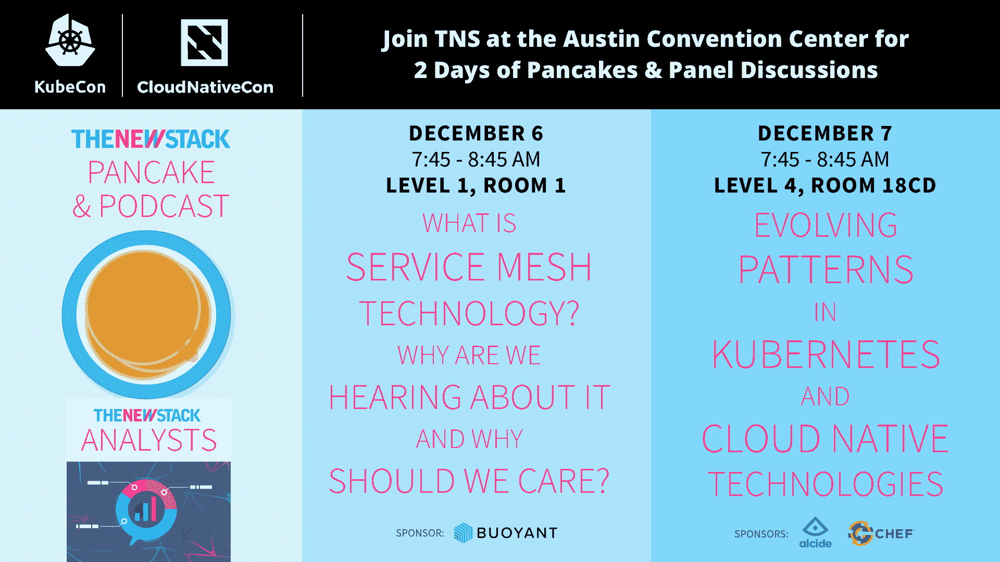

# OpenStack 可以追溯到它的社区根源

> 原文：<https://thenewstack.io/openstack-goes-back-community-roots/>

[开放协作:OpenStack 追根溯源](https://thenewstack.simplecast.com/episodes/open-to-collaborate-openstack-goes-back-to-its-roots)

[OpenStack](https://www.openstack.org/) 持续变化，近年来焦点已经从集成版本发展到大帐篷和可组合性。今年在悉尼举行的 OpenStack 峰会上，OpenStack 基金会执行董事 Jonathan Bryce 谈到了该项目的下一个新重点:开放和协作。

OpenStack 社区需要解决这两个关键点的市场变化是什么？有趣的是，Bryce 说他们真的从来没有谈论过项目名称中的“开放”和“堆栈”是什么意思。随着 OpenStack 越来越受欢迎和被采用，反思过去五年的项目并查看关键属性变得越来越重要。OpenStack 不再是一项实验，它正在为全球范围内的大规模私有云和公共云以及微信等服务提供支持，这些服务为中国超过 10 亿用户提供服务。

随着这种增长，新的挑战出现了。一个挑战是，没有一个单一的组件构成云。相反，不同的独立开源项目与 OpenStack 一起使用来创建云。这些项目有它们自己的发布周期，这使得用户社区很难跟上它们。

正如 OpenStack 对项目最后五年的反思，他们意识到技术并不是项目最重大的成就；是 8 万人的强势社区。如何帮助这个群体，同时利用他们的经验和专业知识，将是基金会的主要关注领域之一。

为这个社区创造相互协作的平台和机会是解决 OpenStack 生态系统中所有这些独立项目之间建立桥梁问题的许多方法之一。

“在这些不同的开源项目之间保持同步是有问题的，这些项目有不同的发布节奏，”Bryce 说。“到目前为止，我们让用户来解决这些问题，但我们意识到我们可以做得更好。这就是协作的重点所在。”

[https://www.youtube.com/embed/WdA8UhpP61M?feature=oembed](https://www.youtube.com/embed/WdA8UhpP61M?feature=oembed)

视频

### 在这个版本中:

[0:41:](https://thenewstack.simplecast.com/episodes/open-to-collaborate-openstack-goes-back-to-its-roots?t=0:41) 
为什么 OpenStack 现在专注于开放性。
[5:47:](https://thenewstack.simplecast.com/episodes/open-to-collaborate-openstack-goes-back-to-its-roots?t=5:47)
open stack 计划如何整合社区？
[11:39:](https://thenewstack.simplecast.com/episodes/open-to-collaborate-openstack-goes-back-to-its-roots?t=11:39) 
 The OpenStack 用户调查结果。
[14:14:](https://thenewstack.simplecast.com/episodes/open-to-collaborate-openstack-goes-back-to-its-roots?t=14:14) 
回顾今年，OpenStack 社区发生了什么变化？
[17:39:](https://thenewstack.simplecast.com/episodes/open-to-collaborate-openstack-goes-back-to-its-roots?t=17:39) 
拆大帐。
[19:10:](https://thenewstack.simplecast.com/episodes/open-to-collaborate-openstack-goes-back-to-its-roots?t=19:10) 
什么是 OpenDev 和 OpenLab？

[OpenStack](https://www.openstack.org/) 是新堆栈的赞助商。

通过 Pixabay 的特征图像。

<svg xmlns:xlink="http://www.w3.org/1999/xlink" viewBox="0 0 68 31" version="1.1"><title>Group</title> <desc>Created with Sketch.</desc></svg>