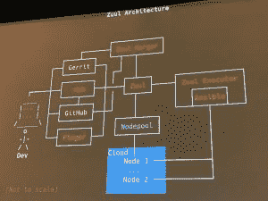
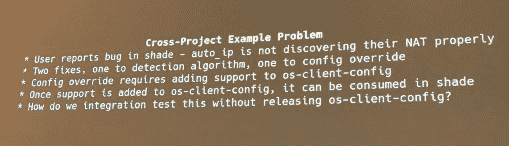

# OpenStack 剥离了 Zuul，这是一个用于多个存储库的门控 CI 管道

> 原文：<https://thenewstack.io/openstack-spins-off-zuul-a-gated-ci-pipeline-for-multiple-repositories/>

持续集成(CI)软件最初是为管理大型多贡献者 OpenStack 软件平台而开发的，现在已经更新为处理其他复杂的协作软件项目。

Zuul 提供自动化门控工作流管道，Red Hat 首席软件工程师、Zuul 项目组创始成员 James Blair 在本周于温哥华举行的 [OpenStack 峰会上解释道。有了门控，在新代码通过由项目管理人员定义的一组单元和集成测试之前，它不会进入生产环境。](https://www.openstack.org/summit/vancouver-2018/summit-schedule/#day=2018-05-21)

与 Zuul 一起，“人类不合并代码，机器合并代码，”在与 OpenStack 峰会共同举办的合作活动 OpenDev 上，[蒙蒂·泰勒](https://twitter.com/e_monty)进一步解释道。它可以处理复杂的代码集:Zuul 可以协调跨多个存储库的集成测试。

蒙蒂·泰勒，穿着 Zuul 的 t 恤

同时管理 OpenStack 和 Kata 容器的 OpenStack Foundation 将继续管理 Zuul。这个 Zuul 不要和网飞的[开源路由网关](https://github.com/Netflix/zuul)混淆。它的名字来源于 1984 年电影《捉鬼敢死队》中一个神秘的半神守门人。和这个虚构的生物一样，这个 Zuul 也是一个无情的看门人，除非通过一系列测试，否则不会让任何代码进入生产。

OpenStack 目前每六个月更新一次。确保每个版本的所有组件都能协同工作是一项艰巨的任务，尤其是因为它们分布在近 2，000 个存储库中。祖尔明白了这一切。

对于 OpenStack，开发人员向 Gerrit 提交潜在的变更，然后由项目维护人员审查。如果维护者批准了补丁，Zuul 将对其进行测试，如果通过，它将被合并到代码库中。“在合并之前，对存储库提出的每一个变更都要经过测试，”Taylor 说。虽然 Zuul 是为了与 Gerrit 接口而构建的，但它可以轻松地与 GitHub 等其他软件开发平台一起工作，甚至可以在全自动 [GitOps](https://thenewstack.io/gitops-git-push-all-the-things/) 风格的管道中工作。

[https://www.youtube.com/embed/Bk0NLB7CR1E?feature=oembed](https://www.youtube.com/embed/Bk0NLB7CR1E?feature=oembed)

视频

简而言之，Zuul 监听代码中发生的事情。当建议的补丁到达时，Zuul 准备作业配置并获取资源来完成作业。一个名为[节点池](https://docs.openstack.org/infra/nodepool/)的配套服务处理构建资源的获取。Zuul executor 使用 [Red Hat 的 Ansible](https://www.redhat.com/en/technologies/management/ansible) 来运行任务，捕获在 Ansible playbooks 上。Zuul 返回结果，并可能合并变更(如果它们通过了测试)。

使用 Zuul，每个项目团队都可以编写自己的测试，并与他人共享。“世界上的任何 Zuul 系统都可以将 Zuul 库添加到它们的 Zuul 安装中，并且会有这些工作已经预先定义的好处，”Blair 说。OpenStack 本身已经创建了许多测试，可能对其他项目也有用。

## “共选通”

通过 OpenStack 的多个存储库，Zuul 实践了跨多个存储库的“共选通”或软件测试。在 OpenStack 的案例中，“如果对 Nova 的更改适用于 Nova，如果它在 OpenStack 的部署中破坏了 Cinder，那么它仍然不是好的，这是不够的，”Taylor 解释道。“OpenStack 是我们正在测试的东西。”

Zuul 被设计成通过一些并行化技术来处理多个代码变更。“这个系统会注意到另外 40 个人同时批准了这个项目的代码，”泰勒说。它知道在哪里运行，以什么顺序运行，应该在什么状态下运行，以及最终如何对结果做出响应

Taylor 举了一个 OpenStack 的例子:有人批准了对 Nova 组件的更改，于是系统开始对提议的补丁进行测试。与此同时，有人批准了对 Keystone 的更改，因此 Zuul 也开始对该补丁进行测试，在一个完整的 OpenStack 部署中运行，加上第一个提议的 Nova 交换。如果不久之后又有两个单独的 Nova 补丁被提交，Zuul 将测试那些 OpenStack 部署的补丁，包括 Nova 和 Keystone 补丁，它们仍在测试中。

“我们有四组不同的 git 状态，代表系统未来的推测状态，”泰勒说。"我们正在测试如果我们合并这些补丁会发生什么."

在这个模拟的例子中，Keystone 补丁失败了，这些结果被报告给用户。因此，Zuul 取消了 Keystone 补丁之后的最后两个 Nova 补丁的测试。取而代之的是，它们会自动基于第一次 Nova 改动，并且没有拱顶石补丁。当第一个 Nova 成功完成测试时，补丁会合并到代码库中。“这是现在新星的新状态，”他说。

“仅仅从四个开发人员批准事件的行动中，我们就能够旋转通过几个 Git 存储库的未来状态，并在整个过程中自动合并那些变更，”Taylor 解释道。

泰勒警告说，Zuul 不是一个通用的自动化框架；举例来说，它并不是设计来取代一个可折叠的塔。它已经与虚拟机和容器一起工作。除了 OpenStack 本身，开源软件已经被宝马、GoDaddy、OpenLab 和维基媒体使用。宝马、GitHub、GoDaddy、华为、红帽和 SUSE 都为该项目做出了贡献。

OpenStack 基金会和红帽是新堆栈的赞助商。

特写:詹姆斯·布莱尔，红帽。

<svg xmlns:xlink="http://www.w3.org/1999/xlink" viewBox="0 0 68 31" version="1.1"><title>Group</title> <desc>Created with Sketch.</desc></svg>