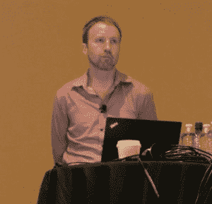

# 波士顿 OpenStack 峰会:Kubernetes 的终点和 OpenStack 的起点

> 原文：<https://thenewstack.io/openstack-summit-boston-kubernetes-ends-openstack-begins/>

为什么 OpenStack 和 Kubernetes 在某些人看来是可互换的，而在其他人看来却是应用管理的潜在伙伴？答案可能在于谁在问:开发人员还是系统管理员。

“这是俱乐部三明治的部分:有我的 Kubernetes 和开发者的 Kubernetes，这两者永远不会相遇，”总部位于多伦多的 [Turbonomic](https://turbonomic.com/) 的解决方案工程师 [Eric Wright](https://www.linkedin.com/in/ericwrightdiscoposse/?ppe=1) 在本周的 OpenStack 峰会上说道。Wright 是网络工程师，不是开发人员。

“我要做一些会影响库伯内特环境的事情。他们会做一些会影响环境的事情。也许他们有五个不同的池，他们想在其中部署。他们希望测试他们的 Kubernetes 部署方式，因为他们希望实现云计算。因此，在 OpenStack 上有五套 Kubernetes，这样我就可以部署一个多云模拟，这样当他们去 GCP 时，他们就可以放心地在那里运行应用程序了。”

## “展示与消费”

“为什么要将基础架构即服务和应用层结合起来？”周一下午，在 OpenStack 峰会的分组会议上，Red Hat 的主要产品经理 Stephen Gordon 问道。“我的想法是从展示和消耗资源的角度出发。

“传统上，Linux 内核负责获取 CPU、磁盘和内存，并通过用户空间进程向您展示这些资源，”Gordon 继续说道。“当我将其扩展到分布式系统时，我仍然需要一些东西来供应系统，并公开它们的资源。例如，当我想到软件定义的网络时，这些可能是硬件或虚拟的。Kubernetes 让我有了一个转换层，可以在应用程序和底层基础设施之间进行有效的通信，而我的应用程序本身不必绑定到基础设施上。”

虽然 Red Hat 注意到它的许多客户在虚拟机中运行[open shift](https://www.openshift.com/)——Red Hat 的商业发行版 Kubernetes——包括在测试阶段，Gordon 说他认为这是一种暂时的情况。他告诉与会者密切关注周三的主题演讲，工程师们预计将展示如何将他所描述的 OpenStack“整体”分成仍然有用和不太有用的项目，幸存者可能是 Kubernetes 管理裸机上的应用程序，以及 [OpenStack Neutron](https://wiki.openstack.org/wiki/Neutron) 和 [OpenStack Cinder](https://wiki.openstack.org/wiki/Cinder) 。

“这个模型与 Eric[*Wright*所说的‘三明治’有点冲突，”Gordon 继续说道，“可能是一种稍微不同的思维方式。也许我不是在用 Kubernetes/open stack/Kubernetes 做三明治。也许我正在构建一个更好的计算工具，它可能由类似讽刺性的的[管理，其中一些运行 OpenStack 以运行虚拟机，一些直接在裸机上运行 Kubernetes，但可能会使用其中一些共享服务在复杂的应用程序中进行通信。”](https://thenewstack.io/day-life-openstack-ironic-core-member-ruby-loo/)

## 明天的遗产

Turbonomic 的 Eric Wright 是一个网络环境的倡导者，在这个环境中, [Kubernetes](/category/kubernetes/) 开源容器编排引擎包裹着能够运行应用程序的每个组件，包括第一代虚拟机和裸机服务器。所有这些组件都由 OpenStack 建立和管理的公共控制平面提供服务。然后，可以在 OpenStack 层之上建立用于运行几乎任何种类、任何年龄的软件的常规应用环境的外观。

“你称之为遗产。我称之为生产，”赖特说。

“当我们开始抛出‘遗产’这个词时，我们必须非常小心，因为相信我，”他继续说道，“两年后，将会出现‘记住你的容器’这样的环境？相信我，它来了。"

赖特做出了更深刻的暗示——似乎是基于广泛的个人经验。这也是一个比 OpenStack 和 Kubernetes 之间的架构障碍更重要的启示。一个组织的网络应用程序的架构就像一个被河流切割的峡谷。三年后，我们可能既不会谈论 Kubernetes，也不会谈论 OpenStack。但是我们今天制作的应用程序在那时的工作方式，很可能需要被任何支持它们的平台所保留。

同时，Wright 给出了 Kubernetes 可能是包装属于 OpenStack 私有云的应用程序的正确组件的三个原因。[正如我们在本周早些时候提到的](https://thenewstack.io/openstack-summit-2017-will-kubernetes-stealing-show/)，原因#1 是每当开发人员项目从测试阶段结束时，组织都没有空闲的硬件来为生产环境构建新的临时集群。

“您今天没有使用所有的基础架构。这是事实，”他宣称。“如果幸运的话，你可能使用了 15%到 20%的 CPU 你用了大约 90%的内存。这是人们真正努力挖掘的地方。但是在您的环境中有很多资源没有被使用。所以你为什么不把其中的一部分拿出来，让 Kubernetes 做它该做的事情——把这种能力给开发者去消费它。”

因此，他的第二个理由是提高利用率，尤其是在利用率可能最低的地区。第三个原因涉及他所描述的“入口”,它不仅使资源更容易被用户消费，而且以运营商规定的更安全、更受欢迎的方式消费。

“然后你会对这两种环境都感到舒适，”他继续说道，“因为你知道谁在使用它，你知道如何使用它，生活是美好的。但作为一个行业和一个社区，我们有一个问题，因为现在我们有两个社区在应对，每个社区都有自己的挑战。”

这是当天晚些时候由 [Rackspace](https://www.rackspace.com/en-us) 杰出建筑师 [Adrian Otto](https://www.linkedin.com/in/adrianjotto/) 在一次关于 OpenStack 和 Kubernetes 之间交集的小组讨论中提出的问题。

从左至右:OpenStack 基金会互操作工程师克里斯·霍格；Rackspace 杰出建筑师阿德里安·奥托；康卡斯特首席云基础架构架构师 Jonathan ChiangCoreOS 培训总监托尼·坎贝尔；Platform9 首席架构师 Bich Le。

“当你有一个玩具应用程序时，你可以在任何你想要的东西上运行它，”Otto *说。*“然后，当你有一个需要管理基础设施的实际应用时，你会意识到容器编排软件——如[ *Docker* ] Swarm、Kubernetes 和[*Apache*]Mesos——并不是为了像 OpenStack 那样管理基础设施而设计的。”

两年前， [Otto 是 OpenStack 的](https://thenewstack.io/magnum-is-the-name-docker-container-management-is-the-game/) [Magnum](https://wiki.openstack.org/wiki/Magnum) 组件的主要倡导者，这是该平台将自身扩展到新兴的容器管理领域的最初努力的一部分。那时，他告诉我们，容器化的应用程序“需要一个专用的服务，该服务有一个专用于容器的 API。”现在，Kubernetes 似乎已经开始扮演这个角色。

我问 Otto 和小组的其他成员，Kubernetes 是否真的减轻了 OpenStack 管理容器化应用程序的部分责任。

“我松了一口气，”奥托叹了口气。

“我创立了一个名为 OpenStack Solum 的项目，这是 Kubernetes 之前的项目，旨在尝试解决这一差距。这是一个很难填补的空白。我认为，如果 OpenStack 扩大其雄心，试图解决所有这些问题，以及所有与基础设施相关的问题，那么重点将会转移太多。我以前并不总是有这种感觉，但我现在有这种感觉，我很高兴。”

这里是现代数据中心的两个主要开源组件，它们开始在分布式系统中为彼此让路。目前还不清楚的是，哪一方会向另一方让步。

<svg xmlns:xlink="http://www.w3.org/1999/xlink" viewBox="0 0 68 31" version="1.1"><title>Group</title> <desc>Created with Sketch.</desc></svg>