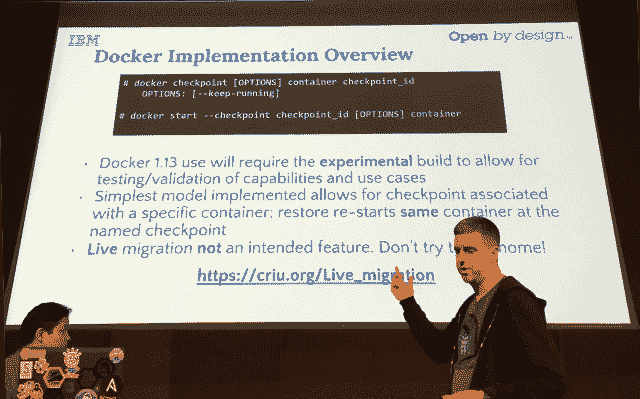

# OpenStack 峰会:IBM 演示 Docker 容器的实时迁移

> 原文：<https://thenewstack.io/openstack-summit-ibm-demonstrates-live-migration-docker-containers/>

两位 IBM 软件工程师展示了将一个活动 Docker 容器从一台主机移动到另一台主机的能力，而不会中断容器正在运行的任何服务。

IBM 开放云技术高级技术负责人 [Phil Estes](https://twitter.com/estesp) 表示，尽管 Docker 可能不会将实时迁移作为其即将发布的 Docker 1.13 版本的一项功能，但这一版本的 Docker 引擎应该能够支持这一功能，最初是以有限的方式，这要归功于一种名为**检查点和恢复**的新功能。

埃斯蒂斯和 IBM 工程同事[IBM 软件工程师 Shaun Murakami](https://twitter.com/stmuraka) 在本周于巴塞罗纳举行的 OpenStack 峰会上展示了这一能力。

检查点和恢复将允许用户通过检查点来冻结正在运行的容器，这涉及到将容器的当前状态捕获到磁盘上的文件集合中，以便以后可以从它被冻结的点恢复它。

Docker 计划在 Docker 引擎的下一个版本中提供检查点和恢复功能，作为一种制作容器快照的方式。容器的实时迁移可以使管理员更容易在不中断服务的情况下在系统中移动容器，从而增加此类服务的灵活性和健壮性。

开放容器倡议的 runC 参考容器引擎也支持 CRIU。

为了提供这种能力，Docker [使用了一个名为](https://criu.org/Docker) [CRIU](https://criu.org/Main_Page) (用户空间中的检查点/恢复)的外部工具，它是由桌面虚拟化软件提供商 [Parallels](http://www.parallels.com/es/) 的一个分支 [Virtuozzo](https://virtuozzo.com/) 创建的。

CRIU 捕获进程状态的所有方面，包括线程信息、用户和组标识符(UID/GID)、内存状态、打开的文件、TCP 状态、计时器信号和网络套接字。“这变成了一组元数据，我可以把它们带到别的地方恢复，”埃斯蒂斯解释道。

CRIU 最初应用于迁移实时虚拟机的任务，从 Linux 3.11 开始就有了内核支持(尽管 CRIU 的大部分工作是在用户空间完成的)。因此，从理论上讲，将其应用扩展到容器应该不会太难。让 CRIU [做同样的检查点并恢复](https://criu.org/Live_migration)是一个自然的扩展，允许 Docker 从 Docker 引擎内的另一个位置重启容器。

“容器只是你的 Linux 系统上的进程，”Estes 说。

Murakami 和 Estes 编译了他们自己版本的 Docker 引擎，它合并了上游检查点和恢复补丁。

村上进行了三次现场迁移演示。在第一个演示中，他将一个装有简单计数应用程序的计数器从一台主机移动到另一台主机，如下面这个简短的 Twitter 剪辑所示:

当容器化的应用程序被移动到新的主机时，计数器从它停止的地方恢复，而不是回到零，这表明应用程序实际上没有被移动中断。

在第二个演示中，Murakami 能够从一个主机移动到另一个更复杂的应用程序，基于内存数据存储中的实时 [Redis](http://redis.io/) ，该数据存储实时报告 Twitter 上#OpenStack 和#Docker 的提及次数。同样，移动并没有中断来自应用程序的数据流。

第三个，也是最雄心勃勃的一个演示并不成功，它展示了在 Docker 或其他任何人能够将实时迁移作为生产就绪特性提供之前，还需要做的额外工作。这个演示包括保持一个基于 VLC 的[视频流在主机变化中运行。当 VLC 软件被分配给新的主机时，围绕套接字重新分配的问题似乎使视频流停止。](http://www.videolan.org/vlc/index.html)

诚然，将实时视频流服务从一台主机迁移到另一台主机是最具挑战性的实时迁移任务，但这种能力将引起大容量视频服务的极大兴趣。埃斯蒂斯警告说，边缘案例需要再次敲定。

村上解释说，移动集装箱有两种不同的方法。具有无状态工作负载的容器是最容易移动的，这意味着与持久数据源没有联系:第二台主机只需拉取甚至预取一个相同的映像，然后放入检查点元数据。

Murakami 说，那些具有持久数据的用户面临额外的挑战，因为文件系统的变化也需要传递给新的主机。

<svg xmlns:xlink="http://www.w3.org/1999/xlink" viewBox="0 0 68 31" version="1.1"><title>Group</title> <desc>Created with Sketch.</desc></svg>