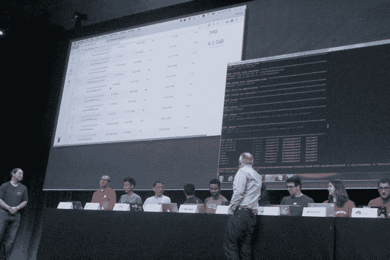

# OpenStack Summit 展示了一个令人信服的跨云融合演示

> 原文：<https://thenewstack.io/openstack-summit-presented-convincing-demo-cross-cloud-convergence/>

它应该发生在 2017 年波士顿 OpenStack 峰会的前半小时，因为它应该回答了 OpenStack 自己的代表向自己提出的一些最大的问题:在一个令人惊叹的演示中，由来自不超过 15 家云服务提供商的代表使用 OpenStack 的 [CoreOS](https://coreos.com/) 首席执行官[亚历克斯·波尔维](https://twitter.com/polvi)和[蟑螂实验室](https://www.cockroachlabs.com/)首席执行官[斯潘塞·金博尔](https://www.linkedin.com/in/spencerwkimball/)*【下图，从左到右**指导*

 *

现代 OpenStack 让多种资源彼此同质的能力，可能没有比这更好、更公开的展示了。如果有人对 OpenStack 到底是什么有任何困惑，正如 OpenStack 基金会昨天非常坦率地承认的那样，看到这个演示将永久地解决这个问题。

“去年，我们打开了一些思路，[展示了我们如何使用 Kubernetes 来部署 OpenStack 本身](https://thenewstack.io/openstack-gets-self-healing-coreoss-new-kubernetes-based-stackanetes/)，”Polvi 在设置演示的介绍时说。“这一次，我们希望再次这样做，现在围绕有状态系统——特别是[cocroach db](https://thenewstack.io/cockroachdb-unkillable-distributed-sql-database/)，这是一个云原生数据库。”

CockroachDB 是少数几位谷歌元老的产品，他们中的一些人是加州大学伯克利分校的前室友。也就是说，金博尔告诉与会者，他的产品名称的灵感来自于其自身的某些特性。

“这是从 GitHub 项目开始的，我有一种黑色幽默，”Kimball 解释道。“当我把它命名为 cocroach db 时，我从未想过我必须向所有人解释，向如此庞大的人群解释……cocroach db 是一种可以自我复制的东西，很难被杀死。所以它名副其实。”

Kimball 继续说，一个云原生 SQL 数据库应该有三个特征:水平可伸缩性，对使用它的应用程序透明，没有单点故障，以及在事故中可生存和自我修复。好的，*四个*特征。(No o o obody 期待[西班牙宗教裁判所](https://people.csail.mit.edu/paulfitz/spanish/script.html)。)

尽管周二的演示可能没有对所有四个特征进行专门测试，但它可能是其中两个特征的倒数第二次演示:在极度压力下的弹性，这是由缩放带来的。

来自 Canonical、EasyStack、华为、IBM、NetApp、Open Telekom Cloud、Platform9、Rackspace、Red Hat、SUSE、T2 云、Vexxhost、VMware、Wind 和中兴通讯的代表——所有这些公司的生产云服务都与 OpenStack 兼容——参加了今年的[互操作挑战](https://wiki.openstack.org/wiki/Interop_Challenge)(第二次，紧随 IBM 在 2016 年奥斯汀举办的一次[)。这个演示结合了 CoreOS **rkt** 容器映像，运行在 Kubernetes 集群上，连接到 OpenStack 基础设施上的 CockroachDB 弹性集群。](https://www.ibm.com/blogs/cloud-computing/2016/04/ibm-issues-interop-challenge-fellow-openstack-vendors/)

遵循 OpenStack 的 RefStack 工作组的[指导方针](https://wiki.openstack.org/wiki/RefStack)，该工作组是为了确保互操作性而成立的，15 个运营商中的每一个都被赋予了运行相同脚本来旋转云集群的任务。每个脚本都创建了新的安全组，提供了 Kubernetes pods，并将这些 pods 附加到 Kimball 和 Polvi 之前启动的 CockroachDB 实例。他们的结果将出现在 Kimball 的 Kubernetes 仪表板上，显示每个新连接的集群所用的时间。

这不是一场竞赛，尤其是因为每朵云的运行条件都各不相同。大多数人表示，他们的部分或全部集群位于美国以外——例如，EasyStack 完全位于中国，总部设在北京。此外，并非所有运营商都运行相同的 OpenStack 配置。

有些脚本只需几秒钟就能执行，有些则需要几分钟。区别几乎是无关紧要的:事实上，他们都成功地执行了从人群中发出的喘息声和口哨声。

“这不仅仅是一个非常酷的演示——事实就是如此，”金博尔毫无歉意地说。“这实际上是越来越多尝试使用蟑螂的人正在寻找的东西:他们试图建立全球数据架构。他们将在全球各种地区使用云，以满足全球客户群的需求。因此，让 Kubernetes 运行在 OpenStack 之上，并运行蟑螂节点，显然是可行的。…这是一个您将会看到更多的使用案例。”

<svg xmlns:xlink="http://www.w3.org/1999/xlink" viewBox="0 0 68 31" version="1.1"><title>Group</title> <desc>Created with Sketch.</desc></svg>*