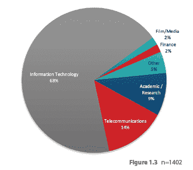
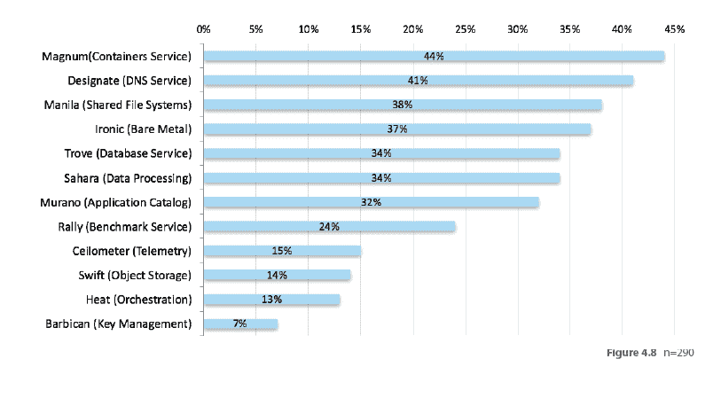
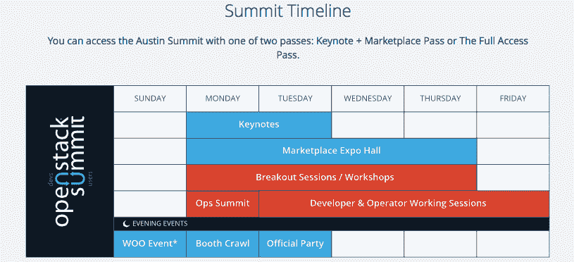
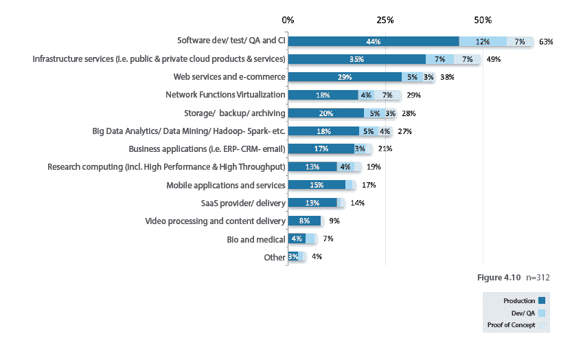
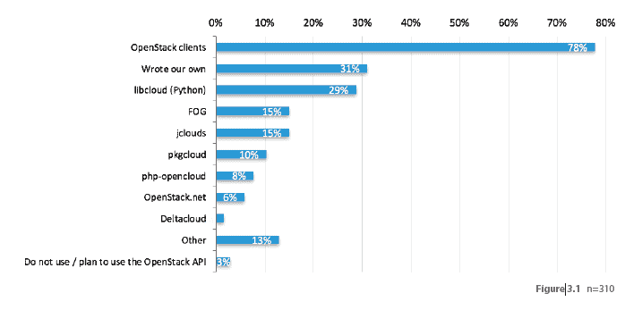

# OpenStack 峰会即将降临奥斯汀

> 原文：<https://thenewstack.io/openstack-summit-ready-deliver/>

下周在德克萨斯州奥斯汀举行的 2016 年 open stack 峰会很容易被众多选择淹没。例如，仅在周三的 2:40-3:20 时间段，就有 34 个演示/工作会议可供选择。好在他们有一个应用程序来组织你的时间表。

从最近的 OpenStack 用户调查结果来看，一群不同的、热切的与会者将来到奥斯汀，渴望获得更多信息。

82%的 OpenStack 调查受访者在 IT 或电信行业工作。

[OpenStack](https://www.openstack.org) ，一个用于云计算的开源 IaaS(基础设施即服务)软件平台，自 2010 年作为 [NASA](https://www.nasa.gov) 和 [Rackspace](https://www.rackspace.com) 的联合项目开发以来，发展迅速。 [OpenStack Foundation](https://www.openstack.org/foundation/) 成立于 2012 年，旨在推广开源软件并管理用户和开发社区。它由一个由 13 人组成的技术委员会和一个董事会领导，技术委员会成员由该项目的活跃技术贡献者选举产生。迄今为止，已有 500 多家公司加入了该基金会。

下周，来自 50 多个国家的 7500 多名应用程序开发人员、云管理员、电信运营商和其他 IT 专业人员将齐聚德克萨斯州奥斯汀，参加由该基金会主办的半年一度的 OpenStack 峰会。这比五年前的第一次峰会增加了 100 倍。

这次峰会是两个会议合二为一。OpenStack 会议将于周一至周四举行，是一个典型的用户会议，会上介绍了如何使用该软件、公司如何使用该软件、实践研讨会、供应商展位和联网机会。

在 OpenStack 调查中，当被问及哪个 OpenStack 项目最让他们感兴趣时，容器服务 Magnum 最常被提及。(左侧)

除了由 58 家不同公司赞助的演示之外，大会还有 23 个不同的演示类别，突出了产品的范围及其用户的多样性。与会者可以在架构决策中找到主题:“你口袋里的是云吗？”到大数据，到工作组。赞助商范围广泛，从业界重量级公司如 Red Hat、Intel、VMware 和 Hewlett Packard Enterprise，到新兴公司如 start-up Datera，再到由 Linux 基金会主持的开源项目 OpenDaylight。

OpenStack 基金会高级营销经理 Heidi Joy Tretheway 在本周的一次采访中表示，她对大会上展示的用户故事感到最兴奋。他们将展示 OpenStack 在现实世界中的应用。

然后是 OpenStack 运营和设计峰会，周一是[运营峰会](https://www.openstack.org/summit/austin-2016/categories/)，周二至周五是开发者和运营商工作会议。对于开源软件的贡献者来说，这是一个半年一次的机会，他们可以聚在一起确定下一个软件版本的需求，并在工作会议、训练营、启发讲座和“鱼缸”会议中与其他社区成员合作。有六种核心产品和超过 13 种可选服务，有很多可以谈论的。单个服务以及关于它们如何在 OpenStack 内以及与其他市场产品协同工作的会议。

## OpenStack，开放的思想

这些会议以克制的怀疑和开放的思想著称，这在其他会议上是找不到的。

在 10 月份在东京举行的上一次峰会上，该小组讨论了一些问题，如未来的发展应该以满足客户的愿望清单为导向，还是从更高的角度出发，以及开放堆栈是否需要分为两部分，一部分用于云原生客户，一部分用于传统工作负载。TNS 的 Scott M. Fulton 报道说，这些会议展示了“在供应商会议上难以想象的令人神往的坦率”。

下周的会议主题是“评估 OpenStack:互操作性:房间里的大象&我们对它们做了什么”，“恐怖故事:我们如何大规模打破计划！”以及“各种 OpenStack 消费模式的利弊”

在 OpenStack 调查中，大约 35%的用户表示他们正在 OpenStack 上运行公共或私有云基础架构服务。(左侧)

除此之外，还有几次参加认证考试的机会。据 Tretheway 称，随着 OpenStack 的持续增长，对认证 OpenStack 工程师和开发人员的需求也在增长。他们希望下周能认证一批新的工程师和开发人员。现在供应有点短缺，所以如果你正在寻找一个长期的职业道路，这可能是你的一个。

OpenStack 特别致力于他们的社区，不仅仅是作为他们产品的客户/消费者，而是作为产品本身的积极的共同创造者。该基金会刚刚发布了最新一期的[用户调查](https://www.openstack.org/user-survey/survey-2016-q1/landing)，将在周一的会议上详细讨论。他们收到了来自 1111 家不同公司的 1600 份调查。

97%的受访者将在同一开放平台上实现标准化列为选择 OpenStack 的五大驱动因素，高于六个月前的 60%。同样重要的是，开放 API 被压倒性地(71%)选为第五优先选项。(左侧)

最新一轮的结果显示，自东京峰会前的上次调查以来，回归人数增加了 25%。自上次用户调查以来，生产中的云数量在过去六个月中增加了 35%。大约 44%的受访者目前正转向使用容器，因此对使用 OpenStack 和容器的兴趣是广泛的。

在谈到未来时，受访者关注三个主要领域。70%的受访者希望在未来的某个时候使用集装箱。[对于大多数参与者来说，软件定义网络](https://thenewstack.io/defining-software-defined-networking-part-1/) (SDN)即将到来。另外，[网络功能虚拟化](https://thenewstack.io/de-ossify-the-network-with-function-virtualization/) (NFV)是许多公司的未来，尤其是那些电信公司。

![When asked what container and PaaS tools are used to manage OpenStack applications, 42 percent said Kubernetes, with 27 percent of the sample actually using it in production. This seems very high in comparison to other studies we have reviewed, especially since according to a discussion with OpenStack specialist Taligent, adoption of containers on OpenStack is probably behind that being done in public cloud environments. The drops in users citing Cloud Foundry (35 to 24 percent) and Docker Swarm (23 to 7 percent) are telling. For Cloud Foundry, the decline in roadmap mentions mirrors scuttlebutt we heard from a Cloud Foundry partner indicating it had partners asking for Kubernetes. Two big caveat when interpreting the chart below: 1) the choices made available in the survey were somewhat odd, as Cloudify seems like an outlier and so many PaaS options were excluded. 2) The sample size was much smaller than the survey as a whole and was likely answered by super-user application developer/deployers.](img/36b6398b4d11fa72489766c24fc58112.png)

当被问及使用什么容器和 PaaS 工具来管理 OpenStack 应用程序时，42%的人说是 Kubernetes，27%的样本实际上在生产中使用它。与我们回顾的其他研究相比，这似乎非常高。自 10 月份调查以来，引用 Cloud Foundry(35%至 24%)和 Docker Swarm(23%至 7%)的用户数量下降就很能说明问题。在解释下面的图表时，有两个重要的警告:1)调查中可用的选择有些奇怪，因为 Cloudify 似乎是一个离群值，所以许多 PaaS 选项被排除在外。2)样本规模远小于整个调查，可能由超级用户应用程序开发人员/部署人员回答。(左侧)

Tretheway 指出，新的 OpenStack 产品 BareMetal 允许虚拟机直接安装到硬件上，而不是通过操作系统托管，因此对许多用户都很有用。

尽管如此，OpenStack 需要训练有素的工程师和开发人员来安装和运行。Stratoscale 的产品管理副总裁 Ronen Kofman 对向大众市场提供 OpenStack 很感兴趣，包括那些想要进入云或者远离亚马逊云服务的小公司。

Stratoscale Symphony 自 2013 年开始开发，于去年推出，是一种基于云的软件定义的数据中心(SDDC)解决方案。这是一个易于部署和使用的捆绑云，几乎不需要任何配置，可以在任何机器上运行。OpenStack 被捆绑到 Stratoscale 产品中，Kofman 将该软件称为“消费 OpenStack 的新方式”。他专注于技术含量较低的小型客户。它是下一代云解决方案——基于本身只有五年历史的技术构建一个开箱即用的。

31%的应用程序开发人员正在编写自己的工具包，以便与 OpenStack API 一起使用。(左侧)

考夫曼表示，尽管这次会议更倾向于大数据和企业，但他仍会继续参加。几年来，他一直参加 OpenStack 大会，期待着发布会和用例演示。Kofman 发现这些会议是一个分享想法和了解云计算未来发展方向的好地方。

这是一个在云环境中工作的激动人心的时刻，”他说。

如果日程安排有所暗示，那将是一个激动人心的时刻。

TNS 分析师劳伦斯·赫克特为本文图表提供了评论。

特色图片:奥斯汀，德克萨斯馅饼公司。T.C .库里。

<svg xmlns:xlink="http://www.w3.org/1999/xlink" viewBox="0 0 68 31" version="1.1"><title>Group</title> <desc>Created with Sketch.</desc></svg>