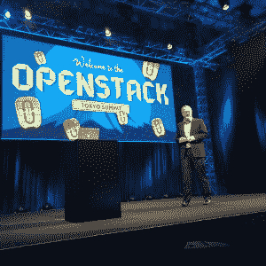

# OpenStack 的未来在东京峰会上引发坦率的辩论

> 原文：<https://thenewstack.io/openstacks-future-sparks-frank-debate-tokyo-summit/>

OpenStack 应该是一个专门运行云原生操作的平台，还是应该专注于托管传统企业应用？会不会是一个满足所有需求的云平台？还是应该专业化，在云市场中开辟自己的一席之地？这些是本周东京 OpenStack 峰会与会者面临的棘手问题。

T2 峰会以思想开放和克制怀疑而闻名。这是开发者第一次质疑云平台在 Docker 的威胁下生存的可能性的地方，也是一些人聚集在一起用 [Magnum 容器管理组件](https://thenewstack.io/magnum-is-the-name-docker-container-management-is-the-game/)拥抱和扩展 Docker 的地方。

去年 5 月在温哥华，当 termie，又名 Andy Smith——open stack 的核心 Nova 计算组件的联合创始人，发表了题为“ [OpenStack 注定要失败，这是你的错](https://www.openstack.org/summit/vancouver-2015/summit-videos/presentation/openstack-is-doomed-and-it-is-your-fault)”的演讲时，坦诚仍在继续

史密斯半开玩笑地说，大公司正在有效地从开源社区控制 OpenStack 的发展，使其朝着更商业化的目标发展。他称这种趋势为“天文数字”——本质上是在草根运动支持下的供应商联盟。

周一，在东京峰会上，OpenStack 的三位备受尊敬的贡献者，包括 NASA 原始星云云项目的创始成员之一，提出了朋友之间的电子邮件交流。他们引用 termie 在 5 月份的讲话，在一次供应商会议上难以想象的坦率展示中，他们表达了他们的担忧，即 OpenStack 目前的发展道路可能会导致一个死胡同，被挤到 VMware，Amazon AWS 和 Docker 之间的利基市场。

“他们最初的目标是 Nova，”DevOps 交响乐团的负责人马特·乔伊斯(Matt Joyce)说，他指的是史密斯和共同创作人维什瓦南达·伊沙亚(Vishvananda Ishaya)，“现在已经完全不同于 Nova 了。”

“这种不同的愿景实际上阻碍了 OpenStack 成为云平台吗？”Platform9 Systems 的技术营销总监 Kenneth Hui 问道。

## 顾客错了吗？

Hui 举了 Cinder 的例子，Cinder 是一个 OpenStack 组件，它将存储块汇集在一起，而无需向使用这些块的服务描述这些块的位置。虽然呈现给 Nova (OpenStack Compute)的典型存储是短暂的，当消耗该资源的虚拟机终止时就会消失，但 Cinder 是一种使虚拟机能够访问更持久的存储的方法，这些存储在其消费者的生命周期结束后仍然存在。

“我认为(Cinder)的发展已经远远超出了最初的设想，”Hui 说，“现在已经变得更像一个传统的企业存储系统。”他引用了 2014 年添加到 OpenStack Juno 中的[一致性组](http://docs.openstack.org/admin-guide-cloud/blockstorage-consistency-groups.html)，以实现块存储卷的多个快照，这是企业会要求的一种功能，因为它是 VMware vCenter Site Recovery Manager 的一部分。现在，[卷复制](https://github.com/openstack/cinder-specs/blob/master/specs/juno/volume-replication.rst)被添加到 Cinder 中，因为 Hui 和他的同事认为，企业认为它已经被定义为一种必需品，这又要感谢 VMware。

“我认为，如果你开始这样做…我们正在构建 Cinder，以至于它不再是云原生应用程序的理想选择。”

Joyce 接着提出了[中子的话题，OpenStack 的网络组件](https://thenewstack.io/sdn-controllers-and-openstack-part1/)。“中子带来的东西，在异步弹性云中都是不必要的，”他说。“这些都是特定的隔离要求，从 PCI 合规性、隔离必要性、高可用性容差开始，所有这些都是您在弹性云中看到的。在这些传统的、企业风格的网络中构建非常特殊。”

> “我要说的一些话可能会惹恼一些人……仅仅因为客户需要它，这是否意味着应该一直实施它？”—许宗衡

Jesse Proudman 是托管基础设施解决方案提供商 Blue Box Group(现在是 IBM 的一部分)的首席技术官和创始人，他不太同意这个观点。是的，大型存储、硬件和网络供应商正在推动这些面向企业的附加产品，他说。但这并不是因为供应商试图添加吸引客户的功能，而是因为他们响应了现有客户对这些功能的需求。

“到目前为止，这些需求中有很多来自最终用户客户，他们说，‘我有一个基于 PCI 的应用，我想在基于 OpenStack 的云上运行它，我需要网络隔离来通过审核。’这就是如何将功能添加到实现中的，”Proudman 说。

Joyce 反驳说，Nova 和 Neutron 的增加实际上是两条不同的发展道路，这将 OpenStack 带入了两个具有“根本不同的工作流”的不同客户群。

Kenneth Hui 说:“我想知道我们是否已经到了实际需要两个 OpenStacks 的地步，一个用于云原生工作负载，一个用于传统工作负载。”

“我不一定同意这是正确的做法，但如果你看看事情的发展方向，我会说一些可能会激怒一些人的话，一件事是，仅仅因为客户需要它，这就意味着应该一直实施吗？”惠说。

回引用了一个著名的比喻，即在 1900 年代给客户提供他们想要的而不是他们需要的东西——更快的马，而不是汽车——建议 OpenStack 的工程师可能需要抓住缰绳或方向盘，当有必要将平台转向与客户需求不一致的方向时。

## 作为变量的弹性

此外，注意到供应商确实提供了扩展 OpenStack 生态系统覆盖范围的优势，他提出了这个令人瞠目结舌的假设:“如果参与的大多数供应商不知道如何实现云原生，会怎么样？因此，他们所构建的实际上无法实现云原生？通过在 OpenStack 中包含所有这些实施细节，我们现在已经创建了一个无法弹性扩展的平台，而且永远不会这样。”

Hui 认为，组织评估 OpenStack 的三大原因之一是有机会取代 VMware 及其高昂的许可费。但是在评估过程中，他们可能会(错误地)将 OpenStack 视为“免费的 VMware”，或者类似于最初将 Linux 与 Unix 相比较时的感觉。

“更有可能发生的是，”他说，“OpenStack 社区中会有越来越多的人会说，‘你知道吗？我希望它是免费的 VMware。目前，我不关心云原生的东西。我的数据中心不需要 AWS。“我想要的是一个免费版的 VMware，我将推动所有开发人员编写代码，允许我自动失败——做 VMware 能做的一切，但要开源。”"

“这将会产生问题，”惠继续说，“因为这不是 OpenStack 的初衷。不管人们喜不喜欢，这很可能是我们前进的方向。”

Matt Joyce 补充道:“热故障转移从未出现在 OpenStack 的初始设计要求中。“现在这是一个非常受欢迎的功能。这不是短暂的。就其本质而言，它违背了 OpenStack 最初的初衷:一种异步的弹性格式。但是顾客想要。这是客户所要求的。所以它会被建造。”

Joyce 引用了网飞的“混沌猴子”的成功，他认为大规模的数据中心最需要的是弹性。尽管客户有 OpenStack 愿望清单，但他们的日常关键需求是能够不受阻碍地与客户进行交易。他说，即使是暂时无法满足这一要求，对一个组织来说也可能是永久性的灾难。

“为了让人们构建有弹性的应用程序，短命背后的理念是强化一切都是短暂的这一理念，”他说。“在技术上，没有什么是大不了的。”

但是 Proudman 提出了弹性是否是一个变量的问题，取决于手边应用程序的关键性质。Proudman 认为，银行交易可能需要完全的弹性，而一个接受会议室预订的表单可能会中断两个小时而不会引发灾难。

“有几类应用程序已经发展了很多年，”他说，“某些类不需要那么有弹性。”虽然许多应用程序在编写时应该考虑到这种设计模式，但他继续说道，“归根结底，我们是否增加了太多的复杂性，或者遵循这些模式增加了太多的复杂性，以至于我们使环境变得不可管理和不可维护？”

## 夹在中间

在回答一位与会者的问题时，Hui 指出了他认为 OpenStack 同时追求传统和云原生客户群的两个风险。首先，如果一个平台在设计上选择支持某些类型的现有应用程序，那么这个决定可能会使其未来对新应用程序的支持变得困难或不可能。

第二，回认为 OpenStack 过于关注支持现有应用程序有一个潜在的危险:云原生开发者可能会说，“让我们完全跳过 OpenStack 吧。他们坚持尝试传统应用程序；让我们直接看集装箱吧。"

“我认为，如果我们把注意力分散在这两种类型的云上，就会有风险，”他警告说。“我们可能会发现自己被夹在中间，我们在这两个方面都做得不是特别好，基本上 VMware 继续拥有传统空间，Kubernetes 和 Mesos 以及 Docker 拥有云原生空间，OpenStack 成为这个非常小的市场中的一个非常特殊的参与者，他们实际上试图利用它来实现这两个目标。”

VMware、Docker 和 IBM 是新体系的赞助商。

*[封面图片](https://commons.wikimedia.org/wiki/File:Horse_drawn_US_Mail_car.jpg)来自[楠塔基特历史协会图书馆](http://www.nha.org/)，经由维基共享。*

<svg xmlns:xlink="http://www.w3.org/1999/xlink" viewBox="0 0 68 31" version="1.1"><title>Group</title> <desc>Created with Sketch.</desc></svg>