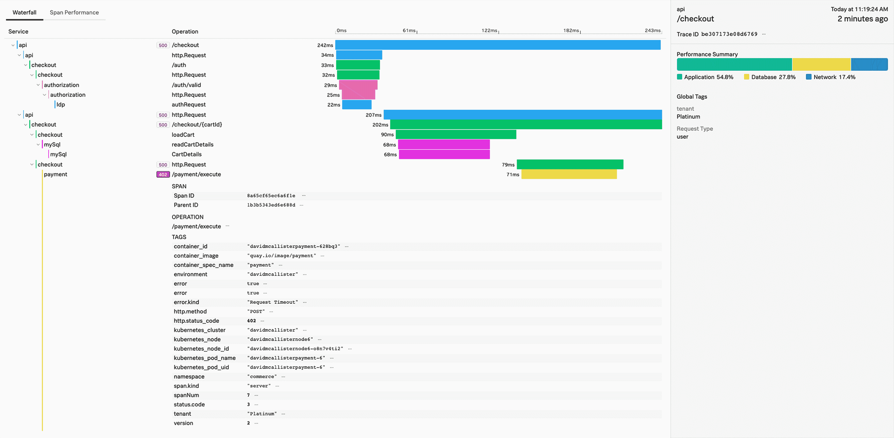

# OpenTelemetry 整合数据以提高可观测性

> 原文：<https://thenewstack.io/opentelemetry-consolidates-data-for-observability/>

 [戴夫·麦卡利斯特

目前，戴夫正在为 Splunk 提供技术宣传，他正与开发人员、开发人员和架构师合作，了解分布式系统中所需的现代微服务架构和编排的优势，尤其是在当今快速发展的周期中。从 Linux 早期开始，通过像 XFS、GFS 和 GlusterFS 这样的开放分布式文件系统，到今天的云和容器世界，Dave 一直是开放系统和开放源代码的倡导者。他经常涉及的话题包括与新兴软件架构和实践相关的现实问题、开源软件和创建新技术公司。他自称是开源极客和标准迷，你可以通过@dwmcallister 在 twitter 上找到他的观点。](https://medium.com/@dwmcallister) 

应用程序的世界是一个复杂的地方。我们有公共云和私有云、内部部署、容器、流程编排、微服务、弹性响应等等。我们不断发展，不断部署，积极扩展。然而，随着所有这些变化，就像习语所说的那样“[在这个世界上，没有什么是确定的，除了死亡和税收](https://en.wikipedia.org/wiki/Death_and_taxes_(idiom))，”在开发运维及开发者领域，我们可以肯定我们可用和有用的数据量将不断增加。那么，我们如何使用开放和标准技术将数据导入我们的监控和分析工具，并避免不同项目的拼凑？

输入可观察性。对于应用程序而言，可观测性是从无数信号(遥测)中设计和传递数据，以提供推断和发现应用程序(及其基础设施)行为方式的能力。可观察性通常分为三个支柱，度量、(分布式)跟踪和日志。与旧的“一个系统，一个应用”模型不同，[可观察性允许监控](https://thenewstack.io/monitoring-vs-observability-whats-the-difference/)和分析工具显示我们甚至不知道我们需要知道的事情，以发现和解决“未知的未知”然而，我们的三种不同类型的数据需要相互关联。在我们现代复杂的环境中，没有一条信息足以解决问题，无论是应用程序故障还是用户满意度。这可能会给我们收集数据的方式带来麻烦。

我们的可观测性数据最令人头痛的一个问题是，我们被限制在通过单一来源的收集器将数据带入我们的工具中。换句话说，我们需要用一种模式引入跟踪，用另一种模式引入度量，用另一种收集器引入日志。通常这些都是专有的，让我们陷入了一个滞后于应用架构和环境变化的数据模型。我们面对的是批量交付的收集器，对数据接收行为的处理要求很高，并且完全缺乏及时性，这让我们无法清楚地了解与我们的[即时满足世界](https://www.thinkwithgoogle.com/marketing-resources/data-measurement/mobile-page-speed-new-industry-benchmarks/)相关的应用程序性能。

这就是像 [OpenTelemetry](https://www.opentelemetry.io) (云本地计算基础[中的一个项目](https://www.cncf.io))这样的项目可以帮忙的地方。OpenTelemetry 是由 OpenTracing 和 OpenCensus 合并而成的项目，专注于为我们提供处理当今现代应用所需的信息。OpenTelemetry 采用了两个项目的最佳概念，合并并扩展了它们，还提供了向后兼容性，以最大限度地减少迁移痛苦，并允许有计划地更新到新的特性和功能 API。它是为可观测性而设计的。

因此，OpenTelemetry 正在成为收集和传输数据到我们的监控和分析工具的迫切需要的开放、标准方式。在许多情况下，特定工具的选择决定了对齐的数据采集代理的使用，例如，如果有必要改变特定的监控工具，就会产生问题。应用程序和基础设施都需要重新装备，如果没有明显的原因，很少团队会选择面对这种情况。使用 OpenTelemetry 模型及其周围的生态系统，数据采集保持不变，允许选择工具来提高我们的洞察力。

OpenTelemetry 在其当前状态下支持跟踪和度量。轨迹由其跨度定义为瀑布图或跨度的有向非循环图(DAG ),其中跨度之间的边定义为父/子关系。

每个跨度包含以下内容:

*   行动名称
*   开始和结束时间戳
*   一组零个或多个 key:value 属性
*   一组零个或多个事件，每个事件本身都是一个与时间戳配对的键:值映射
*   父范围标识符
*   链接到零个或多个因果相关跨度
*   Span 范围的上下文标识

通过这种方式，OpenTelemetry 可以为所有跟踪数据构建跟踪，包括因果关联的跨度。

指标被记录为原始测量值或预定义的集合和标签集。原始度量允许我们推迟在可视化和监控中使用什么聚合算法。通过支持预定义的聚合和原始数据，OpenTelemetry 为我们提供了具有灵活后端使用的整合数据。

虽然 OpenTelemetry 支持度量和跟踪，但可观察性的统一正越来越近。 [OpenTelemetry 日志数据模型](https://github.com/open-telemetry/oteps/blob/master/text/logs/0097-log-data-model.md)已经到来，以将日志信息与应用度量和跟踪数据整合在一起。这仍是一项不断发展的工作，但对完成可观测性的观点至关重要。

我们的信号通过一个开放的收集器统一起来，我们的监控现在可以在所有信息支柱之间建立关联。它仍在形成中，但统一的路线图是清晰的。这样，我们现在可以讨论遥测数据，而不必详细说明哪些数据不可用。当然，这并不意味着所有的工具都将利用度量、跟踪和日志这三者，但是单个收集器意味着我们的应用程序已经准备好向我们的工具交付数据，但是它消除了运行和维护与特定后端工具相关联的多个代理的需要。如前所述，它使我们不必为了更换工具而重新安装仪器。

OpenTelemetry 还通过导出器模型提供了统一性。导出器允许将遥测数据转换成新的格式，通常是特定工具可能需要的格式。例如，您可能希望使用 Prometheus 作为您的监控和警报系统。通过使用 open telemetry Prometheus exporter，您可以将遥测技术输入 Prometheus。此外，因为您可以同时链接和使用多个导出器，所以您可以将数据导出到您需要的地方。exporters 生态系统以及 OpenTelemetry Collector 提供了以正确格式输入必要数据的能力。OpenTelemetry 使我们的统一可观测性更加触手可及。

是时候考虑将 OpenTelemetry 作为可观测性的数据收集模式了。这样做的好处是可以保护您的应用不会因为新工具或新功能而发生仪器变化。能够以开放、标准的方式获取所有数据，并将其交付给您选择的工具，这意味着您可以现在就开始，并在未来随着数据的增长而增长。

云计算原生计算基金会是新堆栈的赞助商。

通过 Pixabay 的特征图像。

目前，新堆栈不允许直接在该网站上发表评论。我们邀请所有希望讨论某个故事的读者通过推特(Twitter)或脸书(T2)与我们联系。我们也欢迎您通过电子邮件发送新闻提示和反馈:[反馈@thenewstack.io](mailto:feedback@thenewstack.io) 。

<svg xmlns:xlink="http://www.w3.org/1999/xlink" viewBox="0 0 68 31" version="1.1"><title>Group</title> <desc>Created with Sketch.</desc></svg>