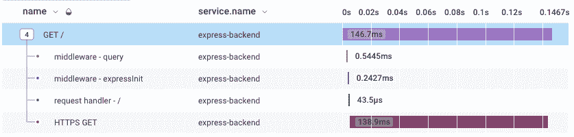
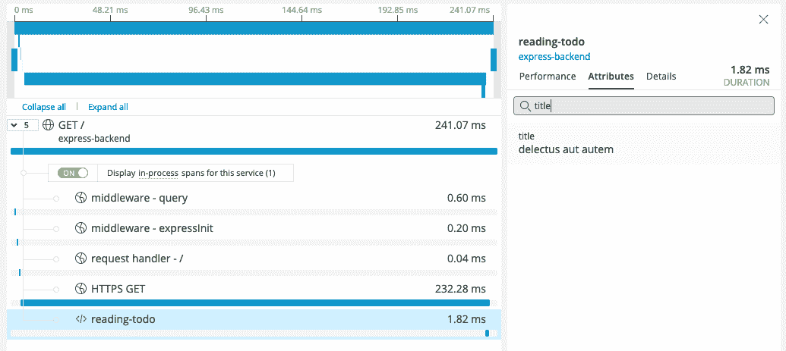

# OpenTelemetry (OTel)是避免厂商锁定的关键

> 原文：<https://thenewstack.io/opentelemetry-otel-is-key-to-avoiding-vendor-lock-in/>

OpenTelemetry 的承诺是，它允许您对应用程序进行一次测试，然后将数据发送到您选择的任何后端，从而帮助您避免供应商锁定。这篇文章向您展示了如何使用代码示例来配置您的应用程序，以向 Honeycomb 和 New Relic 发送遥测数据。

## 供应商锁定是如何形成的

 [维拉·雷诺兹

Vera 是 Honeycomb 的一名高级遥测工程师，喜欢提高开发人员的生活质量。在 Honeycomb 之前，她在 CircleCI 开发了 CI/CD，在 Pivotal CloudFoundry 开发了监控工具，还有其他工作](https://www.linkedin.com/in/vera-reynolds/) 

随着应用程序架构变得越来越复杂，我们用来管理和维护它们的工具也需要发展。传统的监控解决方案从外部探测您的应用程序，在出现问题时能够很好地向您发出警报，但是您将何去何从呢？在大型复杂的系统中，这些工具不能提供足够的上下文来实际追踪和解决问题。

应用程序工具是 APM 工具的支柱。为了提供比传统监控工具更丰富的诊断数据，应用维护人员会将特定于供应商的代理或库添加到他们的项目中。虽然每个供应商都提供了一些预配置的基线，但是维护人员仍然需要手动添加他们自己的工具，以确保向他们供应商的仪表板报告的洞察与他们的特定用例相关。该工具将被添加到该供应商的特定术语中，使其不可转移到其他实现中。结果是在开始时节省了前期时间——但是如果您决定更换工具提供商，这些时间不可避免地会随着数量级的累积利益而收回。

当另一家供应商推出一些引人注目的独特之处或杀手级功能，需要调查时，会发生什么情况？那就是痛苦开始的时候。

你必须首先从你的代码库中取出所有旧的工具，然后用一套全新的代码和依赖重新安装。如果新工具不符合标准呢？然后，是时候回滚一切，重新开始了。

难怪组织会坚持使用他们碰巧首先选择的工具！在经历了重新构建和潜在的历史数据丢失之后，你更有可能放弃并学会接受你所拥有的。

那就是厂商锁定的陷阱，烂透了。

## OpenTelemetry 解锁供应商锁定

如果您曾经发现自己使用的工具并不适合您，但是实现(或者甚至评估)替代工具的成本太高而无法考虑更换，那么您就会理解为什么供应商锁定问题是不可接受的。OpenTelemetry 旨在通过提供标准化的仪器框架来打破这种循环。

出于对专有遥测事务状态的共同不满，标准开始以两个并行开源项目的形式出现:OpenCensus 和 OpenTracing。最终，这些团体将这两个标准合并成了 OpenTelemetry 项目。虽然 OpenTelemetry(或 OTel)仍然是一个相对较新的领域，但它正在快速成长，[最近被接纳为 CNCF 的孵化项目](https://www.cncf.io/blog/2021/08/26/opentelemetry-becomes-a-cncf-incubating-project/)。

OpenTelemetry 为跨任意数量的后端系统生成、收集和导出应用程序遥测提供了一个开放标准。这是一个开源的、厂商中立的工具框架，它让您摆脱了使用专有库来理解代码行为的陷阱。现在，您可以对您的应用程序进行一次检测，然后将该检测带到您选择的任何其他后端系统。

供应商应该根据他们如何取悦你和解决你的问题来争夺你的爱，而不是根据摆脱他们有多烦人。有了 OTel，这终于成为可能。听起来不错，对吧？

让我们来看看用 OTel 切换供应商在实践中会是什么样子。

## 如何使用 OpenTelemetry 转换供应商

我们将从一个简单的 Node.js Express 应用程序开始。我们只有一条路线，我们取一个 todo 来保持事情的趣味性。

```
```js
// app.js
const express  =  require("express");
const https  =  require("https");
const app  =  express();
app.get("/",  async  (req,  res)  =>  {
https.get("https://jsonplaceholder.typicode.com/todos/1",  (incoming)  =>  {
incoming.on("data",  (data)  =>  {
console.log(JSON.parse(data))
});
incoming.on("end",  ()  =>  {
res.send("OK")
});
});
});
app.listen(3000,  ()  =>  {
console.log(`Listening for requests on http://localhost:3000`);
});
```

```

现在让我们在上面撒一些 OTel。我们将添加一些依赖项，并引入一个 tracing.js 文件来初始化 OTel SDK。

```
```json
"dependencies":  {
"@grpc/grpc-js":  "1.3.7",
"@opentelemetry/api":  "1.0.3",
"@opentelemetry/auto-instrumentations-node":  "0.25.0",
"@opentelemetry/exporter-collector-grpc":  "0.25.0",
"@opentelemetry/sdk-node":  "0.25.0",
"express":  "~4.16.1"
}
```
```js
// tracing.js
const opentelemetry  =  require('@opentelemetry/sdk-node');
const  {  getNodeAutoInstrumentations  }  =  require('@opentelemetry/auto-instrumentations-node');
const  {  CollectorTraceExporter  }  =  require("@opentelemetry/exporter-collector-grpc");
const  {  credentials  }  =  require("@grpc/grpc-js");
const traceExporter  =  new  CollectorTraceExporter({
credentials:  credentials.createSsl(),
});
let sdk  =  new opentelemetry.NodeSDK({
traceExporter,
instrumentations:  [getNodeAutoInstrumentations()]
});
sdk.start()
```

```

我们将通过环境变量来配置 OTel 管道的其余部分。首先，我们把它指向蜂巢。

```
```sh
export OTEL_EXPORTER_OTLP_ENDPOINT=“https://api.honeycomb.io”
export OTEL_EXPORTER_OTLP_HEADERS=“x-honeycomb-team=MY_HNY_KEY,x-honeycomb-dataset=otel-node”
export OTEL_SERVICE_NAME=“express-backend”
```

```

现在，当我们运行我们的跟踪应用程序并点击我们的端点时，我们在蜂巢 UI 中看到一些可爱的跟踪数据。

```
```sh
node  -r  tracing.js app.js
```

```



当然，我们不会就此止步。我们想知道我们获取了什么样的 todo。让我们添加一个带有 todo 标题的 span 作为属性。

```
```js
// app.js
const otel  =  require("@opentelemetry/api");
let tracer  =  otel.trace.getTracer("my-tracer");
app.get("/",  async  (req,  res)  =>  {
https.get("https://jsonplaceholder.typicode.com/todos/1",  (incoming)  =>  {
let span  =  tracer.startSpan("reading-todo");
incoming.on("data",  (data)  =>  {
span.setAttribute("title",  JSON.parse(data).title)
});
incoming.on("end",  ()  =>  {
span.end();
res.send("OK")
});
});
});
```

```


哦，嘿，我们在跟踪中得到另一个跨度，它显示了 todo 标题！

现在，假设您想将数据发送到蜂巢以外的地方。简单——只需交换端点和头。让我们以新遗迹为例。

```
```sh
export OTEL_EXPORTER_OTLP_ENDPOINT=“https://otlp.nr-data.net:4317/”
export OTEL_EXPORTER_OTLP_HEADERS=“api-key=MY_NR_KEY”
```

```

现在，在重新运行应用程序并点击端点后，我们可以在 New Relic 中看到踪迹，包括我们非常有用的 todo 标题。



但是，如果您还没有做好转换的准备，并且想要在多个供应商之间购买数据，该怎么办呢？ [OpenTelemetry Collector](https://opentelemetry.io/docs/collector/) 是一个 OTel 组件，允许您通过配置数据管道来接收、处理和导出遥测数据。这不是必需的组件，但在这种情况下，我们可以利用它将我们的跟踪发送到蜂巢和新遗迹。我们首先在 Docker 容器中本地运行收集器。

```
```sh
docker run  -p  4317:4317  -v  /collector-config.yaml:/etc/collector-config.yaml otel/opentelemetry-collector  —config=/etc/collector-config.yaml
```

```

这是我们导出给两家供应商的 collector-config.yaml 文件。

```
```yaml
receivers:
otlp:
protocols:
grpc:
exporters:
otlp/hny:
endpoint:  api-dogfood.honeycomb.io:443
headers:
"x-honeycomb-team":  "MY_HNY_KEY"
"x-honeycomb-dataset":  "otel-node"
otlp/nr:
endpoint:  otlp.nr-data.net:4317
headers:
"api-key":  "MY_NR_KEY"
service:
pipelines:
traces:
receivers:  [otlp]
exporters:  [otlp/hny,otlp/nr]
```

```

因为现在我们的 Node.js 应用程序将向 localhost 上的收集器发送数据，所以我们需要更新 gRPC 凭证以确保不安全。

```
```js
// tracing.js
const traceExporter  =  new  CollectorTraceExporter({
credentials:  credentials.createInsecure(),
});
```

```

最后，我们将端点换成收集器地址。

```
```sh
export OTEL_EXPORTER_OTLP_ENDPOINT=localhost:4317
```

```

现在，在我们运行应用程序并到达终点后，痕迹出现在蜂巢和新遗迹中。这让您能够比较和对比不同供应商的解决方案，以满足您的需求！

## 打破供应商锁定的循环

这个博客中的例子是一个微不足道的例子，但是想想几十个(或者几百个？你好，微服务)的端点和代码路径，可以幸福地不知道你的跟踪后端。有了 OpenTelemetry，您无需将特定于供应商的逻辑硬编码到您的应用程序中，直到时间结束。

OpenTelemetry 使您能够对遥测数据进行更多的代理，并在选择供应商(或多个供应商)时打开更多的大门！).在 Honeycomb，我们相信，一旦您开始分析和调试您的遥测技术，我们为您提供的价值是显而易见的。可观察性是通过您快速识别问题的正确来源和发现遗留工具无法显示的隐藏问题的能力来衡量的。这些指标、日志和跟踪只是简单的表格，您不应该仅仅为了获取数据而被限制在一个特定的解决方案中。

我们完全支持 OpenTelemetry 项目，我们希望这个循序渐进的示例对您有所帮助。

## 你自己试试吧

我们是否激起了你对 OpenTelemetry 的兴趣？如果你已经准备好了，请查看我们的[快速入门文档](https://docs.honeycomb.io/getting-started/quickstart/)来使用 Honeycomb 设置 OTel，如果你还没有，请[注册一个免费的 Honeycomb 帐户](https://ui.honeycomb.io/signup?&utm_source=otel_vendor_neutral&utm_medium=blog&utm_campaign=signup&utm_content=free-product-signup)。如果 Honeycomb 不适合您，您可以在其他地方工作。

您还可以在[https://opentelemetry.io/](https://opentelemetry.io/)了解关于该项目的更多信息，查找文档并加入 OTel 社区

<svg xmlns:xlink="http://www.w3.org/1999/xlink" viewBox="0 0 68 31" version="1.1"><title>Group</title> <desc>Created with Sketch.</desc></svg>