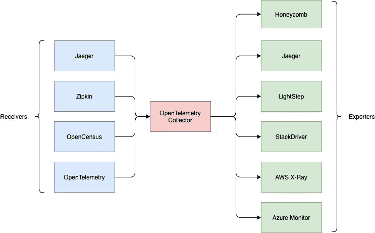

# OpenTelemetry 加强管理微服务的混乱

> 原文：<https://thenewstack.io/opentelemetry-steps-up-to-manage-the-mayhem-of-microservices/>

工作仍在继续，以使 [OpenTelemetry](https://opentelemetry.io/about/) 成为一套标准的厂商中立规范和相关工具，用于捕获云原生操作数据。

该项目发布了一个收集器和软件开发工具包(SDK)来支持许多不同的语言，使工作接近生产就绪状态。

对于最终用户来说，新的候选版本让最终用户“相信 OpenTelemetry 可以安全地进行评估，因为它现在已经接近功能完成、运行时稳定性和 API 稳定性，”observability 软件提供商和项目贡献者 [Honeycomb](https://www.honeycomb.io/) 的主要开发者倡导者[利兹·方-琼斯](https://twitter.com/lizthegrey)在一封电子邮件中写道。

她指出，该版本向监控软件和服务提供商发出信号，是时候为该项目编写自己的导出器了，它为“用户提供了一个更平滑、更少摩擦的路径，以将关键的遥测数据纳入他们的应用程序。”

该项目的贡献者之一，云原生监控提供商 [Lightstep](https://lightstep.com/) 的首席执行官兼联合创始人 [Ben Sigelman](https://www.linkedin.com/in/bensigelman/) 说，这项工作为“高质量遥测成为任何云原生软件的内置功能”奠定了基础。

考虑到跨多个组件调试的困难，在大规模环境中运行基于微服务的架构[可能会过于笨拙](https://thenewstack.io/kelsey-hightower-and-ben-sigelman-debate-microservices-vs-monoliths/)，这一工作变得尤为重要。Sigelman 说:“云原生遥测的挑战在于它有很多，特别是追踪数据。”作为云计算原生计算基金会的沙盒项目，OpenTelemetry 将是使微服务可管理的关键使能因素(OpenTelemetry 本身是 2019 年两个重叠项目 [OpenTracing 和 OpenCensus](https://thenewstack.io/opentracing-opencensus-merge-into-a-single-new-project-opentelemetry/) 的合并)。

OpenTelemetry 是一个跨 82 家不同公司的开源合作项目，正在构建一套库、代理和其他组件，以帮助观察、管理和调试微服务和分布式应用程序。遥测建立在指标、日志和跟踪这三大支柱之上，提供了跟踪流经多个组件的单个事务所需的上下文

OpenTelemetry 的目标不是提供一个可观测性的平台，而是提供一个收集和传递操作数据的标准基础，以便它可以用于监控和观测平台，无论是开源的还是商业的。

从历史上看，当企业购买系统监控包时，所有与资源相关的代理都是特定于该提供商的实现的。Sigelman 解释说，如果客户想要改变，应用程序和基础设施必须完全重新配置。通过使用 OpenTelemetry，用户可以一次测试他们的系统，并为他们的工作负载选择最佳的可视化和分析产品，而不用担心锁定。

除了 Honeycomb 和 Lightstep 之外，监控领域的一些最大的供应商以及最大的最终用户也在参与，包括谷歌、微软、Splunk、Postmates 和优步。

### 新收集器和 SDK

Honeycomb 的 Fong-Jones 解释说，新的收集器至关重要，因为它缩小了供应商必须支持的最小范围，以便接收遥测数据。“它使供应商能够用 Golang 编写一个 exporter，并让任何一个 [耶格](https://www.jaegertracing.io/)、[齐普金](https://zipkin.io/)或 [OTLP](https://github.com/open-telemetry/oteps/blob/master/text/0035-opentelemetry-protocol.md) (OpenTelemetry 的新遥测协议)生产商通过收集器向供应商传输数据。”

OpenTelemetry Collector 是关键遥测数据的“瑞士军刀”,可用于包括 Honeycomb 在内的许多工具的下游，以提高生产系统的可观察性和弹性。

Honeycomb 软件本身最初支持 OpenCensus 和 OpenTracing，现在可以通过仅使用 OpenTelemetry 来格式化和交付到 Honeycomb 来简化。

Fong-Jones 解释说，SDK 也是至关重要的，因为它们允许开发人员用他们自己喜欢的语言编写仪器，同时仍然遵守 OpenTelemetry API 规范。目前支持的语言包括 Erlang、GoLang、Java、JavaScript 和 Python。

[https://www.youtube.com/embed/W_8MHdtrgZE?feature=oembed](https://www.youtube.com/embed/W_8MHdtrgZE?feature=oembed)

视频

[https://www.youtube.com/embed/UdRqts403G4?start=12&feature=oembed](https://www.youtube.com/embed/UdRqts403G4?start=12&feature=oembed)

视频

[https://www.youtube.com/embed/FlghuHDlQdM?start=51&feature=oembed](https://www.youtube.com/embed/FlghuHDlQdM?start=51&feature=oembed)

视频

<svg xmlns:xlink="http://www.w3.org/1999/xlink" viewBox="0 0 68 31" version="1.1"><title>Group</title> <desc>Created with Sketch.</desc></svg>