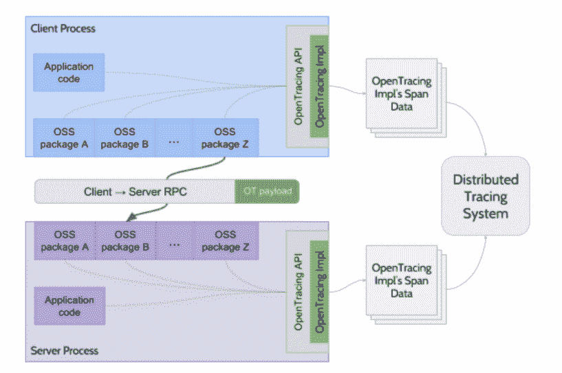
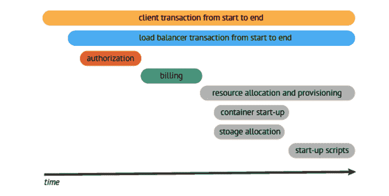
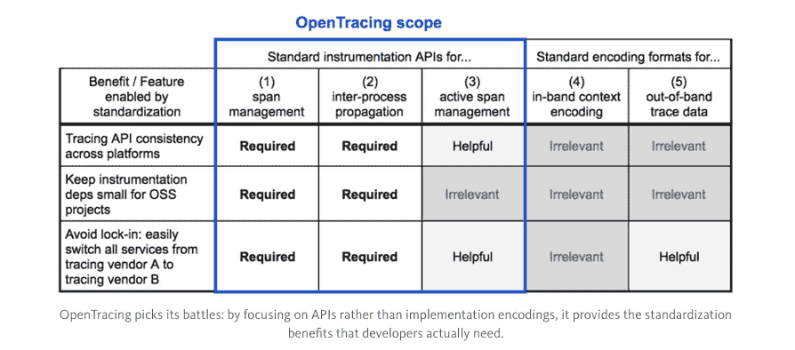
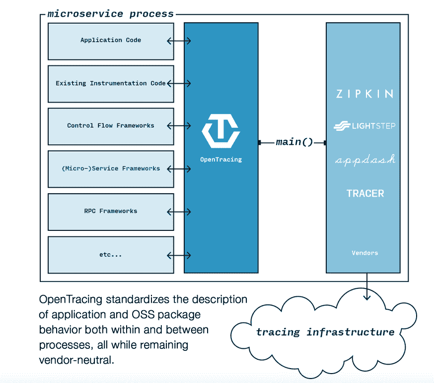

# OpenTracing 旨在更清楚地了解分布式系统中的进程

> 原文：<https://thenewstack.io/opentracing-aims-clearer-view-processes-distributed-systems/>

OpenTracing 诊断工具产生于一个关于事务跟踪的研讨会，最终成为人们的支持团体，大多数人来自大型互联网公司，他们创建了内部团队来解决这些问题。

“这些公司中的每一家都经历了如此痛苦的故事。该项目的创始人之一[本·西格曼](http://bensigelman.org/)说:“我们意识到，我们从每个人那里一遍又一遍地听到同样的故事，说与分布式追踪系统集成是多么困难。

上个月，云计算基金会[采用了](https://www.cncf.io/blog/2016/10/11/opentracing-joins-the-cloud-native-computing-foundation) OpenTracing 作为其第三个项目，紧随普罗米修斯和 [Kubernetes](/category/kubernetes/) 。

Sigelman 说，这项技术的发明者意识到根本问题是缺乏标准化。在这些公司开发应用程序的人使用了大量的开源库，但是在他们和组织的特定业务逻辑之间描述跟踪的方式没有共性。

Sigelman 说:“如果你使用监控，你需要听到一个关于你的系统的清晰、简洁的故事。问题是，10 年前创建的大多数工具都是为了讲述关于单个进程、单个虚拟机或单个机器的故事。”

Sigelman 说，跟踪系统，如 Zipkin、Dapper、HTrace、X-Trace 和其他使用不兼容 API 的应用程序解决问题，Sigelman 也是 LightStep 的联合创始人和首席执行官。西格曼在谷歌的时候建造了 Dapper。

对于 Dapper，他说，“有太多的东西，当你看到它们时，它们的效率低下、损坏或者两者兼而有之是显而易见的。我们发现的所有这些都是多进程的相互作用。…(你会看到)这个漏洞已经存在多年了，但这种情况很难追踪，除非你能看到它们在运行。”

CNCF 开始在 Kubernetes 上工作，然后在五月增加了监测项目[普罗米修斯](https://thenewstack.io/cloud-native-computing-foundation-prometheus-second-hosted-project/)。它最近宣布了 [OpenTracing](https://medium.com/opentracing/towards-turnkey-distributed-tracing-5f4297d1736#.ikciy04ha) 来实现系统的标准化，以便在交易或工作流通过分布式架构传播时对其进行跟踪。

OpenTracing 解决了跟踪数据从一个库传播到下一个库以及从一个进程传播到下一个进程时标准化较差的问题。Sigelman 说，它以一种不会将你绑定到特定供应商的方式做到这一点，无论它是 Zipkin 还是商业产品，并补充说，许多应用程序性能管理供应商预计将在未来几个月内宣布开放跟踪支持。

[英特尔的尼克·韦弗讨论编排](https://thenewstack.simplecast.com/episodes/intels-nick-weaver-discusses-orchestration)

“假设有一个商业供应商，你想用它来进行性能监控，而不是添加一堆专门针对该供应商的代码，通过你的开源依赖，所有这些都可以是 OpenTracing，这是完全通用的，”他说。这使得更换供应商变得同样容易。

Sigelman 说有三个团体关心 OpenTracing:

*   **应用程序开发人员:**这使他们能够从一个供应商转移到另一个供应商。他们可以使用许多开源项目，并让 OpenTracing 开箱即用。
*   **开源库:**提交者和维护者可以用一种允许上游用户将该库与任何下游跟踪系统绑定的方式来装备系统。像 PRPC 或 DropWizard 这样的软件能够添加工具，而不需要对用户提出特别的要求。
*   监控和跟踪系统的供应商:它给了他们一大堆插装代码，而不需要做任何工作。

应用程序代码和 OSS 包针对抽象的 OpenTracing APIs 进行编程，描述请求在每个进程中采用的路径以及进程之间的传播。OpenTracing 实现控制跟踪范围数据的缓冲和编码，它们还控制进程间跟踪上下文信息的语义。

Sigelman 说，编程语言是一个特别棘手的问题。

“当人们部署他们的服务时，如果包括移动网络客户端，他们会使用五六种语言。所以，如果你想让一些东西跨越你的系统，你需要有一套在概念上一致的 API。我认为这是公司价值主张的一个重要部分:你想知道这个库本身以及从追踪系统的角度来看语义上都有意义，”他说。

OpenTracing 以六种语言提供了厂商中立的插装: [Go](https://github.com/opentracing/opentracing-go) ， [JavaScript](https://github.com/opentracing/opentracing-javascript) ， [Java](https://github.com/opentracing/opentracing-java) ， [Python](https://github.com/opentracing/opentracing-python) ， [Objective-C](https://github.com/opentracing/opentracing-objc) ， [C++](https://github.com/opentracing/opentracing-cpp) 。它支持 Zipkin、LightStep 和 [Appdash](https://github.com/sourcegraph/appdash) tracers，可以很容易地集成到 [GRPC](https://thenewstack.io/grpc-lean-mean-communication-protocol-microservices/) 、[烧瓶](http://flask.pocoo.org/)、 [DropWizard](https://github.com/dropwizard/dropwizard) 、 [Django](https://www.djangoproject.com/) 和 [Go Kit](https://github.com/go-kit/kit) 等框架中。

优步是 OpenTracing 的早期采用者和测试者，苹果、Yelp、蟑螂实验室、Joyent 和 Workiva 也参与了该项目。

Sigelman 预测明年将会有大量的集成。他说，有一种方法可以将 OpenTracing 与应用程序集成在一起，这种方法不需要在 Kubernetes 或其他协调部署框架这样的容器环境中修改源代码。

“我希望在这种环境下看到一个开放跟踪的故事，这将需要超越 API 级别的标准化。它将涉及跟踪数据在网络上的外观以及在网络上的格式化方式的一些标准化。我渴望与这些社区的人进行对话，”他说。

他说，真正的圣杯是看到分布式跟踪工作，不需要以供应商中立的方式修改源代码，只需要改变 Kubernetes 的配置或类似的东西。

“这只是需要进行的人员交流和技术配置的问题。…这绝对是可行的。”

云计算原生计算基金会、英特尔和 Joyent 是新堆栈的赞助商。

专题图片:[所有曲目通往…](https://www.flickr.com/photos/elsie/4194374625/in/dateposted/)由 [Les Chatfield](https://www.flickr.com/photos/elsie/) 授权，**CC BY-SA 2.0**。

<svg xmlns:xlink="http://www.w3.org/1999/xlink" viewBox="0 0 68 31" version="1.1"><title>Group</title> <desc>Created with Sketch.</desc></svg>