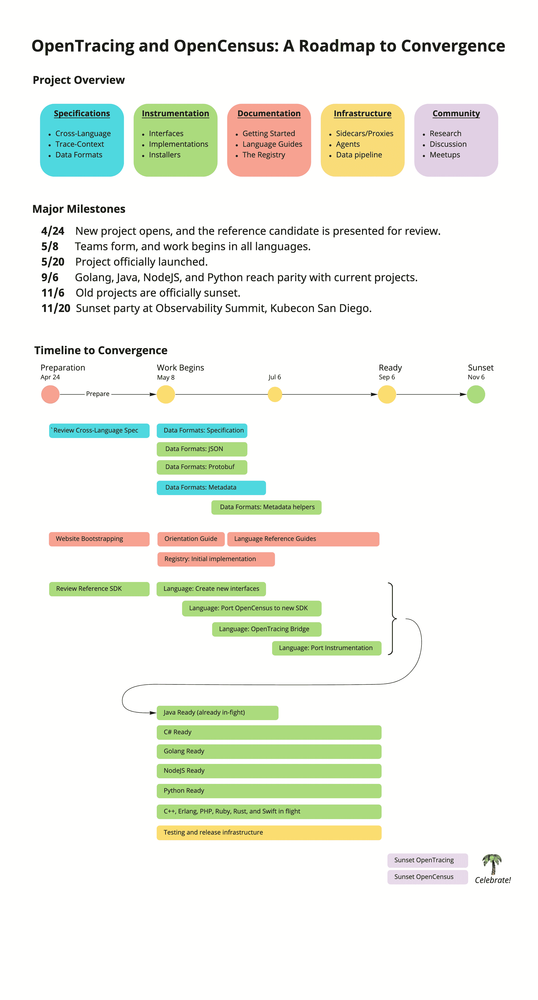

# OpenTracing，OpenCensus 合并成一个新项目，OpenTelemetry

> 原文：<https://thenewstack.io/opentracing-opencensus-merge-into-a-single-new-project-opentelemetry/>

两个开源项目已经合并为一个项目，这两个项目在为云原生操作提供指标方面发挥了重要作用。谷歌的 [OpenCensus](https://opencensus.io/) 和云计算本地计算基金会的 [OpenTracing](https://opentracing.io/) 的融合将成为[，被称为 OpenTelemetry](https://medium.com/opentracing/a-roadmap-to-convergence-b074e5815289) ，并将由 CNCF 管理。

前两个项目的组织者表示，整合背后的想法是创建一个完整的遥测系统，用于监控微服务和其他分布式系统。这也将使终端用户检测服务的过程变得更加容易，尤其是在已经[组件丰富的云原生环境](https://landscape.cncf.io/)中。

“遥测数据有多种形式，用户在做整合时不希望考虑多个品牌。OpenTracing 的联合创始人、observability 软件提供商 [LightStep](https://lightstep.com/) 的首席执行官和创始人 [Ben Sigelman](https://www.linkedin.com/in/bensigelman) 说:“他们应该只需要与一个项目集成，就可以获得他们想要的遥测技术。

到目前为止，OpenTelemetry 已经有了一个 Java 参考实现，尽管随着两个项目的团队将他们的项目合并到一个包中，更繁重的工作将很快开始。

## 深而广

负责 OpenCensus 的谷歌产品经理摩根·麦克林说:“这两个项目都反复被问到它们之间有什么不同，以至于用户很难做出选择。”。然而，每个项目都有不同的范围。

OpenTracing 专门关注分布式跟踪。OpenTracing 项目开发了 API 规范、框架和库，可用于促进一组实践和指标，旨在帮助查明分布式系统中可能出现的性能问题。OpenCensus 是一套提供全方位遥测的库，不仅包括跟踪，还包括应用度量。

OpenCensus 和 OpenTracing 代码库都将合并到新的 OpenTelemetry 项目中。该项目希望从每个项目中挑选出最好的部分。OpenTracing 为开发人员提供了一个强大的 API，用于从框架中获取数据，并将其发送给商业或开源追踪器。OpenCensus 已经构建了大量的追踪组件，减少了开发人员的工作量。

OpenTracing 和 OpenCensus 的现有用户将把 OpenTelemetry 包视为他们的下一次升级。随着时间的推移，遗留 API 可能会有一些小的变化，但为了向后兼容，将提供一个翻译层。

这两个遗留项目将再获得两年的支持。尽管到今年年底，这两个遗留项目将处于只读模式。

CNCF 计划在今年[kube con+CloudNativeCon Europe 2019](https://events.linuxfoundation.org/events/kubecon-cloudnativecon-europe-2019/schedule/)的主题演讲中提供更多关于 OpenTelemetry 的细节。

<svg xmlns:xlink="http://www.w3.org/1999/xlink" viewBox="0 0 68 31" version="1.1"><title>Group</title> <desc>Created with Sketch.</desc></svg>