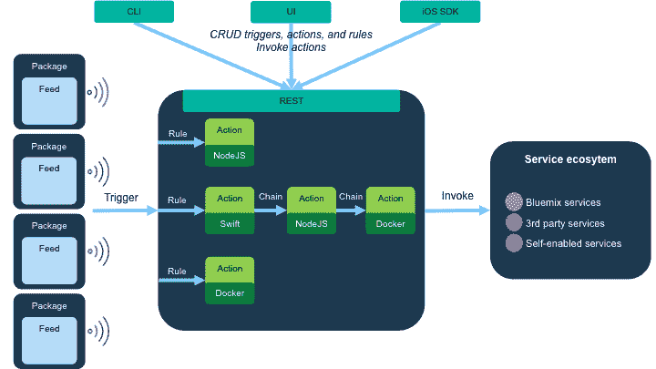
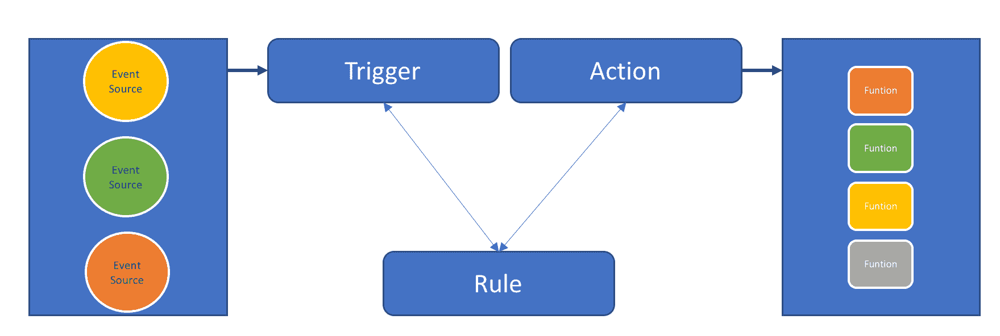
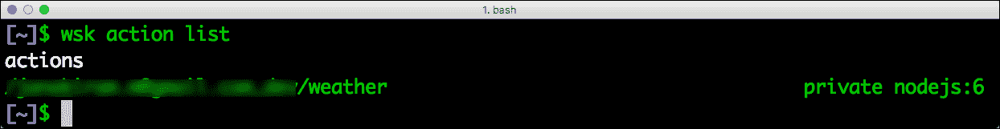
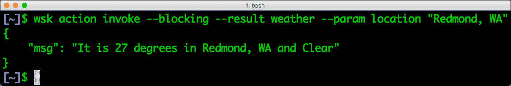
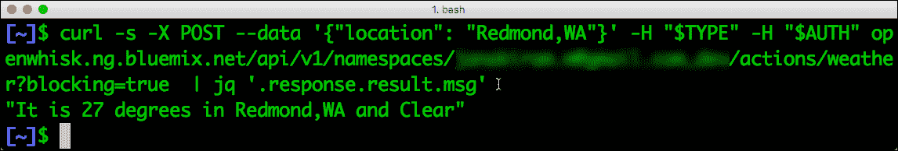

# IBM 的开源无服务器计算平台 OpenWhisk 简介

> 原文：<https://thenewstack.io/openwhisk-open-source-serverless-computing-platform/>

当亚马逊在 2014 年通过 AWS Lambda 推出[无服务器计算](/category/serverless/)时，没有人预计它会成为虚拟机和容器的替代计算模型。但自推出以来，Lambda 已经发展成为 AWS 计算服务组合的一个关键组件。与主流 AWS 服务的更深入集成、对流行语言的支持、简化的部署模型都使 Lambda 成为 AWS 客户可行的微服务平台。

虽然 [AWS Lambda](https://aws.amazon.com/lambda/) 引起了业界和开发者的注意，但人们普遍担心会被锁定。为 Lambda 设计的应用程序不能在 AWS 的上下文之外运行。对于考虑可以在数据中心和云中运行的替代方案的客户，IBM 的 OpenWhisk 可能是一个潜在的选择。

【2016 年 2 月宣布，OpenWhisk 是 IBM 的一个事件驱动计算框架。它与 IBM 基于 Cloud Foundry 的平台即服务(PaaS)的 Bluemix(T7)集成在一起，也可以作为开源软件部署在防火墙后面。Adobe 和 IBM [联合向 Apache 提交了](https://wiki.apache.org/incubator/OpenWhiskProposal) OpenWhisk，现在已经成为一个孵化项目。它是市场上第一个开源的无服务器平台之一。2016 年 12 月，IBM 宣布 [Bluemix OpenWhisk](https://console.ng.bluemix.net/openwhisk/) 正式上市，这是公有云中的托管版本。

## OpenWhisk 概念和术语

像其他无服务器框架一样，OpenWhisk 在特定事件发生时调用代码片段。OpenWhisk 中有三个关键概念:触发器、规则和动作。



触发器与特定事件相关联，比如向表中添加新行、GitHub 中的提交、传感器读数超过特定阈值。当满足特定条件时，触发器由事件源触发。

行动是橡胶与路面相遇的地方。它们是开发人员编写的代码片段，可以通过 HTTP 调用或触发器直接调用。OpenWhisk 支持 JavaScript、Java、Swift，甚至打包成 Docker 容器的任意二进制文件。

规则将操作与触发器相关联。它们充当将代码片段与事件源绑定在一起的粘合剂。一个规则可以将多个触发器与一个操作相关联。

此外，可以通过包和源简化部署。包是相关代码片段的捆绑集合，可以很容易地与他人共享。提要使得将动作与事件源集成起来变得容易。也可以将多个动作链接成一个序列，该序列可以与一个触发器相关联。

理解 OpenWhisk 最简单的方法是将其视为一个发布/订阅基础设施，能够在订阅者中嵌入和调用代码。触发器可以比作发布者，而动作就像订阅者。规则扮演关联订阅者和发布者的主题的角色。



OpenWhisk 的所有实体，包括触发器、规则和动作，都可以通过 REST API 创建和调用。例如，一个事件源可以调用 REST 端点来启动一个触发器，该触发器反过来调用相应的动作。该模型使得实现一个松散耦合的事件系统变得容易，该系统在运行时用代码片段连接各种事件源。

如果你使用过 AWS Lambda，你会发现这些概念很熟悉。Lambda 和 OpenWhisk 的关键区别在于可配置的触发器。除了受支持的 AWS 服务，如 [DynamoDB](https://aws.amazon.com/dynamodb/) 、简单队列服务( [SQS](https://aws.amazon.com/sqs/) )、简单通知服务( [SNS](https://aws.amazon.com/sns/) )和 [Kinesis](https://aws.amazon.com/kinesis/) ，AWS 开发者将不得不等待亚马逊为新服务添加 Lambda 触发器。在 OpenWhisk 中，他们可以决定哪个事件将启动触发器。因为它只是一个 REST API 调用，所以大量的资源都可以成为事件驱动的无服务器计算环境的一部分。

## 入门指南

开始使用 OpenWhisk 最简单的方法是注册 IBM Bluemix。您可以使用 Bluemix 提供的基于浏览器的代码编辑器创建您的第一个动作。下面是一个用 [node.js](https://nodejs.org/en/) 编写的简单动作，返回特定地点的天气信息。

```
var request  =  require('request');

function main(params)  {

   var location  =  params.location  ||  'Hyderabad,India';

   var url  =  'https://query.yahooapis.com/v1/public/yql?q=select item.condition from weather.forecast where woeid in (select woeid from geo.places(1) where text="'  +  location  +  '")&amp;format=json';

   return new Promise(function(resolve,  reject)  {

       request.get(url,  function(error,  response,  body)  {

           if  (error)  {

               reject(error);

           }

           else  {

               var condition  =  JSON.parse(body).query.results.channel.item.condition;

               var text  =  condition.text;

               var temperature  =  condition.temp;

               var output  =  'It is '  +  temperature  +  ' degrees in '  +  location  +  ' and '  +  text;

               resolve({msg:  output});

           }

       });

   });

}

```

一旦操作就绪，您就可以将[open whish CLI](https://console.ng.bluemix.net/openwhisk/cli)下载到您的机器上。客户端 CLI 是用 Go 语言编写的，可用于 Linux、Mac 和 Windows。

与 Cloud Foundry CLI 一样，OpenWhisk 的 wsk 工具需要针对特定的 API 端点进行配置。对于每个 Bluemix 帐户，都有一个唯一的认证密钥，可以传递给 wsk 工具。

我们可以用下面的命令
配置 CLI

```
wsk property set  --apihost openwhisk.ng.bluemix.net  --auth  &lt;unique_token&gt;

```

你可以用下面的命令
列出所有可用的动作



您应该会看到我们在上一步中创建的天气动作。OpenWhisk 中的每个实体都通过一个唯一的名称空间来标识，这个名称空间通常是当前用户的用户名。这样可以避免命名上的冲突。

让我们通过 CLI
调用该操作

```
wsk action invoke weather  --blocking

```


这应该会返回一个 JSON 响应，其中包含我们期望的结果。注意我们在调用动作时使用的**阻塞**开关。这将同步调用阻塞客户端的函数，直到执行完成。

我们还可以向动作传递参数。让我们调用带有自定义参数的函数，沿着**–result**开关，它将只显示输出。

```
wsk action invoke  --blocking  --result weather  --param location  "Redmond, WA"

```



尽管我们一直使用 CLI，但我们创建的天气操作可以很容易地通过触发器触发。例如，我们可以创建一个移动应用程序，它将在满足特定条件时调用触发器。

现在让我们用 [cURL](https://curl.haxx.se/) 调用动作。但在此之前，我们需要用 Base64 编码身份验证令牌。在 Mac 上运行以下命令来查看输出。在执行 cURL 之前，您还需要安装用于从命令行解析 JSON 的 jq。

```
export TYPE='Content-Type: application/json'

export AUTH='Authorization: Basic '`wsk property get  --auth  |  awk  '{printf("%s", $3)}'  |  base64  `

export NAMESPACE=&lt;YOUR_NAMESPACE&gt;

curl  -s  -X  POST  --data  '{"location": "Redmond,WA"}'  -H  "$TYPE"  -H  "$AUTH"  openwhisk.ng.bluemix.net/api/v1/namespaces/$NAMESPACE/actions/weather?blocking=true   |  jq  '.response.result.msg'

```



开发人员可以从任何支持 HTTP 调用的语言启动触发器。

OpenWhisk 是一个强大的开源无服务器计算平台。它将与其他多个需要无服务器和服务功能的项目集成。

在接下来的文章中，我们将探索如何配置和集成 OpenWhisk 和物联网应用程序。敬请期待！

<svg xmlns:xlink="http://www.w3.org/1999/xlink" viewBox="0 0 68 31" version="1.1"><title>Group</title> <desc>Created with Sketch.</desc></svg>