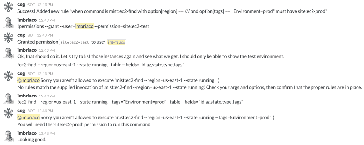
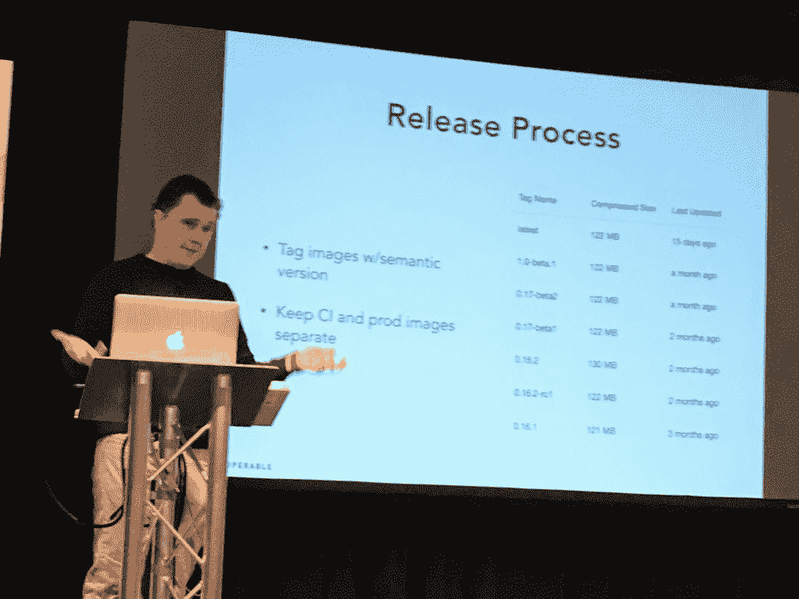
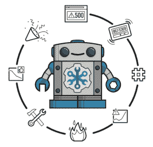

# 如何在 Docker Images 上构建 ChatOps Cog 平台

> 原文：<https://thenewstack.io/operable-built-chatops-cog-platform-docker-images/>

为了开发和打包其尖端的 ChatOps 工具，start-up Operable 转向 Docker containers，以加快软件开发过程，并使客户易于部署该工具。

在 RedMonk 伦敦 Monki Gras 活动的舞台上，Operable 首席技术官兼联合创始人[凯宾·史密斯](https://twitter.com/kevsmith)分享了他的公司如何构建 ChatOps 平台 Cog 的细节。

ChatOps 是对话驱动开发的俚语，它结合了工具和对话，利用一个[聊天机器人](https://thenewstack.io/chatbots-will-soon-kill-app-store/)，然后用插件和脚本定制，所有这些都是为你的团队更好地协作和自动化而设计的。

ChatOps 是解决分布式团队协作问题的重要工具之一，无论是跨工具、语言还是位置。以前，你可能一直在追踪同事，以找出谁做了什么，但现在聊天机器人以透明的方式工作，追踪一切。此外，这一切都伴随着大量的自动化，这有助于您的连续交付过程。

无论你是集中在一起还是分散在各处，你的团队可能已经通过 Slack 这样的聊天客户端进行交流了。现在想象一下，在授权的聊天通道中，您可以跟踪每个人的动作和通知，以及任何错误、测试结果等。

> “我认为 Docker 最大的创新是 Docker images”——凯宾·史密斯，可操作性强。

有各种各样容易定制的开源聊天机器人——[Hubot](https://hubot.github.com/)、 [Lita](https://www.lita.io/) 和 [Errbit](https://github.com/errbit/errbit) 。但是，正如 Smith 指出的那样，“ChatOps 实际上只能和你为它构建的命令一样好，实际上只能和它的插件 API 一样好。”输入重心。

可操作的齿轮在运转

史密斯的演讲不是产品推销，而是用他的公司如何建立 Cog 的故事。他首先谈到我们如何花费大量时间关注基础架构、应用程序和自动化管理，但我们往往忽略了人的因素。

Cog 是一个受 Unix 启发的共享自动化外壳或“软件的现代收缩包装”，它被打包为 Docker 映像，并使用 Docker 上的插件 API 构建。

为什么是 Docker？史密斯说“Docker 的重大创新不是容器——它们很好，非常有用，但这不是他们的核心创新。而且它们的部署也不容易，”他称之为创新的副产品。

“我认为 Docker 最大的创新是 Docker images”，他称之为“可执行包”。他说这是因为码头工人的形象是:

*   独立的
*   可执行的
*   可检查和可测试
*   跨平台

该公司选择围绕运送 Docker 图像来构建他们的工具，因为在其平台的初期，Docker 图像的下载量远远超过其他图像。Docker 选择仍然发布他们的源代码，但是停止使用开源包。

“我们建立 Docker 成像包，我们已经改变了整个管道，以适应这一目的，”史密斯说。

对于他的团队来说，使用 Docker 图像作为运输包裹的好处是:

*   对整个环境的完全控制，但是说既然他们有这种控制，就应该由他们作为供应商及时发布产品。
*   通过 [12 因素应用程序方法](https://thenewstack.io/12-factor-app-streamlines-application-development/)实现标准化配置，因此可以通过所有环境变量完成所有配置。
*   图像很容易扩展到集群环境，包括 Kubernetes 和 Swarm，很快就会支持这些环境。
*   简化支持和调试，用 Alpine Linux 做 5mg 镜像，他们整个产品 22ms。

接下来，Smith 描述了构建 Operable 的 ChatOps 平台所需的配置和设计:

*   环境变量而不是文件。
*   合理的缺省值很重要——你应该能够让基本功能正常工作，而不需要做太多的改动。
*   目录安装用于用户定制，因此数据在计算机重新启动时保持一致。

“所有这些都让我们非常注意如何管理应用程序状态，”他说。

开发团队将他们所有的 Docker 工件和它管理的代码一起版本化，这样就有一个审计跟踪来查看代码是如何被改变的，以及他们是如何更新配置的。“所以当你发布一个东西的时候，你有很高的信心它会工作，”史密斯说。

容器生态系统为开发团队提供了进行极端尝试的能力:“我们在 Docker 中做一切事情，单元测试、功能测试、集成测试，就在 Docker 内部，”Smith 说。我们不在自己的电脑上做任何事情。这使我们能够在用户之前找到粗略的边缘，我们通过 docker-compose 运行集成测试，以一种用户将与之交互的方式。"

他说，使用 Docker 解决了许多针对 ChatOps 的 API 的设计挑战，使用了以下工作流:

1.  安装:只需从回购拉图像。
2.  升级:比较图像标签，拉图像，重启容器。
3.  配置:部署 12 个因素环境变量。
4.  卸载:杀死容器进程和移动图像。
5.  执行:启动一个容器进程——Docker 公开了一些 nob，这样您就可以控制它能做什么。

Cog 开发团队在实践中是如何工作的:

*   他们没有使用 Docker CLI 工具，“因为[它]表现不佳，不是我们长期想要做的事情。”
*   因为 Docker 是开源的，他们只是抓取代码，编写自己的 Docker 客户端，与 REST API 对话，通过 Docker 守护进程公开。

“这就是我们如何确保这个命令运行器总是可用的——并且我们不必用任何实现细节来打扰用户，”Smith 说。

他说，按照这个过程，Cog 的表现是:

*   200 毫秒用于创建容器。
*   几乎没有流程执行开销。
*   集装箱销毁 90 毫秒。

最后，Smith 将他的工具和他们构建的 ChatOps 操作描述为可伸缩的，用于创建和销毁容器，而 I/O 输入输出却停滞不前。他随后总结了这一进程的以下利弊:

他确实注意到基于 Docker 图像构建 ChatOps 平台有几个缺点:容器的启动可伸缩性仍然很差，所以尽可能缓存，Smith 建议。此外，Docker 仍然需要进一步记录容器 I/O API。“像大多数开源软件一样，文档非常缺乏，”Smith 说。

基于 Docker 图像构建 ChatOps 平台的优势:

*   ●由于许多用户已经知道 Docker，所以需要为用户教育工作创建文档。
*   您有一个定义好的图像格式和良好的工具。
*   您有一个安全的流程执行。
*   Docker 储存库可以作为一种发现机制。

最后，它并不完美，但它是目前为止最适合 Cog 需求的。

可操作的特征图像。

<svg xmlns:xlink="http://www.w3.org/1999/xlink" viewBox="0 0 68 31" version="1.1"><title>Group</title> <desc>Created with Sketch.</desc></svg>