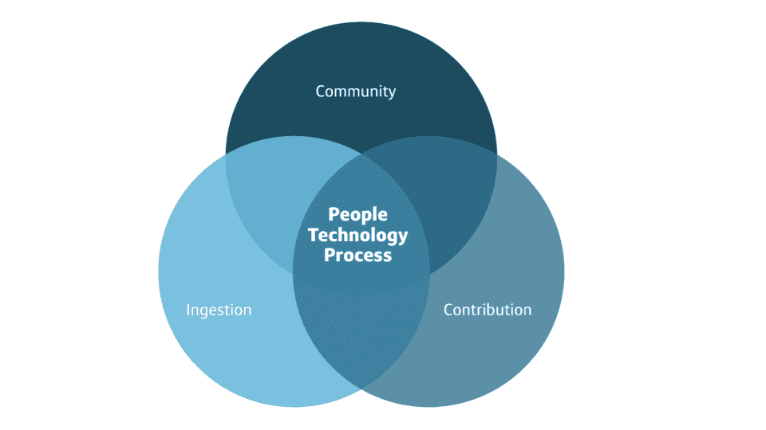

# 实施企业开发人员，第 3 部分:OSPO 3.0

> 原文：<https://thenewstack.io/operationalize-the-enterprise-developer-part-3-ospo-3-0/>

[Nureen D ' Souza](https://www.linkedin.com/in/nureen-d-souza-3b234a14/)

[Nureen 在首都一号领导开源项目办公室。她已经在该公司工作了近七年，改变了软件交付生态系统。](https://www.linkedin.com/in/nureen-d-souza-3b234a14/)

在本系列的前两篇文章([第 1 部分](https://thenewstack.io/operationalize-the-enterprise-developer/)和[第 2 部分](https://thenewstack.io/part-2-operationalize-the-enterprise-developer/))中，我们介绍了一些公司如何通过提高开发人员的运营效率来创建成功的技术平台。我们讨论了如何让您的平台变得乏味并将创新推向边缘，从而为开发人员带来明显的优势，我们还讨论了一些可以帮助工程团队更高效地参与开源供应链管理的过程。简而言之，我们已经讨论了过程和技术。

现在我们来谈谈人。开源项目办公室(OSPO)就是让更多的人参与到开源对话中来。在这篇文章中，我将讨论这些适应是如何带领我们走向我称之为 OSPO 3.0 的，我将为你定义它。

## **人:你的开源框架的中心**

正如优秀的领导者所知道的那样，工程师不是可替代的资源，你可以简单地插入一个给定的工作流程，并期望立即得到结果。工程师也是人，风险经理、安全专家、IT 支持人员、法律顾问、营销人员、人力资源经理，是的，甚至上层管理人员也是人。所有这些人都是 OSPO 的利益相关者。然而，对于许多构建 OSPOs 的公司来说，人-过程-技术三角关系中的人这个角落往往最容易被忽视，因为坦率地说，这是最难解决的问题。将非技术人员整合到您的 OSPO 中可能感觉是一项令人生畏的任务，但这是操作企业开发人员的关键部分，因为它将技术和非技术团队聚集在一起，讨论开源如何影响整个公司。

随着开放源码在当今许多公司中发挥越来越大的作用，你不能再即兴发挥了。Capital One 在 2015 年首次创建了一个 OSPO，作为全公司数字化转型的一部分，该转型侧重于[增强开发者](https://thenewstack.io/how-open-source-drives-cloud-innovation-at-capital-one/)的能力。从那时起，我们的 OSPO 不断发展以应对新的挑战，行业内其他企业也是如此。

## **OS pos 简史**

OSPO 1.0 时代始于像孙、英特尔和 IBM 这样的公司创建了工程部门，使得开源代码可以随时插入到内部和外部的产品中。

当像谷歌这样的公司增加社区营销和推广时，OSPO 2.0 模式出现了，以达到他们开源平台的目标，并增加全球开源采用的增长。 [TODO 集团甚至创建了一个创建开源程序的指南](https://todogroup.org/guides/create-program/)。

但是新时代带来了新的挑战。我们不再需要在全球范围内宣传开源合作。它已经赢了。我们现在需要的是安全性、可持续性以及对工程师进行合作最佳实践方面的培训。因为尽管开源开发已经在世界范围内取得了胜利，但是在内部取得成功仍然是一个挑战。

## **OSPO 3.0:培养协作文化**

除了第一代和第二代开源项目办公室的责任之外，OSPO 3.0 使开发者能够为公共开源项目做出贡献。这需要法律、风险、人力资源、营销和其他非技术团队的参与，以确保所有贡献不仅合规，而且有利于整体业务。记住:不在于你在给定的时间内做出了多少贡献，而在于这些贡献的质量和交付的商业价值，无论是对于那些上游项目还是下游用例。世界银行最近写了一篇博文,讲述了他们的开源项目如何带来更高的投资回报，以及一旦他们将产品经理、技术作家和培训团队纳入进来，如何更深入地吸引开发人员。

任何 OSPO 3.0 流程的第一步都是支持开发人员通过正确的技术和流程框架做出正确的贡献，同时确保利益相关者参与到流程中。我们的目标是让每一行代码都反馈到开源社区，同时为组织创造价值。

我们如何做到这一点？您应该确保工程和产品团队与开发人员紧密合作，以创建同时支持内部关键应用程序和流程的公共代码。这是一个上游优先的框架，你在公共的上游社区中处理代码，然后把它拉到下游来处理内部用例。衡量价值也可能意味着营销团队赞助一个黑客马拉松或编码项目，以提高该公司作为开源软件冠军的知名度，其双重目标是展示该公司是开发人员工作的好地方。这可能意味着法律团队与开发人员合作，以确保创建的任何代码不仅符合公司法规，而且符合与供应商、公共云或其他合作伙伴建立更广泛合作关系的法律框架。

OSPO 3.0 的责任不止于公司的边界，还包括外部利益相关者和建立有利于组织战略的社区参与。一个例子是为公司的需求构建基础包，如 [OpenSSL](https://www.openssl.org/) 或 [Python 软件基础](https://www.python.org/psf/)。这可能意味着客户成功负责人定期与 OSPO 会面，就客户不断要求的特定功能提供反馈，以查看它们是否可以在开源中开发。

在 Capital One，我们开始构建 OSPO 3.0，与许多不同的团队密切合作，探索开发者驱动的开源文化如何帮助他们更有效地完成工作，更好地服务于我们的客户。我们让非技术团队加速我们的开源计划，相反，教育开发人员他们在更广泛的组织中扮演的角色。我们还需要不断地与我们的风险合作伙伴一起改进流程，以帮助我们的开发人员以更加结构化和自动化的方式为公共开源项目做出贡献。构建 OSPO 3.0 没有唯一的方法，但最重要的方面是专注于将整个组织的人都纳入进来。

## **3×3 型号**

为了更深入地研究构建 OSPO 3.0 的本质，将它想象成一个 3×3 的模型可能会有所帮助。典型的 OSPO 管理开源框架的三个主要部分:使用、贡献和社区建设。对于这三个领域中的每一个，您都应该解决三个关键方面:技术、过程和人员。问自己这些关键问题:

*   对于我的 OSPO 的使用(或贡献，或社区建设)部分，需要哪种技术来促进该任务？
*   需要实施哪些流程？
*   讨论中应该包括哪些人？

最后一部分可能是一个困难的练习。你的公司奖励跨团队协作吗？打破孤岛是您的工程师喜欢的活动还是他们害怕的事情？

以 OSPO 的用法部分为例。您将需要购买技术来管理如何在您的公司内使用开源来构建应用程序。这可能是开发工具、企业开源产品和/或法律或合规软件。然后，您将需要建立流程来管理开发人员如何在公司内部使用开源软件。最后，您需要让几个人参与使用讨论，包括来自 IT、安全、工程、产品开发和客户成功的经理，以及外部利益相关者，如企业开源供应商和公共云。这听起来可能很容易，但是您企业中的几个团队可能对特定的平台或工具集有偏好。你有可靠的方法来推动整合吗？你如何安排利益相关者来促进这种练习？

为 OSPO 凳子的下两条腿完成相同的 3×3 结构化过程:贡献和社区建设。在您的技术和流程为贡献和社区建设就位之后，您就可以考虑人员组件了。对于贡献部分，您将让来自法律、风险和网络安全团队的人员以及您在使用对话中涉及的技术人员参与进来。对于社区建设方面，你可以开始接触营销，品牌，技术作家，人力资源，活动策划团队和其他人。在这两种情况下，您都必须采取措施来确保利益相关者在哪些社区应该获得最高优先级方面保持一致。让一项工作优先于另一项工作，你觉得舒服吗？如果没有，你需要考虑哪些利益相关者参与，以及你如何在对任何技术组织来说都是棘手的话题上促进一致和结盟。

开源可能看起来是世界上最“技术化”的东西，但事实上它是一个完美的框架来开始一个关于公司范围内协作的更大的对话。OSPO 3.0 可以成为您组织的核心，推动协作，让您的公司在当今以开发者为导向的世界中走上成功之路。

<svg xmlns:xlink="http://www.w3.org/1999/xlink" viewBox="0 0 68 31" version="1.1"><title>Group</title> <desc>Created with Sketch.</desc></svg>