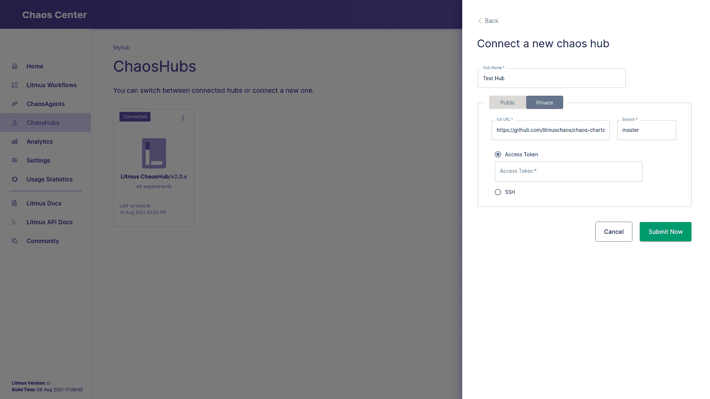
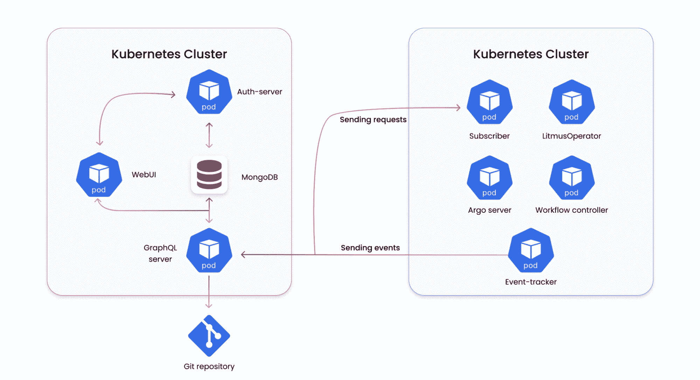
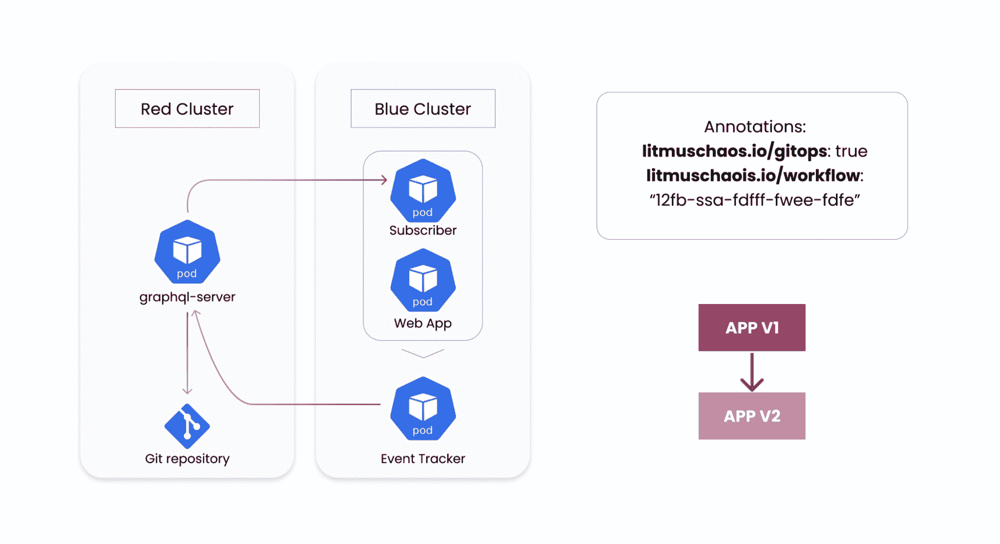

# 用 GitOps 实施混沌工程

> 原文：<https://thenewstack.io/operationalizing-chaos-engineering-with-gitops/>

Kubernetes 是云原生生态系统运行的核心基础。Kubernetes 的收敛特性有助于实现最纯粹的 GitOps。虽然 GitOps 工具的最初采用集中在与目标集群同步的“Kubernetes 部署代码”上，但随着集群 API 和 Crossplane 等项目的出现，它已经发展到管理核心平台基础设施中的漂移。

## GitOps 是 CNCE 的核心原则

 [卡尔蒂克·萨奇塔南德

Karthik 是 ChaosNative 的联合创始人兼首席技术官。](https://www.linkedin.com/in/karthik-satchitanand/) 

当 LitmusChaos 作者定义 [cloud native chaos](https://www.cncf.io/blog/2019/11/06/cloud-native-chaos-engineering-enhancing-kubernetes-application-resiliency/) 时，其想法无疑是通过使用自定义资源(CRD)来定义故障注入和稳态验证意图，保持 chaos/resilience 测试方法和体验与其他 Kubernetes 功能的一致性。这种类型的定义有助于存储在 git 源代码中，从而实现审计、版本控制和自动化。

自动化是混沌工程的核心原则。虽然这适用于任何工程系统，但它在云原生环境中的相关性更大。这是由核心应用服务相对更快的升级节奏、来自 CNCF(云本地计算基金会)生态系统的依赖工具、Kubernetes 版本以及有时底层托管基础设施本身所驱动的。通过执行混沌测试，可以验证变化。这就要求混沌实验与标准的 GitOps 流联系起来。

### 要求和挑战

正如上面的讨论所揭示的，下面是使用 GitOps 的有效混沌工程的要求:

*   **单一事实来源:**确保混沌神器存储在单一事实来源中，并确保总是挑选最新的实验定义。
*   **自动化测试:**确保由 GitOps 控制器促成的核心应用程序变更通过自动化混沌注入进行测试。

虽然需求的紧迫性显而易见，但也存在一些实际挑战:

*   **按需和预定运行:**混沌实验通常作为按需或预定任务执行。对于端到端的实验来说尤其如此，这些实验涉及稳态检查、合成负载和其他面向实例/运行的操作。这些通常是通过某种控制平面来执行的，这种控制平面本身就是一个 Kubernetes 应用。因此，它们不像标准应用程序资源那样一直“活”着。尽管它们有声明性的定义。
*   当工具的智能设计克服了之前的挑战时，每当测试的定义在源代码中改变时，注入混乱是不可取的。混乱注入的触发应该由部署环境的所有者/涉众控制，并且应该是任意的。
*   **映射混沌测试:**需要用一套特定的混沌测试来映射应用程序和基础组件。虽然混沌的定义是随机的，实验本质上是探索性的，但实验的分类是有价值的，在自动运行的情况下，验证已知行为和捕获未知行为也是有价值的。

## LitmusChaos 中的 GitOps 实现

Litmus 通过一个定制的 GitOps 实现来满足这些要求，该实现确保驻留在集群上的控制平面在 git 源代码中选择最新的混沌定义，将应用程序映射到特定的场景或工作流，并在集群上的应用程序发生变化时启动这些应用程序。

Litmus 控制平面作为一组 Kubernetes 微服务运行，以几种不同的方式与 git 进行交互。

### ChaosHub 上的静态混沌伪影

Litmus 提供了易于使用的故障模板，同时还允许用户使用这些故障构建更复杂的工作流，在 litmus lingua franca 中称为预定义工作流。这些可以存储在 git 存储库中的特定结构中，该存储库充当“ChaosHub”的[规范源](https://github.com/litmuschaos/chaos-charts)

每个混沌实验或预定义的工作流都由一组文件来表征:核心定制资源，(可选的)执行实验的 RBAC 定义和一些元数据文件(包含描述、关键字、源链接、父类别等。).这种通过 SSH 密钥或访问令牌连接的公共或私有的 ChaosHub 可以添加到 Chaos-Center 中，并作为目录来选择在集群上执行的实验。在源代码中通过用户提交对错误或工作流模板所做的更改对开发人员来说是可用的，以便随后调用实验。

### 双向同步混沌工作流定义

虽然上一节描述了手写的 chaos 工件，但是有一些机制可以确保使用集群上的 chaos dashboard 构建的 chaos 工作流被保存到源代码中，从而促进了黄金拷贝。Litmus 服务器运行 git 服务，通过该服务，新构建的工作流被存储到 git 存储库中，该存储库可以与充当 hub 源的存储库相同，也可以与工作流的实例元数据、其相关联的控制平面和目标集群环境不同。这个 git 服务本质上是双向的；例如，对 git 存储库上的这些工作流规范所做的更改会自动同步到 Chaos-Center 中。更新后的规范可以用于该工作流的后续调用。

## 事件触发的混沌注入

随着混乱工件的变化变得可用，下一个需求是将这些工作流与集群上的应用程序进行映射。这是由 Litmus 中的事件跟踪器操作者完成的，它启用了一个订阅模型，其中给定的 Kubernetes 工作负载可以订阅 chaos-Center 上的 git 同步 Chaos 工作流，并通过 EventTracker 策略资源以声明方式描述触发该工作流的事件。

事件跟踪器监视应用程序工作负载的上述变化，这有助于通过注释进行监控，并在发生变化时触发工作流，这主要是通过标准 GitOps 控制器的同步操作发生的。这样，可以执行健全性混乱测试，用户可以根据实验报告的混乱结果设置回滚机制。

LitmusChaos 很容易在 Kubernetes 集群或名称空间上部署。在 [litmuschaos.cloud](https://litmuschaos.cloud) 注册，快速开始混沌工程，或者按照[文档](https://docs.litmuschaos.io)在您自己的 Kubernetes 集群上安装 Litmus。

<svg xmlns:xlink="http://www.w3.org/1999/xlink" viewBox="0 0 68 31" version="1.1"><title>Group</title> <desc>Created with Sketch.</desc></svg>