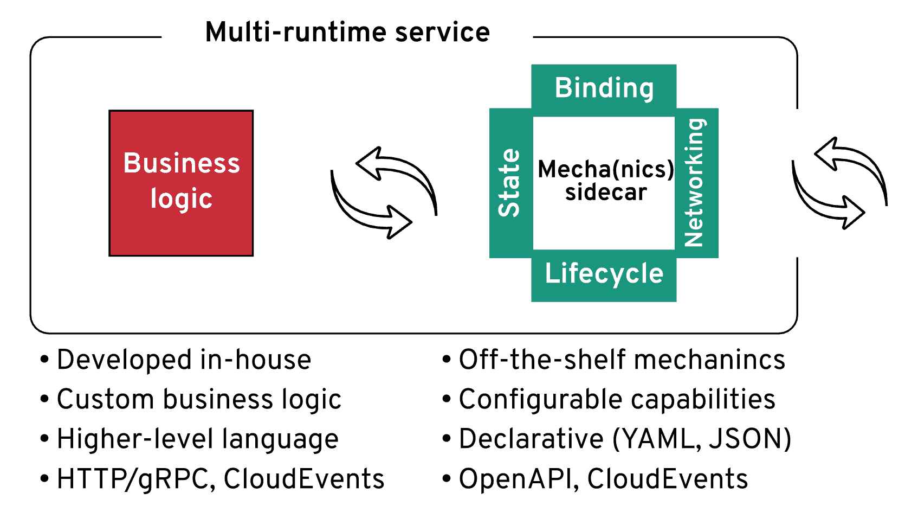
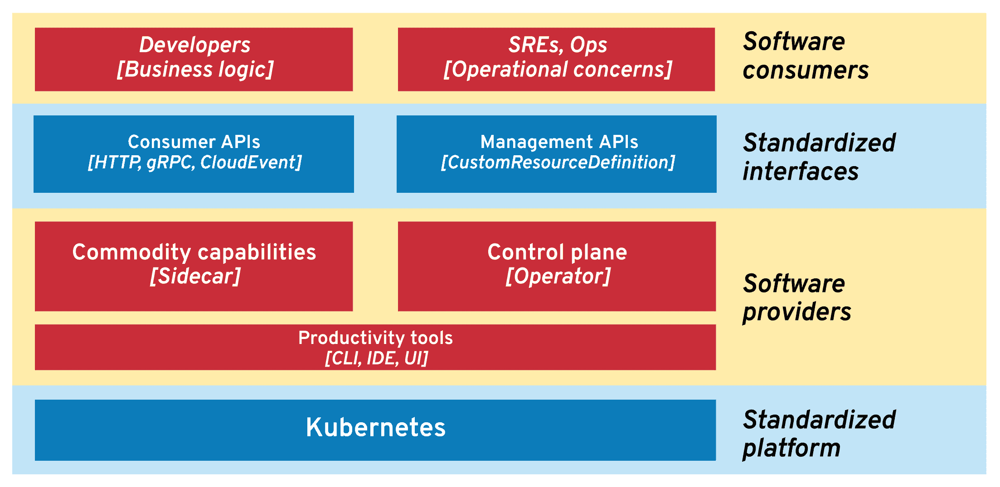

# 操作员和边车是软件交付的新模式

> 原文：<https://thenewstack.io/operators-and-sidecars-are-the-new-model-for-software-delivery/>

[Bilgin ibr yam](https://twitter.com/bibryam/)

[Bilgin ibr yam(@ bibryam)是 Red Hat 的产品经理和前架构师，也是 Apache 软件基金会的成员。他经常写博客，偶尔发言，是 Camel Design Patterns 的作者，也是 Kubernetes Patterns 书籍的合著者。Bilgin 目前的工作重点是数据集成技术与云原生架构的交叉。](https://twitter.com/bibryam/)

今天的开发人员被期望开发弹性和可伸缩的分布式系统。面对安全问题时易于修补的系统，以及易于进行低风险增量升级的系统。受益于软件重用和开源模型创新的系统。对于不同的语言，使用各种具有嵌入式库的应用程序框架来实现所有这些是不可能的。

最近，我在博客[上发表了关于“多运行时微服务架构”的文章](https://www.infoq.com/articles/multi-runtime-microservice-architecture/)，其中我探讨了分布式系统的需求，比如生命周期管理、高级网络、资源绑定、状态抽象，以及这些抽象是如何在这些年中发生变化的。我还[谈到了](https://www.youtube.com/watch?v=CZPEIJFJV9k)关于“Kubernetes 上分布式系统的发展”,涵盖了 Kubernetes 操作者和 sidecar 模型如何作为交付相同分布式系统原语的主要创新机制。

在这两种情况下，主要的收获是预测 Kubernetes 上的软件应用程序架构的发展将走向运营商管理的 sidecar 模型。Sidecars 和 operators 可能会成为主流的软件分发和消费模式，在某些情况下甚至会取代我们已经习惯的软件库和框架。

sidecar 模型允许用不同语言编写的应用程序的组合更快地交付联合价值，并且没有运行时耦合。让我们看几个边车和操作员的具体例子，然后我们将探索这种新的软件组合范例如何影响我们。

## 进程外智能正在增加

在 Kubernetes 中，边车是[核心设计模式之一](http://k8spatterns.io/)，通过在一个 Pod 中组织多个容器可以轻松实现。Pod 结构确保容器总是放置在同一节点上，并且可以通过网络、文件系统或其他 IPC 方法进行交互来进行协作。[操作员](https://kubernetes.io/docs/concepts/extend-kubernetes/operator/)允许自动操作、管理边车并将其与平台的其余部分集成。sidecars 代表一种语言无关的、可伸缩的数据平面，为定制应用程序提供分布式原语。运营商代表他们的集中管理和控制平面。

我们来看看边车模式的几个流行表现。

### 使者

Istio、Consul 等服务网格正在使用透明的服务代理，如 [Envoy](https://www.envoyproxy.io/) ，为分布式系统提供增强的网络功能。Envoy 可以提高安全性，支持高级流量管理，提高弹性，增加深度监控和跟踪功能。不仅如此，它理解越来越多的第 7 层协议，如 Redis，MongoDB，MySQL 和最近的 Kafka。它还增加了响应缓存功能，甚至 WebAssembly 支持，这将启用各种定制插件。Envoy 是一个透明服务代理如何将高级网络功能添加到分布式系统中的示例，而无需将它们包含在分布式应用程序组件的运行时中。

### 斯库伯

除了典型的服务网格，还有一些项目，如 [Skupper](https://skupper.io/) ，通过外部代理提供应用程序网络功能。Skupper 通过第 7 层虚拟网络解决多集群 Kubernetes 通信挑战，并提供高级路由和连接能力。但是它并没有将 Skupper 嵌入到业务服务运行时中，而是按照 Kubernetes 名称空间运行一个实例，该实例充当共享的 sidecar。

### 云状态

Cloudstate 是 sidecar 模型的另一个例子，但是这次是为无服务器开发模型提供有状态抽象。它通过 GRPC 为事件源、CQRS、发布/订阅、键/值存储和其他用例提供有状态原语。同样，这是一个 sidecars 和 operators 在起作用的例子，但这次是针对无服务器编程模型。

### Dapr

Dapr 是由微软发起的一个相对年轻的项目，它也使用 sidecar 模型来提供面向开发者的分布式系统原语。Dapr 为状态管理、服务调用和故障处理、资源绑定、发布/订阅、分布式跟踪等提供了抽象。尽管 Dapr 和服务网格提供的功能有一些重叠，但两者在本质上是非常不同的。带有 Istio 的 Envoy 是从服务中注入并透明运行的，它代表了一个操作工具。另一方面，Dapr 必须通过 HTTP 或 gRPC 从应用程序运行时显式调用，它是面向开发人员的显式 sidecar。它是一个分布式原语库，作为一个 sidecar 分发和使用，这种模型对于使用分布式功能的开发人员来说可能非常有吸引力。

### 骆驼 K

Apache Camel 是一个成熟的集成库，它在 Kubernetes 上重新发现了自己。它的子项目 [Camel K](https://camel.apache.org/camel-k/latest/index.html) 大量使用运营商模型来改善开发者体验，并与 Kubernetes 平台深度集成。虽然 Camel K 不依赖于 sidecar，但通过其 CLI 和操作符，它能够重用同一个应用程序容器，并在不到一秒钟的时间内在远程 Kubernetes 集群中执行任何本地代码修改。这是另一个通过运营商模式以开发者为目标的软件消费的例子。

## 还会有更多

这些只是通过边车和操作员探索各种方法的先锋项目的一部分。还有更多工作要做，以减少基于容器的分布式架构引入的网络开销，如数据平面开发工具包( [DPDK](https://www.dpdk.org/) )，这是一个用户空间应用程序，它绕过 Linux 内核网络堆栈的各层，直接访问网络硬件。Kubernetes 项目致力于创建具有更细粒度生命周期保证的[边车](https://github.com/kubernetes/enhancements/issues/753)容器。有一些基于 GraalVM 实现的新 Java 项目，如 [Quarkus](https://quarkus.io/) ，它们减少了资源消耗和应用程序启动时间，这使得更多的工作负载对 sidecars 有吸引力。所有这些创新将使侧车模型更具吸引力，并能创造更多这样的项目。

提供分布式系统原语的边车

我不会惊讶地看到项目围绕更具体的用例出现，例如长期运行流程的有状态编排，如 sidecars 中的业务流程模型和符号(BPMN)引擎。边车中的作业调度程序。无状态集成引擎，即 sidecars 中的企业集成模式实现。sidecars 中的数据抽象和数据联合引擎。oauth 2/[OpenID](https://github.com/louketo/louketo-proxy)sidecars 中的代理。sidecars 中无服务器工作负载的可扩展数据库连接池。边车等应用网络。但是为什么软件供应商和开发者会转向这种模式呢？让我们来看看它提供的一些好处。

## 控制平面在库上的运行时

如果你现在是一个软件供应商，你可能已经考虑过将你的软件作为 API 或者基于 SaaS 的解决方案提供给潜在用户。如果可能的话，这是最快的软件消费模式，也是一个显而易见的选择。根据软件的性质，您也可以将您的软件作为库或运行时框架来分发。也许现在是时候考虑是否可以将它作为一个容器提供给操作员了。这种分发软件的机制和由此产生的体系结构有一些库机制无法提供的非常独特的好处。

### 支持多语言消费者

通过提供可通过开放协议和标准消费的库，您为所有编程语言开放了它们。一个作为 sidecar 运行并可通过 HTTP 使用的库，使用诸如 JSON 之类的文本格式，不需要任何特定的客户机运行时库。即使当 gRPC 和 Protobuf 用于低延迟和高性能的交互时，生成这样的客户端仍然比在应用程序运行时中包含第三方定制库和实现某些接口更容易。

### 与应用架构无关

显式 sidecar 体系结构(与透明体系结构相反)是一种软件能力消费方式，它是一个以开发人员为中心的 API 背后的独立运行时。这是一个正交特性，可以添加到任何应用程序中，无论是单片应用程序、微服务应用程序、基于功能的应用程序、基于角色的应用程序，还是介于两者之间的任何应用程序。在动态性较低的环境中，它可以位于一个整体的旁边，或者在动态的基于云的环境中，它可以位于每个微服务的旁边。在 Kubernetes 上创建 sidecars 很简单，在许多其他软件编排平台上也是可行的。

### 容忍释放阻抗不匹配

业务逻辑总是在内部定制和开发的。分布式系统原语是众所周知的商品特性，既可以作为平台特性，也可以作为运行时库使用。您可能会使用状态抽象、消息客户端、网络弹性和监控库等软件。来自第三方开源项目或公司。这些第三方实体也有他们的发布周期、关键修复、CVE 补丁，它们也会影响您的软件发布周期。当第三方库作为单独的运行时(sidecar)使用时，升级过程更简单，因为它在 API 后面，并且不与您的应用程序运行时耦合。您的团队和所消费的第三方库供应商之间的发布阻抗不匹配变得更容易管理。

### 控制平面包括心态

当一个特性作为一个库被使用时，它就包含在你的应用程序运行时中，你有责任去理解它是如何工作的，如何配置、监控、调整和升级。这是因为语言运行时(如 JVM)和运行时框架(如 Spring Boot 或应用服务器)决定了如何包含、配置、监控和升级第三方库。当一个软件功能作为一个单独的运行时(比如一个 sidecar 或独立的容器)被消费时，它以一个 [Kubernetes 操作符](/automating-kubernetes-cluster-operations-operators/)的形式拥有自己的控制平面。

这有很多好处，因为控制平面了解它管理的软件(操作数),并附带所有必要的管理智能，否则这些智能将作为文档和最佳实践分发。此外，运营商还与 Kubernetes 进行了深度集成，提供了平台集成和开箱即用的操作数管理智能的独特组合。操作符是由创建操作数的同一批开发人员创建的，他们了解容器化特性的内部，知道如何最好地操作。运营商是容器中的可执行软件，随着更多运营商和[市场](https://marketplace.redhat.com)的出现，运营商的[数量](http://operatorhub.io/)和他们的能力正在稳步增加。

## 未来的软件分发和消费

### 作为带控制面板的侧柜分发的软件

假设你是一个 Java 框架的软件提供商。您可以将它作为档案或 Maven 工件分发。也许你更进一步，你分发了一个容器图像。无论哪种情况，在今天的云原生世界中，这都不够好。用户仍然需要知道如何在不停机的情况下修补和升级正在运行的应用程序。他们必须知道要备份什么并恢复其状态。他们必须知道如何配置他们的监控和警报阈值。他们必须知道如何检测复杂的故障并从中恢复。他们必须知道如何根据当前的负载状况来调整应用程序。

在所有这些和类似的场景中，Kubernetes 操作符形式的智能控制平面就是答案。操作员将应用程序的平台和领域知识封装在声明性配置的组件中，以管理工作负载。

> Sidecars 和 operators 可能会成为主流的软件分发和消费模式，在某些情况下甚至会取代我们已经习惯的软件库和框架。

让我们假设您正在提供一个软件库，它作为一个依赖项包含在消费者应用程序中。可能就是上面说的后端框架的客户端库吧。例如，如果它是用 Java 编写的，你可能已经证明它可以在 JEE 服务器上运行，只要 Spring Boot 的启动者、构建者、工厂和其他实现都隐藏在一个干净的 Java 接口后面。你甚至可以把它转接到。网也是。

与 Kubernetes 运营商和边车所有这一切是隐藏的消费者。工厂类由操作符代替，唯一的配置接口是定制资源的 YAML 文件。然后，操作员负责配置软件和平台，以便用户可以将它作为显式边车或透明代理来使用。在所有情况下，您的应用程序都可以通过远程 API 使用，并与平台功能甚至其他相关操作符完全集成。让我们看看这是如何发生的。

### 通过远程 API 而不是嵌入式库消费的软件

思考 sidecars 的一种方式类似于面向对象程序设计中的组合优先继承原则，但是是在多语言环境中。这是一种不同的组织应用程序职责的方式，它通过组合来自不同流程的功能，而不是将它们作为依赖项包含在一个应用程序运行时中。当您将软件作为库使用时，您实例化了一个类，通过传递一些值对象来调用它的方法。当您将它作为进程外功能使用时，您访问的是一个本地进程。在这个模型中，方法用 API 代替，进程内方法调用用 HTTP 或 gRPC 调用代替，值对象用 CloudEvents 之类的东西代替。这是从应用服务器到作为分布式运行时的 Kubernetes 的变化。从特定于语言的接口到远程 API 的变化。从内存调用到 HTTP，从值对象到 CloudEvents 等等。

这需要软件提供商分发容器和控制器来操作它们。创建能够在本地构建和调试多个运行时服务的 ide。CLI 用于将代码变更快速部署到 Kubernetes 中并配置控制平面。编译器可以决定在自定义应用程序运行时编译什么，从 sidecar 使用什么功能，从编排平台使用什么功能。

软件消费者和提供商生态系统

从长远来看，这将导致用于边车中通用原语消费的标准化 API 的整合。我们将拥有多语言 API，而不是特定语言的标准和 API。例如，与 Java 数据库连接(JDBC) API、Java 缓存 API(JCache)、Java 持久性 API (JPA)不同，我们将使用类似 CloudEvents 的东西在 HTTP 上使用多语言 API。用于消息传递、缓存、可靠联网、cron 作业和定时器调度、资源绑定(到其他 API、协议的连接器)、幂等性、SAGAs 等的 Sidecar 中心 API。所有这些功能都将通过管理层以运营商的形式提供，甚至与自助服务用户界面包装在一起。运营商是这里的关键推动者，因为他们将使这个更加分布式的架构易于管理和在 Kubernetes 上自我操作。操作者的管理接口由 CustomResourceDefinition 定义，代表另一个面向公众的 API，它仍然是特定于应用程序的。

在交付速度和可操作性的驱动下，这是一个心态上的巨大转变，以不同的方式分发和消费软件。这是从单运行时到多运行时应用程序架构的转变。这种转变类似于摩尔定律终结时硬件行业从单核平台向多核平台的转变。这是一个通过构建拼图的所有元素而慢慢发生的转变:我们已经统一采用和标准化了容器，我们通过 Kubernetes 有了一个事实上的编排标准，可能很快就会改进 sidecars，运营商快速采用，CloudEvents 作为一个广泛认可的标准，Quarkus 等轻量级运行时。有了基础，应用程序、生产力工具、实践、标准化 API 和生态系统也会随之而来。

<svg xmlns:xlink="http://www.w3.org/1999/xlink" viewBox="0 0 68 31" version="1.1"><title>Group</title> <desc>Created with Sketch.</desc></svg>