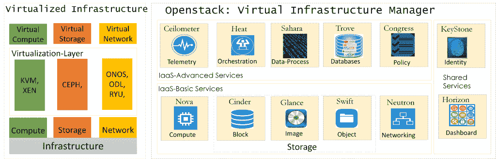
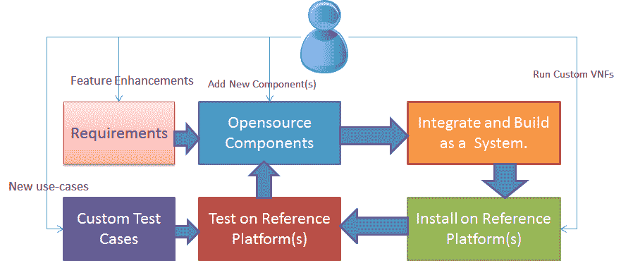
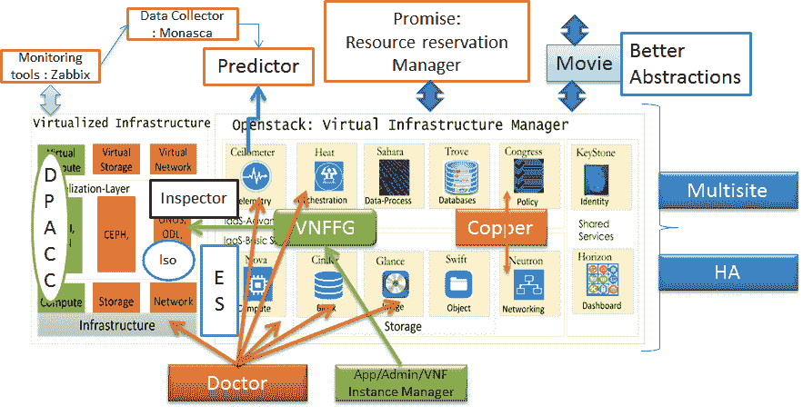
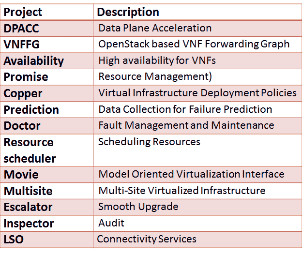
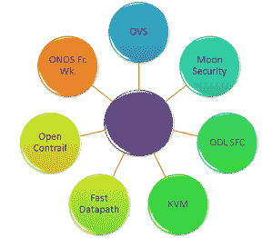

# OPNFV 如何实现网络功能虚拟化

> 原文：<https://thenewstack.io/opnfv-operationalizes-network-functions-virtualization/>

*Editor’s Note: This is the second part of a multi-part series detailing Network Functions Virtualization, an emerging set of technologies to virtualize the network layer. The first part of the series, the introduction to NFV, can be found [here](https://thenewstack.io/de-ossify-the-network-with-function-virtualization/).*

得益于云计算，网络流量正呈指数级增长。服务提供商面临着满足最终用户和企业需求的巨大压力，因此毫不奇怪，他们正在寻求软件定义网络(SDN)和网络功能虚拟化(NFV)等技术来提高服务灵活性和运营效率。

开源软件已经成为应对这些挑战的关键因素。在本文中，我们将关注这样一个开源项目，【OPNFV 开放平台 (OPNFV)，这是一个面向 NFV 的电信级开源参考平台。

## 大局

在 Linux Foundation 的支持下，OPNFV 试图将提供商、云和基础设施供应商、开发人员和用户聚集在一起，为行业定义一种新型的参考平台，将现有的开源构建模块与新的组件和测试相集成，以加速 NFV 的开发和部署。

OPNFV 是一个合作项目，涉及美国电话电报公司、中国移动、NTT DOCOMO、意大利电信和沃达丰等服务提供商以及 Brocade、思科、戴尔、爱立信、惠普、华为、IBM、英特尔、瞻博网络、NEC、诺基亚网络和 Red Hat 等 IT 供应商。

所有这些行业领导者都致力于通过构建电信级参考平台来推动 NFV 的发展。重点是使多个开源组件具有互操作性，同时实现一致性和高性能。在这方面，OPNFV 与多个上游项目合作，协调持续集成和测试，同时填补开发空白。

OPNFV 的目标不是开发和制定标准，而是与各种标准组织密切合作，如 [ETSI 的 NFV 互联网标准组织](http://www.etsi.org/technologies-clusters/technologies/nfv)、ONF 和 IEEE，以确保 NFV 参考平台标准的一致实施。

OPNFV 最初的重点是虚拟化基础设施。考虑到使用 OpenStack 作为虚拟基础架构管理器，下图描述了最初对 OPNFV 的关注。

OPNFV 的第一步是组装一个最小的基础设施集，以实现现实世界的部署。最少的软件包括计算软件(OS Nova、KVM)、存储软件(OpenStack Glance 和 Cinder)、网络软件(OpenDaylight、OVS 和 ONOS)、基础设施软件(RabbitMQ、PaceMaker、MySQL)、运营软件(OpenStack Horizon、Keystone 和 Heat)和测试软件(OpenStack Tempest 和 Robot、Rally)。

OPNFV 的第一个版本名为 ARNO，于 2015 年 6 月发布。下一个版本将被命名为布拉马普特拉河，计划于 2016 年初发布。随着 ARNO 的发布，ISO 映像可以使用[燃料](https://wiki.openstack.org/wiki/Fuel)和[工头](http://theforeman.org/)部署工具进行部署。该版本包括各种开源组件，包括 open stack(Juno 版本)、 [OpenDaylight](https://www.opendaylight.org/) (氦 SR3 版本)，以及 CEPH 和 KVM 等支持技术。

上图总结了 OPNFV 的用法和相关流程。作为用户，用户可以添加新的开源组件，提出功能增强，提出新的使用案例或在参考平台上运行定制的虚拟化网络功能。

OPNFV 安装过程可以概括为两个阶段。在第一阶段，安装的重点是设置虚拟基础设施管理器(VIM)。在下一阶段，更多的特定于 OPNFV 的安装和维护将被关注，例如 Puppet 清单的公共配置、Rally/Robot 的系统级测试等。

## OPNFV 项目

OPNFV 项目可以有许多不同的风格:(a)需求项目，(b)开发项目，(c)集成和测试项目(d)文档。

需求项目关注于识别和解决上游项目中的差距，如 OpenStack、OpenDaylight 等。这些项目是由定义用例的需求以及确保上游组件满足电信级 NFV 部署需求的需求所驱动的。因此，这些项目的输出通常包括用例、差距分析、需求和架构以及实现计划。

下图可能有助于读者理解需求项目的范围:

以下是上面列出的一些项目的简要总结:

**DPACC** :提高以虚拟机为中心的通信性能一直是学术界和工业界关注的焦点。该项目致力于为 VNF 数据平面加速构建一个框架。该框架包括用于 VNF 可移植性的 API，主要是包括硬件加速器的环境中的资源管理功能。

**Promise:** Promise 是一个资源预留和管理项目。为了加强 NFV 的实现，Promise 侧重于服务提供商的特定要求。运营商将需要预留一组资源以备将来使用，或者预见一些流量突发，或者作为对任何自然灾害的准备的一部分。通过引入容量管理系统来管理计算、网络和存储等资源池，可以满足这些要求。

**Copper** : Copper 的建立是为了定义意图和策略审计的特定用例。提供了各种示例，包括本地和地理冗余以及安全控制。Copper 旨在确保虚拟化基础设施符合 VNF 开发者或用户的需求。

**博士**:由于电信部署中强烈的高可用性需求，大部分模块/节点采用冗余配置，需要在任何情况下进行维护和管理。有三个使用案例展示了 NFV 自动化故障管理和维护的典型要求和解决方案。它们是(a)自动修复(由严重错误触发)，(b)基于故障预测的恢复(通过处理警告来防止服务停止)，(c) VM 退出(在硬件维护时管理服务)。Doctor 是一个“故障管理”项目，致力于与 OpenStack 紧密合作，开发一个框架来实现这种故障管理和维护。

**多站点** : NFV 的基础设施在很多情况下可能相当真实，分布在多个地理  地理位置。这种分布式部署需要多个虚拟基础设施管理器(vim)之间的协调。这种协调可能从支持跨数据中心的应用程序级冗余到网络(虚拟和物理基础架构)管理，再到策略管理。该项目致力于增强 OpenStack，以支持此类多站点 NFV 部署。

**资源调度器**:open stack 中现有的资源调度解决方案考虑了一组有限的参数，比如 CPU 和内存。然而，除了这些参数之外，对于某些特定于电信的应用，也有必要考虑网络信息。这个项目旨在开发一个高效的资源调度器，该调度器将考虑用于资源隔离的网络信息。

**预测**:避免失败是这个失败预测系统背后的动机。预测系统由数据采集器、预测器和管理模块组成。对于数据收集，OpenStack 的 Celiometer 和 Monasca 等工具得到了增强，可以与 Zabbix、Nagios 和 Cacti 等收集器交互工作。预测器子系统使用实时分析和机器学习技术，并对收集器提供的数据进行处理。基于所做的预测，预测器向管理模块发送通知，管理模块将根据通知适当地采取行动。

## 协作开发

OPNFV 的协作开发项目旨在与现有的/正在进行的开源项目协作产生原始代码。  让我简单介绍一下其中的一些项目。

1.  **开放网络操作系统框架(ONOS fw)**:ONOS SDN 控制器用一堆代码增强，实现与 OpenStack 的集成。这种集成涵盖，ML2，L3 和一些服务插件和驱动程序。
2.  **面向 NFV 的 openv switch(OVS)**:这是 OpenVSwitch 项目中的一项合作开发计划，旨在提高软件加速用户空间 Open vSwitch 的性能，并增强其对 NFV 电信部署的适用性。
3.  **OpenContrail** :该项目将使 OpenContrail 被选为 OPNFV 部署中的虚拟网络技术。该项目的主要任务是将 OpenContrail 工件集成到 OPNFV 持续集成基础设施中，并确保支持各种安装程序项目。
4.  **月球安全**:该项目提出了一个名为月球的安全管理系统，规定了用户的安全需求。它还将通过各种机制加强安全管理，如访问控制的授权、网络的防火墙、存储的隔离、可追踪性的日志记录等。
5.  **快速数据路径**:项目“软件快速路径服务质量度量”专注于通过 NFV 基础设施(NFVI)支持低延迟、高性能数据包处理路径(快速路径)的实用程序和库的开发，以便 VNFs 可以测量电信流量和性能关键性能指标(KPI)，并检测和报告 VNFs 和更高级别的 EMS/OSS 系统可能使用的违规。任何电信级 NFVI 实施都必须具备在数据平面中测量和实施流量质量 KPI 的能力，无论数据平面是用硬件还是软件实现的。
6.  **基于内核的虚拟机(KVM)**:NFV 虚拟机管理程序在 NFVI 中提供了至关重要的功能。但是，现有的虚拟机管理程序的设计或目标不一定符合 NFVI 的要求，并且需要完成启用 NFV 功能的工作。
7.  **OpenDaylight 服务功能链(ODL SFC)** :服务功能链提供了定义网络服务(如防火墙、NAT、QoS)有序列表的能力。这些服务然后在网络中被缝合在一起以创建服务链。该项目提供了在 NFV 环境中安装上游 ODL SFC 实施项目的基础设施。

## 集成和测试

OPNFV 包括全球不同地区的系统化持续集成(CI)驱动的测试平台。测试项目包括功能和性能测试:

**Octopus** : OPNFV 与很多上游开源项目合作。通常，这些项目是独立开发和测试的，这些项目考虑的用例可能不包括 NFV 特定的情况。因此，这些项目的集成可能会暴露一些差距，这些差距应该在最早的时候被识别出来。Octopus 的第一个目标是在最初的一系列上游项目上实现原型集成。

**BootStrap/Get Started:** 该项目为 OPNFV 组装和测试一组最小的基础架构组件，以运行一组示例 VNFs。基本上，这个项目提供了一个解决方案，使用现有的安装程序和配置工具自动安装和配置所需的组件，并执行一组基本的系统级测试。安装基于 Linux Ubuntu 14.04/Centos 7 作为基本操作系统。

**VSPerf** :该项目旨在表征虚拟交换机(VSwitch)的性能。VSPerf 旨在开发虚拟交换机测试框架和所有相关测试，这将有助于验证虚拟交换机在电信公司 NFV 部署中的使用。

**Functest:** Functest 用于设置测试工具来运行测试用例，包括那些可以被认为是性能测试的测试用例，并将测试用例集成到 CI 流程中。

尺度:该项目将从 VNF 的角度实现 NFVI 验证。它提供了针对整个系统的功能和性能测试用例。

**Q-Tip** : Q-Tip 是一个针对 OPNFV 的性能基准测试套件，旨在从裸机组件开始描述平台的特征。

**IPV6:** 该项目将创建一个支持 IPV6 的 OPNFV 平台的元发行版，并提出一种演进 IPv6 OPNFV 的方法。IPV6 项目的交付成果包括自动化脚本、安装和用户指南、测试案例、差距分析和未来建议。

Pharos :这个项目关注于联合 NFV 测试能力的创建。这个测试设施由 OPNFV 社区中的不同公司托管，考虑了地理上分散的和技术上多样化的环境。这项工作将为符合 OPNFV 的测试环境创建一个规范，以及工具、流程和文档。这样的基础设施可以用来支持项目的集成、测试和协作开发。

## 潜在的需求/开发项目

我想以分享一个名为 Project 1View 的项目提案来结束这篇文章。我欢迎您的反馈和意见。

这个项目解决了系统可视化的需求，这是管理员、应用程序开发人员和网络管理员所需要的。在当前的 NFV 部署中，许多工具在堆栈的不同级别提供可视化功能，用于服务、基础架构管理、物理和虚拟网络拓扑、虚拟和物理网络元素、流表、统计和配置。

在某些情况下，这些工具缺少一些重要的特性。在尝试执行故障排除时，查看流程表极具挑战性。我认为有必要开发一套清晰的需求来简化可视化问题，并为可视化开发基础元素或构建模块。

因此，1View 将为理想的可视化工具指定一组要求，考虑 NFV 部署中可视化的不同方面，并启动与上游项目的协作开发以实现这些要求。

思科、HPE、IBM、英特尔和红帽是这一新体系的赞助商。

通过 Pixabay 的特征图像。

<svg xmlns:xlink="http://www.w3.org/1999/xlink" viewBox="0 0 68 31" version="1.1"><title>Group</title> <desc>Created with Sketch.</desc></svg>