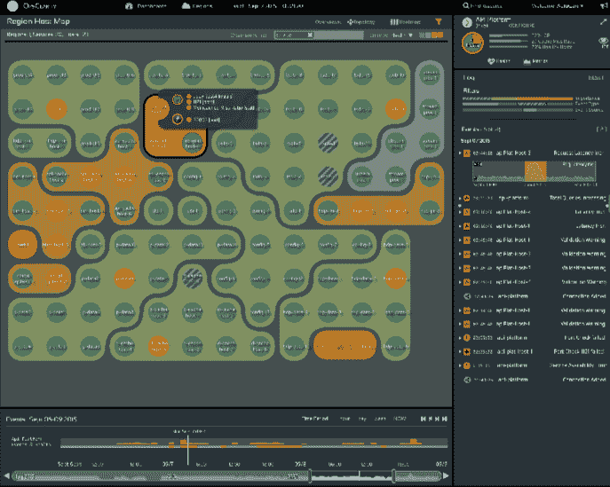

# OpsClarity 将应用程序和基础架构监控可视化

> 原文：<https://thenewstack.io/opsclarity-visualizes-application-infrastructure-monitoring/>

当组织开始考虑将他们的应用程序迁移到基于容器的架构中时，如何在大规模工作时监控这些服务的问题就成了一个挑战。OpsClarity 希望通过将运营分析和监控结合起来，将应用程序和基础架构监控结合在一起，来帮助简化这一过渡。

OpsClarity 首席执行官 Dhruv Jain 表示:“鉴于当今应用的复杂性，静态监控基础设施的传统模式将不再适用。

通过关注应用和基础设施监控， [OpsClarity 智能运营平台](http://www.opsclarity.com/product/)能够综合应用开发这两个方面的见解和数据。OpsClarity 的 SaaS 服务从容器的内部架构中收集数据。结果输出类似于一个应用程序图，类似于白板上的架构描述。该功能为用户提供了一个应用架构的“街道级”视图，该视图从主机级别与来自其他数据源的信息一起不断更新。

OpsClarity 主机映射

软件团队不仅需要有一个坚实的基础结构概述，而且他们必须能够一起看到应用程序类型、依赖性、故障排除和网络服务。

“我们认为，没有可视化，数据分析是没有用的，”贾恩说。通过关注数据的可视化，OpsClarity 能够关注整个系统的状态。异常检测和可视化工具提供了更高的信噪比，并能够解决常见问题。

“看看 10 年前的营销软件——每个客户属性都被分割成小块，以创建一个数据透视表。现在，基于机器的学习改变了营销。我们会自动创建新的相似用户群，获得答案而不是原始数据。同样的模式也适用于运营，”贾恩说。

实际上，OpsClarity 主要是用 Scala 编写的。它还利用了机器学习库、图形库和大型流处理基础设施。在前端，OpsClarity 使用 Angular.js with Node。JS 用的是服务器端。

这个框架允许 Jain 所说的直观的、超交互的数据可视化。自动化允许 OpsClarity 用户立即获得价值。数据收集和配置都是自动化过程，减少了运营经理为使服务正常运行而必须采取的步骤。

随着微服务的兴起，以线性、静态的格式呈现操作不再合适。监控数据必须是交互式的，而不是呈现一列列数字供管理员分析。正是这种区别将真正塑造下一代监控软件和服务。

<svg xmlns:xlink="http://www.w3.org/1999/xlink" viewBox="0 0 68 31" version="1.1"><title>Group</title> <desc>Created with Sketch.</desc></svg>