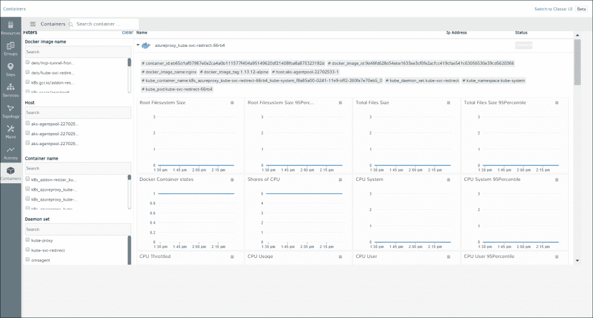

# OpsRamp 为 Kubernetes 环境带来了 AIOps

> 原文：<https://thenewstack.io/opsramp-brings-aiops-to-kubernetes-environments/>

多年来，您已经听说 DevOps 是提高从开发到部署的速度的方法，并深入了解如何以及在哪里可以改进这一过程。现在，[将人工智能融入 DevOps 工具](https://thenewstack.io/aiops-is-devops-ready-for-an-infusion-of-artificial-intelligence/)产生了 AIOps，以人类以前无法获得的方式提供了对 DevOps 生命周期的洞察和自动化。

[T4 ops ramp](https://www.linkedin.com/in/ramachandranm/)的产品管理副总裁马赫什·拉玛钱德朗表示，人工智能可以帮助降低警报噪音，确定上下文，并提高开发速度。

Ramachandran 说:“这里的总体目标是尽可能地把人从等式中去掉。“当您查看 IT 管理员响应事件所花费的时间时，您会发现其中很大一部分时间都花在了从噪音中识别信号、制造事件以及将问题提交给人力来解决。我们的目标是通过应用机器学习来尽可能多地消除人类的时间。”

本月早些时候，混合 IT 基础设施 AIOps 平台 OpsRamp [作为银会员加入了云原生计算基金会](https://blog.opsramp.com/opsramp-joins-cncf) (CNCF)，现在该公司通过推出面向 Kubernetes 的 AIOps 进一步展示了其对云原生技术的专注。Ramachandran 表示，云原生资源仅仅是一种新形式的 IT 资源，应该得到与其他资源相同的对待，并且应该获得相同的监控和管理能力。

“从运营的角度来看，我们将云和原生云视为一种新的环境，在这种环境中，IT 资源是以运营的方式获得和使用的。Ramachandran 说:“当客户试图融合传统、云和云原生环境的资产时，他们需要仔细考虑他们的运营模式。“客户需要为这种混合服务建立统一的运营模式，OpsRamp 可以帮助他们在这种独特的混合环境中建立和实践单一的运营模式。他们不应该以不同于物理资源的方式监控云资源。任务是一样的。”

在该公司的“冬季发布”中，它公布了对内部和云服务 Kubernetes 环境的监控，包括 Azure Kubernetes 服务、谷歌 Kubernetes 引擎和亚马逊 Kubernetes 弹性容器服务。根据 Ramachandran 的说法，OpsRamp 通过一个代理提供 Kubernetes 监控，该代理作为 Kubernetes 集群的守护进程集的一部分运行。

“OpsRamp 符合你在 Kubernetes 做事的自然方式，”Ramachandran 说。“只需在 YAML 文件中指定一个指向 OpsRamp 代理的链接，该代理被打包为 Docker 容器映像。我们使用 Kubernetes API 本身来发现 Kubernetes。我们发现正在运行的内容，然后作为数据集的一部分进行部署。”

除了 Kubernetes 的支持，OpsRamp 现在还提供云事件监控，允许它“收集、汇总、关联和上报来自 AWS 服务的事件，如 AWS Health、ECS、Redshift、数据迁移服务和 CloudWatch”，并作为“跨多个云帐户监控、管理和补救云事件的单点”，根据公司声明。

除了 OpsRamp 的云原生功能集的这些新功能，该公司还进一步专注于微调其 AIOps 功能，并为其用户提供更多上下文。

在上下文方面，OpsRamp 为用户提供了 IT 资源的拓扑图，现在包括支持四十多种流行的企业应用程序，以及 VMware vSphere 和 KVM 环境中的虚拟机、虚拟机管理程序服务器和集群。该版本还包括一个新的服务地图界面，该界面“可以轻松识别 it 服务中断背后的底层资源，以便运营团队能够采取正确的行动来恢复服务。”

最后，OpsRamp 扩展的 AIOps 功能包括公司的“智能事件管理引擎”OpsQ 的新功能。这些功能包括自动事件创建和路由、推理模型的增强培训以及频率驱动的警报升级。要全面了解 OpsRamp 的冬季发布，请浏览一下该公司的[网络研讨会](https://info.opsramp.com/winter-release)。

云计算原生计算基金会(Kubernetes)是新堆栈的赞助商。

通过 Pixabay 的特征图像。

<svg xmlns:xlink="http://www.w3.org/1999/xlink" viewBox="0 0 68 31" version="1.1"><title>Group</title> <desc>Created with Sketch.</desc></svg>