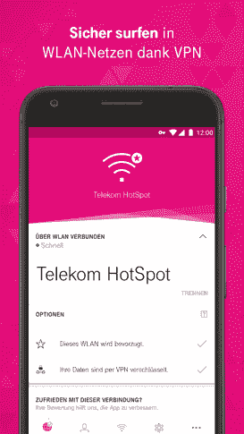
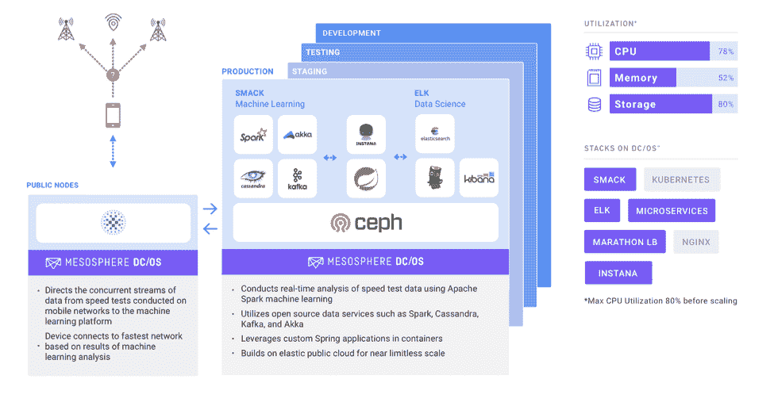

# 通过机器学习优化移动设备连接

> 原文：<https://thenewstack.io/optimizing-mobile-device-connectivity-machine-learning/>

 [劳拉·凯尔索

劳拉·凯尔索是一名市场营销专业人士，专门传播企业软件和开发人员工具的价值。她目前负责中间层的企业沟通，住在旧金山。](https://www.linkedin.com/in/lauraakelso/) 

想象一下:你正把车开出车道，要求你的手机调出导航到你的目的地，就在你需要决定转向哪个方向的关键时刻，你低头看着你的手机，意识到它挂了。它找不到目的地，看起来也没有联系。这种令人沮丧的时刻几乎是一种普遍的经历，但德国电信[的目标是为其在欧洲和全球的所有客户消除这种经历。作为世界顶级电信提供商之一，德国电信及其子公司，如美国的 T-Mobile，正在使用基于由 Mesosphere DC/OS 管理的动态云基础设施的机器学习算法，以大幅改善移动连接方面的消费者体验。Deutsche Telekom CONNECT 应用程序现在可以在 Google Play 和 iOS 应用程序商店中使用，该应用程序于今年推出，允许客户在任何时间点根据成本或性能优化他们的连接。](https://www.telekom.com/)

想要避免像上述场景那样的掉线和性能下降吗？然后你可能会选择“最佳网络”设置，应用程序会自动将你的手机从 Wi-Fi 热点切换到蜂窝网络，以确保无缝体验。如果你是精打细算的类型，那么你会选择“Wi-Fi 首选”设置，以将蜂窝网络上的数据传输保持在最低水平。当然，如果电信提供商能帮你随心所欲地找到快速 Wi-Fi，那么大家都是赢家。确保客户尽可能使用可用的 Wi-Fi 网络意味着避免网络负担过重。疏通移动蜂窝网络意味着每个人都有更好的体验。

## 用于数据分析和机器学习的新堆栈

虽然最终目标看似简单，但实现这一目标的技术却远非如此。在与德国电信负责驱动 CONNECT 应用后端基础设施的解决方案架构师 Oliver Goldich 交谈时，Goldich 观察到该公司在 2015 年首次开始调查连接解决方案。该团队首先尝试了一种新兴的电信标准，称为接入网络发现和选择功能( [ANDSF](https://en.wikipedia.org/wiki/Access_network_discovery_and_selection_function) )。然而，Goldich 观察到，“该标准仍然是过时的，对于我们的用例来说不是很灵活，这需要动态监控和决策。我们需要一个协议不支持的动态规则引擎。”

当他们明确需要一种新的堆栈来采用高级数据分析和机器学习时，Goldich 和团队开始采购组件来实现这一目标。2016 年，他们选择投资 DC/OS。“当时，中间层 DC/OS 已经是一个成熟的、经过生产验证的平台，”Goldich 说。“这是推进我们连通性项目的最佳候选人。”CONNECT 应用程序最初是一个低摩擦的概念验证:他们在 DC/操作系统服务层上构建了一个网络速度测试应用程序，允许用户进行简单的速度检查。德国电信用 Spark 收集并分析了这些用户数据，以验证他们的方法。

## 选择云提供商

随着概念验证结果看起来不错，Goldich 和他的团队开始构建自动化速度测试的基础架构要求，并最终改善客户体验。“在那一点上，我们知道如果我们想要创建机器学习能力，我们需要添加云能力以实现规模化。但是，在没有供应商锁定的情况下这样做是非常重要的，”Goldich 说。伴随着云而来的是复杂性。Goldich 指出，他们现有的 DevOps 流程以部署到内部数据中心为中心，这与他们想要采用的机器学习堆栈不兼容。

“我们选择了 Microsoft Azure，并立即设置了具有新 CI/CD 功能的 DC/操作系统环境。我们对选择云提供商充满信心，因为我们知道，有了 DC/操作系统，如果我们将来选择移动提供商，我们将永远不需要重新设计应用程序。Goldich 说:“DC/操作系统完全抽象了基础设施层，只需最少的工程工作，就可以轻松地将我们的应用迁移到我们首选的基础设施，无论是云、裸机还是内部部署。

此外，DC/操作系统支持使用弹性云资源，无需为每个应用程序创建虚拟机，这使得德国电信能够保持较高的利用率，目前其生产集群的平均 CPU 利用率超过 75%。

DC/OS 还提供一键访问德国电信所需的所有开源数据服务，包括 Apache Spark、Akka 和 Apache Cassandra。通过利用“ [SMACK Stack](https://mesosphere.com/blog/smack-stack-new-lamp-stack/) ”，这种 Mesos 上的数据工具组合经常被提及，德国电信能够执行大规模数据收集和实时网络速度测试分析。

## 在 ELK 堆栈上添加

德国电信还选择了“ELK Stack”，这是 Elasticsearch、Logstash 和 Kibana 的组合，以补充他们的数据科学，并与 [Instana](https://www.instana.com/) 合作进行人工智能应用性能监控，从而深入了解他们的整个技术堆栈和服务的健康状况。

期待预测分析

随着所有生产就绪组件的到位，德国电信在 2017 年底推出了 CONNECT 应用程序，为其 1.56 亿移动客户提供无缝连接体验。每当 CONNECT 应用程序连接到热点时，德国电信就能够执行自动速度测试，以收集成千上万个可用热点的数据。然后，Spark 处理这些并发数据流，以便在旅途中为客户做出实时决策。更进一步，德国电信的工程团队正在使用 Spark 训练机器学习模型，以更快地做出这些决定，这将不断改善用户体验。

随着机器学习模型的不断发展，DC/操作系统平台允许开发人员向他们的客户推出不断的增量改进。长期目标是整合预测分析，预测某些蜂窝网络或热点何时会出现拥塞，并相应地转移网络使用。目前，CONNECT 应用程序专注于德国电信的热点网络，但它计划将这项服务扩展到第三方提供商，如酒店和其他公共场所。

[中间层](https://d2iq.com/)赞助了这篇文章。

通过 Pixabay 的特征图像。

<svg xmlns:xlink="http://www.w3.org/1999/xlink" viewBox="0 0 68 31" version="1.1"><title>Group</title> <desc>Created with Sketch.</desc></svg>