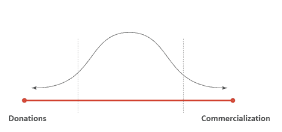

# 开源项目货币化的选择

> 原文：<https://thenewstack.io/options-for-monetizing-your-open-source-project/>

开源无处不在。开发人员开始一个软件项目而不考虑在其中使用开源组件几乎是闻所未闻的。事实上，今天开发的 90%的软件项目都依赖于开源组件。所有的开发人员都使用这些不可思议的软件，这些软件可以在网上免费获得，但是很少考虑它们背后的开发人员。开源开发人员花费了无数小时的业余时间，编码、调试和编写文档，却仅仅因为他们的才华和努力工作而获得 0 美元的报酬。

## 为什么不是所有的开发者都将代码货币化？

 [陈·拉维德

Chen Ravid 是一名自由软件爱好者和连续创业者。他是 xs:code 的联合创始人兼首席产品官，xs:code 是一个连接软件公司和开源开发者的平台。](https://xscode.com/) 

开源开发者显然不是为了钱。比起免费发布伟大的代码，有更简单的谋生方式。他们很可能出于好奇、兴趣或者为了解决他们遇到的问题或需求而开始他们的项目。大多数开源开发者甚至不考虑将他们的项目货币化。这通常是因为他们不知道从哪里开始，但也因为一些常见的误区:

*   货币化是“反开源的”。
*   我必须“关闭”我的代码来赚钱。
*   货币化是复杂的。我得开公司，雇律师，处理账单等等。
*   为什么有人要付钱给我？我的代码已经在 GitHub 上免费了。

这些误解既普遍又错误。

## 货币化范围

货币化可以被视为一个具有两个极端的钟形曲线:一端是捐赠，另一端是完全商业化。Y 轴是可以从这些货币化方法中受益的项目数量。

一端，有捐赠，或赞助。开发人员要求使用他们项目的好人在他们认为合适的时候捐款，通常是通过 Open Collective 或 Github 赞助商，这样他们就可以继续维护他们的项目。虽然捐赠是一个崇高的概念，但只有少数开源项目实际上积累了足够多的持续捐赠，可以被认为是一个重要的收入来源。这些通常是非常大的项目，引起了大公司的注意，他们决定回馈给项目背后的团队。一般的开源项目只是偶尔得到一些捐赠，原因是捐赠给个人或公司的价值(或缺乏价值)。没有价值交换，只是一种善意的行为。

在货币化光谱的另一端，是项目的完全商业化。这通常意味着一个项目足够大，足够成熟，足以保证围绕它成立一家公司，提供企业版、专业服务和付费支持层。许多伟大的公司就是这样开始的。想想 Red Hat 或 Redis labs，他们将开源项目变成了价值数十亿美元的公司。组建公司、雇佣员工和筹集资金都是大多数开源开发者还没有准备好的主要承诺。理应如此。大多数开源项目都很棒，但永远不会大到足以成为财富 500 强公司。然而，这并不意味着他们不能赚很多钱，即使他们的项目保持在今天的范围内。

## 价值永远是一个好的商业模式

曲线的两个极端只对少数项目(和开发人员)有效。像所有的钟形曲线一样,“肉”在中间。中间代表一种不同的方式，不像捐赠那样宽松，但也不像完全商业化那样激烈。使用像 [xs:code](https://xscode.com/) 这样的平台，开发者可以通过提供真正的价值来为他们的项目创造收入，但他们不必承诺成立一家公司。使用 xs:code，创建者提供的代码是免费的(免费的，就像在 freedom 中一样免费)，但他们在免费代码的基础上提供了另一个价值主张。该价值主张可以是三种模式中的一种或多种:服务、高级代码或双重许可。通过提供免费代码的付费功能和服务，开发者为用户提供了享受免费提供的附加价值的能力。这也表明项目背后有人支持，并且项目得到了积极的维护。付费服务可以是订阅或一次性购买。这完全是由项目创建者来决定如何收费以及每项服务收费多少。因为 xs:code 处理所有的账单/支付/支出/店面等。，创作者享受不用担心商业方面的自由。他们可以专注于为用户创造价值，这导致收入可以用于使他们的项目更好。

## 选择货币化模式

选择将一个开源项目货币化本身就是一个具有挑战性的决定。然而，一旦做出选择，还有另一个障碍需要克服:决定什么是项目货币化的最佳方法。不同的项目可能受益于不同的模型，并且不是所有的模型都适合所有的开发者——但是几乎所有的开源项目都可以货币化。这只是一个选择正确模式的问题。

## 附加服务–为用户提供时间和专业知识

使用开源项目的开发人员(即所有人)经常发现自己需要帮助。有时是代码问题给生产带来了巨大的破坏，需要尽快解决。有时候，让开源代码与公司的代码库配合得更好。有时候人们只需要问几个问题，而不是花几个小时自己寻找答案。最后，开源项目背后的开发人员(或维护人员)最有能力帮助完成以上所有工作——甚至更多。通过提供付费服务，开发人员创造了一种很好的方式来帮助他们的用户群，创造收入，并向人们展示使用他们的项目是安全的，因为如果需要的话，实际上有人可以提供帮助。在 xs:code 上，开发人员可以按小时提供专门的服务，比如 bug 修复、咨询，甚至为需要的客户编写定制特性。开发商设定价格、时间以及他们将提供服务的方式(例如，仅在工作日下午 6 点至晚上 9 点(GMT))。应该要求用户在购买服务之前联系开发者或维护者。xs:code 中的应用内聊天将在有人 pinged 他们时给他们发电子邮件，这使您能够更精确地控制要做什么工作、做多少以及何时做。

## 许可——向付费用户提供另一个许可

虽然开源许可证有时看起来令人生畏，但它们实际上是强大的工具，开发人员可以使用它们来管理用户可以和不可以对他们的代码做什么。使用付费许可是一种非常流行的货币化选择，并且比人们想象的更容易使用。

一种叫做“双重许可”的盈利模式允许开发者提供两份相同的代码。每个副本都有不同的许可证。免费版有一个许可证，付费版有一个不同的许可证。通过给免费版本分配一个限制性许可(如 GPL 许可),给付费版本分配一个许可性许可(如 MIT 许可),开发者可以激励需要在商业环境中使用代码的用户付费。

限制性许可证设置了商业公司可能无法承受的限制。但是对于社区使用和保持代码开源来说，它们是非常棒的。需要使用特定存储库的公司可以购买 MIT 授权版本的访问权限，然后可以自由使用代码，而不用担心更严格的免费许可证带来的限制。

一个好的建议是提供双重许可作为订阅。例如，在 [xs:code](https://xscode.com/) 上，订阅允许用户使用许可许可证访问 git 存储库，除非订阅处于活动状态，否则该存储库是锁定的。我们经常收到的一个有效的问题是，如果有人用 MIT 许可证“赠送”他们的代码，然后可以免费分发，为什么还要付费。虽然这是真的，但它只适用于当前版本的代码。许可证仅对用户下载的版本有效。如果用户希望获得最新版本并享受未来的更新，他们需要保持订阅有效。这也应该激励开发者继续开发和维护他们的项目，让他们的用户满意和付费。

虽然使用双许可的过程需要开发人员重新许可他们的代码并保留两个独立的存储库，但 xs:code 已经使使用“双许可向导”开始变得非常容易，这将使他们在几分钟内完成设置双许可的过程。

## 高级代码-提供代码的付费版本

许多软件公司使用一个叫做“开放核心”的概念来赚钱。想法很简单——他们免费提供项目的“基本”或“核心”版本，同时向付费客户提供额外的特性、功能或更频繁的更新。这意味着他们将保留两套代码(免费和付费)，并以订阅的方式授予对付费版本的访问权限。在 xs:code 上，这是通过在私有存储库上保存付费版本，并只授予购买订阅的用户访问权限来实现的。

由开发者决定在付费版本中包含哪些功能，但只要付费功能为用户提供价值——人们就会付费。请记住，免费版本必须自己提供价值，因为不是所有的用户都会转化为付费用户。有些人可能会说，这种方法意味着付费代码子集不是真正的开源。虽然这在某种程度上是正确的，但只要保持免费版本，开发者就完全有权提供一些付费功能。

## 比较模型

## 我们走吧

不同的选项可以混合搭配。例如，可以提供包括支持时间的高级版本。或者多个单独的选项，如付费许可或支持时间。这完全取决于开发商和他们愿意做什么来赚钱。需要注意的是，价值是最好的商业模式。只要项目和服务为用户提供价值，他们就会为此付费。

有了正确的货币化模式和正确的平台，任何人都可以将他们的项目货币化，同时保持其完全开源和免费。

祝你好运！

通过 Pixabay 的特征图像。

<svg xmlns:xlink="http://www.w3.org/1999/xlink" viewBox="0 0 68 31" version="1.1"><title>Group</title> <desc>Created with Sketch.</desc></svg>