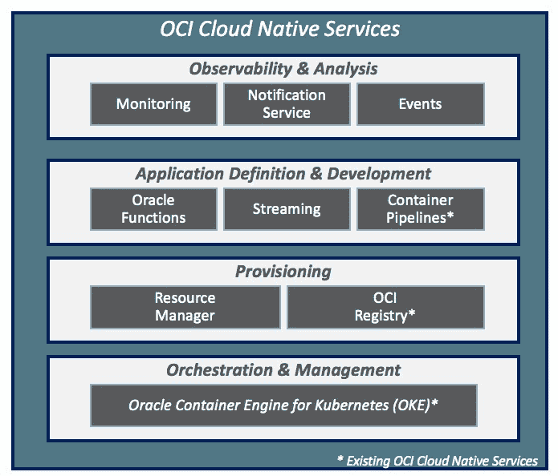

# Oracle 云本机框架承诺“双向”云可移植性

> 原文：<https://thenewstack.io/oracle-cloud-native-framework-promises-bi-directional-cloud-portability/>

Oracle 发布了一个框架，帮助开发人员为云原生架构构建应用程序，包括云中和防火墙后的应用程序。

为了在 Oracle 云基础设施(OCI)上以服务和软件的形式提供，Oracle 云原生框架包括对许多开源云原生基础设施技术的支持，包括 Oracle Functions，这是一种基于开源 [Fn 项目](https://urldefense.proofpoint.com/v2/url?u=https-3A__fnproject.io_&d=DwMFaQ&c=qwStF0e4-YFyvjCeML3ehA&r=gtC8ipR-hQsN72P011B5WzqX4-L5-rBmyaMPhx8yai0&m=Yvnp0kRrw-TMeTbKN46dSB9bYGMUJbVQd2iNY-NSz9k&s=MdUnQU-ibBFqi7m2IUp342IRJFJRKUq5P56Ics91Ay8&e=)的新型无服务器云服务。甲骨文在本周于西雅图举行的 [KubeCon + CloudNativeCon](https://events.linuxfoundation.org/events/kubecon-cloudnativecon-north-america-2018/schedule/) 上宣布了这项新服务。

甲骨文开发人员关系副总裁[鲍勃·奎尔林](https://www.linkedin.com/in/bob-quillin-46802511/)在接受新堆栈采访时表示，新产品“将我们一直致力于的云活动与我们的 Linux 框架一直在进行的许多活动结合在一起”。

结果是应用程序的“双向可移植性”,既可以在云中运行，也可以在防火墙后运行。Oracle Cloud Native Framework 既可用于绿色云原生应用的开发，也可用于传统 Java 和数据库驱动的应用。

该框架包括由[云本地计算基金会](https://www.cncf.io/) (CNCF)管理的多项技术，该基金会专注于支持开源、[云不可知基础设施软件](https://www.cncf.io/projects/)。甲骨文是 CNCF 的白金会员。

该框架还整合了一组基于 Kubernetes、Oracle 的基础设施即服务和用于 Kubernetes 的 Oracle 容器引擎(OKE)构建的 OCI 服务。这六个新产品包括无服务器、流、资源管理、可观察性和监控、通知和事件驱动计算方面的功能。

例如，使用 Oracle Functions，开发人员可以在按使用付费的基础上轻松部署和执行基于功能的应用程序。工作负载可以转移到基于容器的 Fn 项目的内部或替代云部署。

“如果你目前正在使用 Fn，那么很容易将它作为托管服务‘提升’和‘移动’到云中，允许你访问所有其他底层 OCI 服务，作为事件驱动的微服务架构的一部分，”Quillin 说。

甲骨文是新体系的赞助商。

通过 Pixabay 的特征图像。

<svg xmlns:xlink="http://www.w3.org/1999/xlink" viewBox="0 0 68 31" version="1.1"><title>Group</title> <desc>Created with Sketch.</desc></svg>