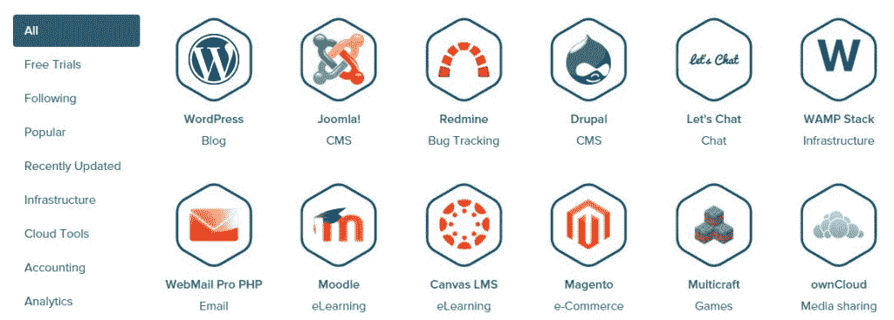

# Oracle 云将提供 Bitnami 应用程序库

> 原文：<https://thenewstack.io/oracle-cloud-offer-bitnami-application-library/>

Bitnami 应用程序库即将进入 Oracle Cloud。

[Oracle Cloud](https://cloud.oracle.com/home) 用户只需点击一下 Bitnami Cloud Launchpad 或 Oracle Cloud Marketplace，即可启动 Bitnami 应用程序。Bitnami 在本周于三藩市举行的甲骨文[全球大会](https://www.oracle.com/openworld/index.html)上宣布了这项服务。

Bitnami 在其目录中提供了 130 种流行的服务器应用[，以及可以在本地、虚拟机或公共云中运行的部署服务。Bitnami 保证应用程序来自可信的来源，经过修补、保护和更新；它负责编译和配置应用程序及其所有依赖项，如第三方库、语言运行时和数据库。](https://bitnami.com/stacks)

Bitnami 对商业云部署并不陌生，甲骨文云加入亚马逊 Web 服务，微软 Azure，谷歌云平台，DigitalOcean 等都加入了 Bitnami。

尽管如此，对 Bitnami 来说，采用 Oracle 仍然意义重大。

> Bitnami 营销副总裁大卫·丹尼斯(David Dennis)表示:“我们认为，甲骨文平台对那些有典型企业问题的客户有吸引力，他们可能会优先考虑那些与谷歌或亚马逊不同的问题。

Bitnami 目录包括基础设施栈，如 WAMP、MAMP、LAMP 和 Ruby，以及协作工具，如 WordPress、Drupal、Ghost 和 Roller。几个月前，它发布了 Docker images，里面有独立的开发者组件，比如 NGINX、PHP、Ruby in SQL 和 noSQL。

一些 Bitnami 堆栈

9 月，Bitnami 宣布扩展其库，除了开源软件包之外，还包括商业许可的服务器软件。

“我们支持的一些早期平台，如 AWS，在很大程度上是开源的……随着 Bitnami 用户的快速增长，人们问我们‘对混合云的支持如何？’”Bitnami 产品副总裁西蒙·贝内特说。

“VMware 的 vCloud Air 就是一个很好的例子，”Bennett 说。VMware“认为 Bitnami 是其现有基础设施的延伸。他们试图解决的问题有所不同，他们看待功能的方式，如让应用程序运行在扩展我的内部基础架构的网络上，这是非常不同的。比如实现[高可用性]和故障转移的能力。”

Bennett 说，CenturyLink 是其私下提供 Bitnami 应用程序目录的客户之一。

在 Oracle 云上启动的映像构建在 Oracle Linux 发行版之上；它们不包括 Oracle 的专有数据库。

“没有明说的是，甲骨文有自己的服务运行在它的云上。我们相信人们会想说，“如果我想使用甲骨文的一项 PaaS 服务，但需要将其与甲骨文 PaaS 领域中不存在的其他服务相结合，该怎么办？”很多这样的应用程序和基础设施确实存在于 Bitnami 应用程序目录中，”丹尼斯说。

甲骨文产品开发总裁 Thomas Kurian 表示，甲骨文云业务的各个方面都在增长，70%的云客户以前从未从甲骨文购买过软件，因此它带来了大量新客户。

Kurian 还认为亚马逊将无法提供其承诺的迁移服务，以回应 AWS 最近推出的名为 [AWS 数据库迁移服务](https://aws.amazon.com/dms/?tag=bisafetynet-20)的服务，该服务帮助公司将数据从甲骨文或其他内部数据库转移到亚马逊关系数据库服务(RDS)。据报道，[第一周就有超过 1000 名顾客注册了](http://www.businessinsider.com/amazons-oracle-killer-tool-goes-nuts-2015-10)。

AWS 市场已经成为亚马逊 10 亿美元的收入来源，甲骨文是软件供应商中的一员，参与了 [AWS 试驾计划](https://thenewstack.io/aws-makes-push-for-enterprise-buyer-with-test-drives-for-microsoft-oracle-netapp-and-others/)，该计划允许客户在购买前试用软件。

7 月，甲骨文加入了[开放容器倡议](https://thenewstack.io/now-that-oracle-and-verizon-are-aboard-dont-count-out-the-open-container-initiative/)，该组织致力于行业范围的容器标准，并且刚刚[更新了其 Oracle OpenStack 平台](http://siliconangle.com/blog/2015/10/20/oracle-offers-up-new-openstack-release-as-docker-instances/)以适应容器。

尽管如此，甲骨文在云市场上严重落后于主要的公共云供应商。

> 分析师 Rob Enderle 表示:“甲骨文起初对此并不重视，考虑到其他公司的发展速度，从后面赶上他们几乎是不可能的。”

“鉴于他们很好地锁定了他们的客户，并经常迫使他们的技术获胜，所有[甲骨文]真正需要的是足够的，对许多人来说，如果不是大多数人，这加上不必经常处理跨供应商互操作性问题，应该足以保持他们的基础，”他说。

“但它不会是一个获得新客户的好平台，除非他们的行动速度比现在快得多，或者找到一种收购方式，使他们成为某种公认的市场领导者。因此，至少目前来看，可以把它的战略看作是留住顾客而不是获取顾客的战略。

一小时的应用程序云演示是免费的。

DigitalOcean、Docker 和 VMware 是新堆栈的赞助商。

通过 Pixabay 的特征图像[。](https://pixabay.com/en/blue-sky-cloud-summer-196230/)

<svg xmlns:xlink="http://www.w3.org/1999/xlink" viewBox="0 0 68 31" version="1.1"><title>Group</title> <desc>Created with Sketch.</desc></svg>