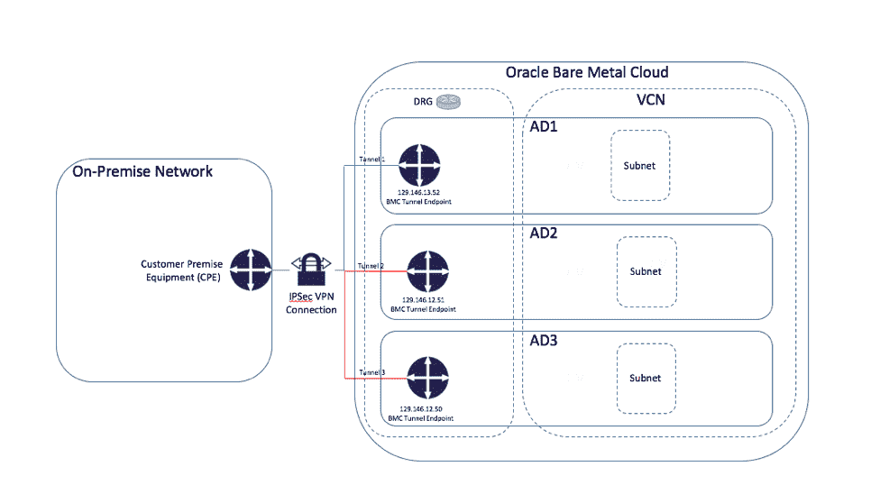

# 甲骨文云的秘密武器:虚拟云网络

> 原文：<https://thenewstack.io/oracle-clouds-secret-sauce-virtual-cloud-network/>

甲骨文可能在公共企业云的游戏中姗姗来迟，但[甲骨文云](https://cloud.oracle.com/home)声称至少有一种基础设施技术，至少是主要的主导云提供商，如亚马逊网络服务和微软 Azure 还不能提供的:无管理程序虚拟化。

该公司的[甲骨文裸机云服务](https://cloud.oracle.com/bare-metal)的虚拟化，提供了该公司所谓的[虚拟云网络](https://cloud.oracle.com/en_US/bare-metal-network/faq) (VCN)，通过提供计算和存储节点之间的直接连接，最大限度地提高网络吞吐量。

“我们将 I/O 虚拟化从虚拟机管理程序中分离出来，并将其放入网络中，”甲骨文开发副总裁 Deepak Patil 在上个月在纽约举行的甲骨文云日新闻发布会上说。“我们一直将网络视为平台。我们将在网络中构建的功能类型将决定平台的灵活性。”

对于其公共云，甲骨文提供了许多基础设施服务，即计算、存储、网络、身份和安全。通过 API，用户可以构建虚拟网络，连接所需的服务。系统可以通过异步消息传递连接在一起，通过 DNS 服务发现，并通过负载平衡服务扩展。

客户如何将其内部与 Oracle 云连接起来。

Oracle 数据中心内的每个网络都具有扁平拓扑，因此客户可以轻松地横向扩展计算和存储资源。甲骨文产品开发总裁托马斯·库里安在会上发言说:“任何一台电脑服务器都可以在网络上与任何一台不超过两跳的电脑服务器进行对话。”。他说，这种方法“保证了可预测的延迟和性能”。

Kurian 告诉与会者，这种方法的关键是甲骨文将虚拟化“从虚拟机管理程序转移到核心网络”的架构决策。Oracle 原始物理主机提供隔离，并保证该主机上没有运行任何其他内容。“公共云中没有其他人能提供这种能力，”Kurian 说。

“总的目标是尽可能消除网络中的瓶颈，”帕蒂尔后来说。Patil 认为，虚拟机管理程序可能会有“税收”，不仅会降低性能，因为它们是另一个基础架构层，还会限制平台的可扩展性。这种无需虚拟机管理程序的方法允许用户轻松使用自己的中间件、防火墙、操作系统和其他软件。另一个问题是虚拟机管理程序带来了另一层潜在的安全问题。

Oracle 没有投资虚拟机管理程序，而是投资了基于网络的 I/O 虚拟化，创造了 Patil 所说的“网络中的凸点”帕蒂尔指出，该公司没有使用开源项目来完成这项任务，只是补充说该公司使用了内部开发的软件来完成这项任务。

用户可以通过三种方式之一访问计算资源:一种是“原始物理主机”，用户可以在其中启动 Linux 或 Windows 操作系统。也可以启动虚拟机管理程序，或者在原始物理主机上启动容器。

Patil 说:“在云社区中，关于在哪里放置存储和 I/O 虚拟化有一个相当普遍的争论。例如，Azure 和 AWS 将虚拟化放在管理程序中。帕蒂尔说，通过提供裸机服务器，甲骨文让客户可以选择直接在服务器上运行容器，或者，如果安全政策另有规定，在虚拟机管理程序内运行容器。

通过 VCN，客户获得了一个私有 IP 空间，他们可以在其中创建子网、路由表和设置防火墙。为了隔离相关资源，他们可以设置多个 vcn。使用 IPSec VPN 连接，用户还可以链接回内部数据中心，Oracle 将提供设备和支持，以将其 Oracle 云网络连接到内部网络。

## 云服务还是托管？

甲骨文云平台高级副总裁 [Amit Zavery](https://twitter.com/azavery) 在后续采访中表示:“将虚拟机管理程序迁移到网络层可以让您获得更好的健壮性、性能、可扩展性和控制能力。“您可以将任何应用程序引入网络并进行横向扩展，从而为您提供更加可预测的性能和故障切换。”

然而，并不是每个人都相信这种方法是最好的。甲骨文的竞争对手 [Joyent](http://www.joyent.com) 也通过自己的 [Triton](https://www.joyent.com/triton) 云计算产品提供类似的裸机隔离服务。但是 Joyent 首席技术官 Bryan Cantrill 在一次采访中说，这两种服务是完全不同的。

然而，Cantrill 指出，Oracle 的裸机实例要求用户购买整个服务器的使用权，从而将每台服务器限制为一个且只有一个租户。“没有管理程序，因为那里没有云，”他说。“就我而言，这是托管。”

利用 VCN 所需的最低计算资源量是一个单 CPU 虚拟机实例，每个 OCPU 每小时的成本为 0.075 美元。据甲骨文发言人称，裸机实例是单租户的。

单租户计算实例有两种形式:裸机计算和专用计算。裸机计算实例目前每个实例有 36 个 ocpu([Oracle CPU](https://jes.blogs.shellprompt.net/2015/10/21/making-sense-of-oracle-cloud-ocpus/comment-page-1/))，带有可选的内部非易失性内存(NVMe)存储。这些费用从每小时每 OCPU 0.075 美元到 0.15 美元不等。该价格包含内部 NVMe 存储，出站带宽每月高达 10 TB。

Oracle 的专用计算云服务相当于 500 个 CPU，每月起价 50，000 美元。块存储每月每 TB 50 美元。每月 10TB 以上或跨地区的外网流量需要额外付费。

据该公司称，甲骨文云今天每天管理超过 550 亿笔交易。甲骨文计划在 2017 年年中之前为其云网络带来三个新地区:弗吉尼亚州的莱斯顿；英国伦敦；还有土耳其。这将使甲骨文覆盖的地区总数达到 29 个，并计划在 2018 年年中之前在亚太、北美和中东进一步扩张。

该公司一直在加强其基础设施团队。帕蒂尔本人是微软 Azure 的创始工程师之一，后来加入了甲骨文。帕蒂尔指出，该公司现在有近 1000 名工程师从事基础设施云工作，其中包括之前与 Azure、亚马逊网络服务、谷歌、Joyent 和其他原生云提供商合作过的工程师。

帕蒂尔说:“去年，我们的工程团队增加了几次，我希望明年的工程团队再增加几次。”。

帕蒂尔说，甲骨文在其云上看到了容器使用量的增加。他将部署分为两种类型。一方希望使用成熟的容器技术，如 Docker 和 Kubernetes，而另一组企业客户则更喜欢部署他们自己的内部容器工具。

<svg xmlns:xlink="http://www.w3.org/1999/xlink" viewBox="0 0 68 31" version="1.1"><title>Group</title> <desc>Created with Sketch.</desc></svg>