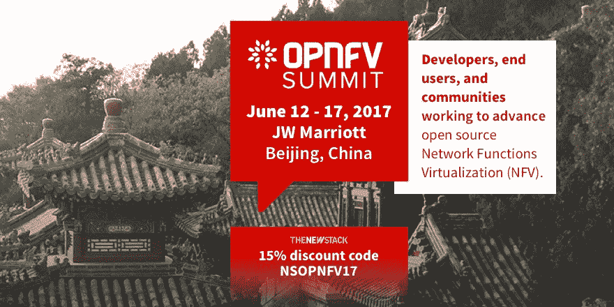

# Oracle 通过其超大规模云开发了什么

> 原文：<https://thenewstack.io/oracle-developing-hyperscale-cloud/>

自从“Oracle Java”一词在 2010 年成为现实以来，开发人员一直在公开思考软件世界的两大象征——曾经看似对立——最终将如何无缝融合。因此，当甲骨文去年 4 月宣布打算收购 CI/CD 平台制造商 Wercker 时，对一些人来说，这仍然令人惊讶。

“我们肯定看到开源是，如果它不是已经崛起的派别，它是一个正在崛起的派别，”甲骨文工程副总裁 [Mark Cavage](https://www.linkedin.com/in/mark-cavage-81b5771/) 在最近的 CoreOS Fest 上接受新堆栈的 Alex Williams 采访时承认。“我们计划深入参与其中。[ *但是* ]对于 Kubernetes，我们认为不应该放弃它。”

Cavage 向我们解释了甲骨文的宏伟计划，Wercker 在其中发挥了关键作用。事实上，它正在加倍增加其公共云资产，兑现甲骨文董事长拉里·埃里森去年 10 月许下的承诺,无论如何都要登上前三的领奖台。它正在利用[t . j . Fontaine](https://github.com/tjfontaine)——Joyent 曾经的 Node.js 项目负责人——作为一名工程师，围绕 Cavage 所描述的“vanilla Kubernetes”—[构建一个云原生部署平台，这不是一个专有的衍生产品，但也不是没有一些额外添加的 Oracle 专业知识。](https://thenewstack.io/oracle-joins-kubernetes-fray/)

现在，甲骨文正在利用[Micha Hernandez van Leuffen](https://twitter.com/mies)——wer cker 的创始人兼首席执行官，最近出版了《[今日软件世界:我们如何走到这一步，什么需要修复](https://thenewstack.io/software-world-today-got-needs-fixing/)》一书，作为新堆栈的工作流程工程师，甲骨文希望这将使更多组织能够为云原生应用程序规划一个逐步部署计划。

“迁移到云原生环境，”van Leuffen 告诉我们，“实际上需要一套全新的工具[*和*]平台，首先是协作和沟通。如果您正在构建微服务，这意味着您可能有更小的团队在不同的服务集合上工作，这些服务都是相互依赖的，它们需要很好地协同工作。这是您面临的完全不同类型的 CI/CD 问题。

“随后，”他继续说，“你需要一种方法来测试 API 契约，并确保…当我消费一项服务，而你改变了一些东西，我的东西仍然可以与你的一起工作。”

关于围绕 Kubernetes orchestrator 设计一个可靠的云部署平台，这是一个非常合理、开放、全面的对话，作为去年 5 月战略协议的一部分，该平台将美国电话电报公司作为一个关键客户。如果没有甲骨文的参与，这可能是最新一期的[新堆栈制造商播客](https://thenewstack.io/podcasts/makers)的一个非常普通的话题。现在来听听 Cavage、Fontaine 和 van Leuffen 首次谈论 Oracle 在公共云领域抢占中心舞台的战略。

[甲骨文正在开发什么样的超大规模云](https://thenewstack.simplecast.com/episodes/what-oracle-is-developing-with-its-hyperscale-cloud)

## 主题:

[1:23:](https://thenewstack.simplecast.com/episodes/what-oracle-is-developing-with-its-hyperscale-cloud?t=1:23) 甲骨文云的故事及其现状。
[3:58:](https://thenewstack.simplecast.com/episodes/what-oracle-is-developing-with-its-hyperscale-cloud?t=3:58) 讨论 Wercker 被 Oracle 收购及其对云原生生态系统的影响。
[8:21:](https://thenewstack.simplecast.com/episodes/what-oracle-is-developing-with-its-hyperscale-cloud?t=8:21) 甲骨文将如何参与开源社区。
[12:25:](https://thenewstack.simplecast.com/episodes/what-oracle-is-developing-with-its-hyperscale-cloud?t=12:25) 探索其他 CI/CD 环境的缺点。
[19:55:](https://thenewstack.simplecast.com/episodes/what-oracle-is-developing-with-its-hyperscale-cloud?t=19:55) 甲骨文希望如何通过开放 API 来构建其开源贡献。
[23:18:](https://thenewstack.simplecast.com/episodes/what-oracle-is-developing-with-its-hyperscale-cloud?t=23:18) 在容器化的环境中部署 Java。

Wercker 是新堆栈的赞助商。

专题图片:2010 年美洲杯帆船赛获奖的三体帆船，位于加利福尼亚州雷德伍德城的甲骨文公司总部外，由甲骨文公司提供。

<svg xmlns:xlink="http://www.w3.org/1999/xlink" viewBox="0 0 68 31" version="1.1"><title>Group</title> <desc>Created with Sketch.</desc></svg>