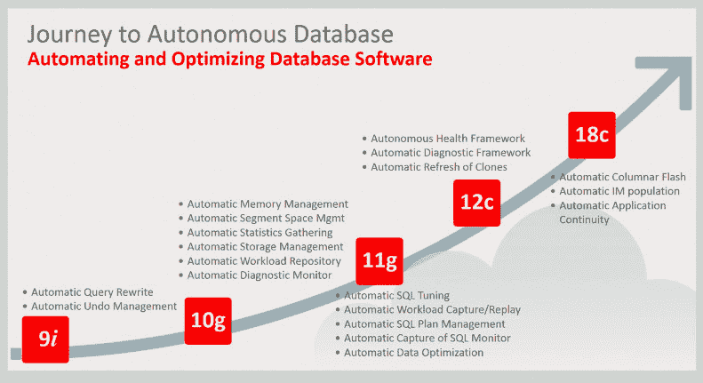
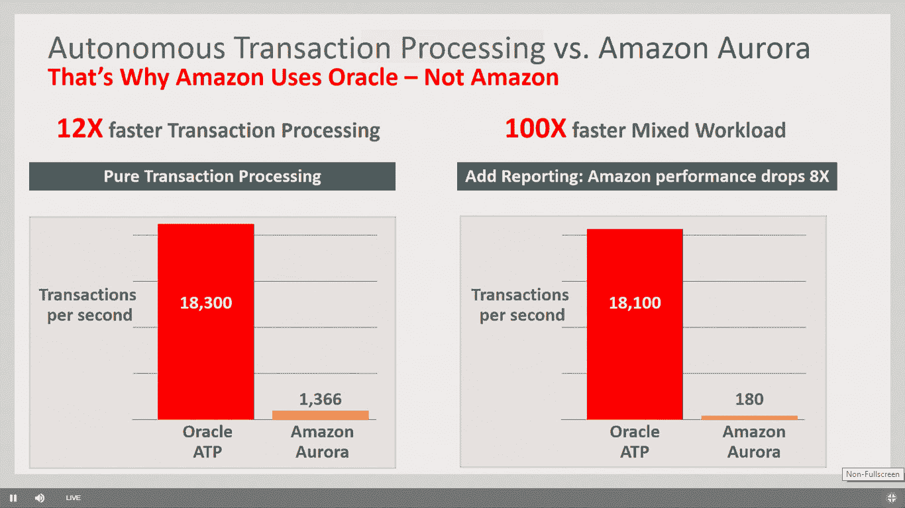

# Oracle 将“自治”数据库扩展到事务性工作

> 原文：<https://thenewstack.io/oracle-extends-autonomous-database-to-transactional-work/>

为了证明持续的自动化可以为企业节省大量资金，Oracle 将其旗舰数据库的“自治”功能扩展到了事务处理。

甲骨文执行董事长兼首席技术官拉里·埃里森(Larry Ellison)周二在介绍这项新技术时表示，本周发布的甲骨文 18c 的自我修复或自主功能旨在为用户节省资金，因为它们需要更少的人员来操作，并且在不需要时不使用服务器和其他资源。

“我们现在是世界上最容易使用的数据库。没什么可学的，也没什么可做的，”他说。"运行这个数据库所需的人工少得多，所以成本也低得多."该公司声称它可以削减高达 80%的管理费用。

“自主”计算的概念至少从 20 世纪 90 年代就有了，首先出现在 IBM 的大型机和 eServer 系列中， [Pund-IT](https://www.pund-it.com/about-pund-it/) 的首席分析师[查尔斯·金](https://twitter.com/punditinc)在一封电子邮件中提到。“从那以后，自我管理/修复系统变得越来越普遍，并成为云提供商平台和运营效率的核心，”他指出。King 指出，甲骨文似乎通过利用机器学习算法(通过其丰富的经验开发)来自主监控、修复和调整数据库实例，进一步推动了这一概念。

Oracle 称其数据库包是“自治的”,因为软件和底层基础设施是自我调整、自我修复和自我保护的。涵盖数据库和底层服务器以及网络组件，Oracle 开发或采用了用于自调优、内存管理、自动故障转移、实时漏洞监控、实时自动更新的软件。它运行在 Oracle Exadata 集成服务器上，由 Real Application Clusters 管理以实现并行横向扩展操作，并由 Active Data Guard 灾难恢复软件提供支持。“系统中没有单点故障，”埃里森说。

对于调优元素，一个基于机器学习的组件监视所有 SQL 查询和索引，寻找可能导致优化的使用模式。它还足够复杂，可以理解回归(更新会导致性能下降)并计划减轻它们。

Oracle first [在今年早些时候推出了自治功能](https://thenewstack.io/oracle-promises-self-securing-self-repairing-autonomous-cloud-services/)，推出了 Oracle 自治数据仓库服务，为数据分析提供自调优查询。这个版本将这些功能扩展到了事务处理，事务处理是所有数据库工作的主体。

部分动机似乎是为了减少管理数据库系统所需的工作量。大多数 IT 专业人员和开发人员对管理数据库系统知之甚少——这就是导致 MongoDB 或 Cassandra 等 NoSQL 数据库大受欢迎的原因。埃里森承认，它们非常容易使用。这就是甲骨文想要击败的对手

数据管理分析公司 [WinterCorp](https://wintercorp.com/) 在一份研究报告中总结道:“使用 Oracle 自治’数据库，客户只需关心数据库的逻辑设计以及应用程序的开发和维护。”。该软件“旨在大幅简化客户的角色，从而大幅减少员工和技能要求，降低
客户的总成本，加快上市速度，并带来其他重大好处。”

该软件的自我配置和自动扩展功能可以根据特定的工作负载定制资源。如果没有工作负载，就不会使用服务器(Ellison 将这种方法称为“无服务器云”)。如果需求激增，系统会自动添加更多资源。埃里森吹嘘说，这种方法可以节省高达 90%的运行时间成本。他还吹嘘这种方法如何能够比运行亚马逊网络服务的 [Aurora](https://aws.amazon.com/rds/aurora/) 和 [Redshift](https://aws.amazon.com/redshift/) 数据库减少一半的成本。

“亚马逊的数据库做不到这一点，”埃里森说。“他们不能在系统运行时动态添加服务器。他们不能动态增加网络容量。当服务器不运行时，他们不能动态地拿走它，”埃里森说。“只有在基础设施被使用时，你才需要为其付费。”

速度在节约成本方面也发挥着作用。甲骨文声称，在相同的硬件配置下，其数据库的运行速度比 AWS 的 Aurora 和 Red Shift 快 5 到 10 倍。“这些性能优势转化为成本的大幅降低，”埃里森说。"如果我们用一半的时间做同样的工作，我们的价格是一半."

在他的演讲中，Ellison 还指出，亚马逊仍然使用 Oracle 作为其主要数据库，而不是自己的内部数据库，这也无助于他的竞争本性。“当亚马逊使用甲骨文时，这有点尴尬，但他们希望你使用极光和红移，”埃里森说。

在安全领域，甲骨文已经安排其软件自我更新，没有停机时间。该公司声称，这意味着数据库系统、其支持组件和底层操作系统(Oracle Linux)可以通过错误和漏洞修复进行升级，同时保持运行。总体而言，Oracle 保证 99.995%的可用性，即每月不到 2.5 分钟的停机时间，包括升级。

King 指出，甲骨文提供的自治数据库要么是公共云服务，要么是其私有云管理服务的一部分——它不是 core 18c 产品的一部分。该公司[提供 3500 小时的免费试用](https://cloud.oracle.com/tryit)。据该公司称，目前，甲骨文云每天支持全球 195 个国家超过 550 亿笔交易。

[https://www.youtube.com/embed/cJxmowxEsRA?feature=oembed](https://www.youtube.com/embed/cJxmowxEsRA?feature=oembed)

视频

<svg xmlns:xlink="http://www.w3.org/1999/xlink" viewBox="0 0 68 31" version="1.1"><title>Group</title> <desc>Created with Sketch.</desc></svg>