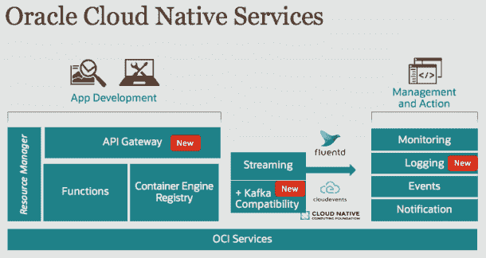

# Oracle 发布 API 网关、Kafka 流、Oracle 云日志

> 原文：<https://thenewstack.io/oracle-launches-api-gateway-kafka-streaming-logging-for-oracle-cloud/>

Portworx 赞助了 New Stack 在圣地亚哥的 KubeCon + CloudNativeCon 的报道。

随着公司继续向云原生软件架构迁移，云提供商正在寻求提供工具和框架，不仅使这种迁移变得更容易，而且防止这些公司将其软件迁移到其他云，在这些云上迁移会是一个更容易的过程。去年，[甲骨文](https://www.oracle.com/)发布了其云原生框架，该框架提供了在第三方云和甲骨文云上运行云原生工作负载的能力，今年该公司在今年的 [Kubecon+CloudNativeCon 北美 2019](https://events19.linuxfoundation.org/events/kubecon-cloudnativecon-north-america-2019/) 上推出了三项新服务，扩展了这些能力。

随着针对 Oracle Streaming、Oracle API Gateway 和 Oracle Logging 的 Kafka 兼容性的推出，该公司正在扩展其用户在 Oracle Cloud 上开发云原生软件的能力，方法是填充其软件开发和管理堆栈的各个部分。

[甲骨文云开发人员关系副总裁 Bob Quillin](https://www.linkedin.com/in/bob-quillin-46802511/) 解释说，这些新特性有助于在甲骨文云上实现新的和现有软件部署的现代化。

“您的所有功能都与所有其他 OCI [Oracle 云基础架构]功能相集成。因此，在许多方面，我们正在构建整个云原生功能，因此当人们推出新应用程序或扩展现有应用程序时，他们可以利用容器、Kubernetes、无服务器功能，然后将其与 DevOps 服务的标准集挂钩，包括日志记录、监控、事件和通知。这些都是托管服务，”奎尔林说。“从几年前开始，我们经历了一场全面的变革。因此，现在我们为所有 Oracle 客户提供了一个完整的解决方案，来实现应用程序的现代化并将其迁移到云，同时构建新的应用程序。”

虽然 Oracle Streaming 已于今年早些时候推出，但 Kafka 兼容性是新的，将为用户提供与 Oracle Cloud Auth N & Auth Z 集成的能力，访问 Kafka 生态系统，以及 Kafka 的按使用付费定价，Oracle 声称这将为用户节省 20%至 40%的成本。与此同时，Oracle Logging 为您的云原生应用程序提供了一个单一窗口。然而，奎尔林说，Oracle API 网关才是此次发布的真正症结所在。

“通过 API gateway，您可以连接到基于 Kubernetes 的应用程序和/或无服务器功能应用程序，甚至是云中的本地或 SaaS 应用程序。如果你正在构建一个复杂的、多方面的应用程序，你将需要一种方法，以一种标准的方式将所有这些 API 连接在一起，管理它们，并拥有一个围绕它们的托管服务，”Quillin 说。“大多数人不仅希望升级，还希望改进应用程序并采用云原生服务。围绕这些服务，围绕应用程序的各个部分包装 API，允许您开始以更面向服务或微服务的方式管理应用程序。这样，您就可以开始迁移到云基础架构，而不必重新架构和重新搭建整个平台。这种向云原生的渐进迁移是我们看到的一种模式。”

Oracle API Gateway 提供了一个高度可用、完全托管的网关，为开发人员提供了与这些其他服务进行交互的界面，包括 Oracle Functions、Oracle Container Engine for Kubernetes 和 Oracle Cloud infra structure Compute，还通过身份验证和速率限制 HTTP/S 端点提供了策略实施。

这三种服务目前都是有限提供的，可以通过[在线表单](https://go.oracle.com/LP=78019?elqCampaignId=179851)请求访问，预计在不久的将来会全面提供。Quillin 还指出，Oracle API Gateway 有助于使 Oracle 最近发布的 Oracle 功能与其其他产品更加一致。

Quillin 说:“API gateway plus 函数——所有这些函数都可以有 API 端点，并可以以非常标准的方式开始与所有应用程序进行互操作。“从许多方面来说，它正在完善围绕功能的生态系统，并使其更好地集成到 Oracle 云服务的其他部分，通过所有这些东西以一种有凝聚力的整体方式协同工作，提供越来越多的连接性和协同价值。”

KubeCon + CloudNativeCon 和 Oracle 是新堆栈的赞助商。

图片来自 Pixabay 的 ArtTower。

<svg xmlns:xlink="http://www.w3.org/1999/xlink" viewBox="0 0 68 31" version="1.1"><title>Group</title> <desc>Created with Sketch.</desc></svg>