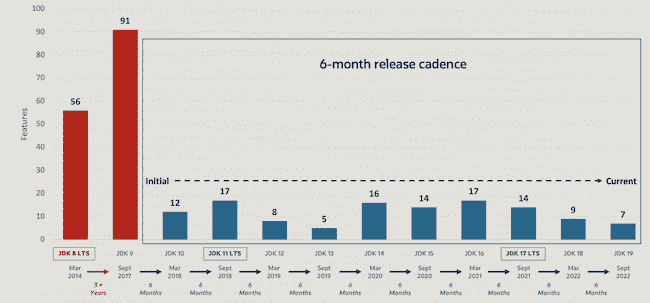

# Oracle 为 Java 19 的未来奠定了基础

> 原文：<https://thenewstack.io/oracle-sets-foundation-for-the-languages-future-in-java-19/>

[Java](https://thenewstack.io/java-after-java-17-lts-loyalty-containers-and-open-source/) 是编程语言的主力，Oracle 继续在该语言和开发平台的基础上进行开发，不仅提供了提高生产率、稳定性、性能和安全性的增强功能，还为该语言的未来奠定了基础。

随着该平台的最新发布， [Java 19](https://www.oracle.com/java/) ，也被称为 Java 开发工具包(JDK) 19，Oracle 已经做到了这一点——通过七个 JDK 增强提案(jep)应用更新和改进。Oracle open JDK 管理委员会 Java 平台开发高级副总裁兼主席 [Georges Saab](https://www.linkedin.com/in/georgessaab/) 表示，这些更新中的大部分将作为后续预览功能发布，以改进早期版本中引入的功能。

## 节奏的重要性

为了保持 Java 的改进速度，五年前，甲骨文为平台的发布制定了六个月的节奏。Java 19 标志着第十个这样的版本，它提供了源源不断的创新。

萨博说:“随着这六个月的节奏，你知道，基本上，我们的创新渠道已经开始了。”“所以旧模式基本上相当于每三年清空一次管道，然后你必须从头开始。相反，现在，我们发现我们正在不断创新，这些项目能够看到其他人在做什么，并将其结合起来，找到组合比各个部分的总和更丰富的地方。”

观察家说，企业已经习惯了 Java 发布的节奏。

Omdia 的分析师 Brad shimmen 告诉新的 Stack，“由于这是甲骨文进入六个月滚动更新以来的第十次迭代，我认为这种节奏凸显了一个事实，即甲骨文及其全球用户社区已经适应了一种非常可行的节奏，新的孵化器、预览和生产代码从一个版本平稳地流向下一个版本。”。“尽管如此，看到 JDK (JEP 422)的 RISC-V 端口在主线代码库中找到一个家还是很棒的，因为它将为 Java 打开一个边缘和物联网设备的新世界。”

Java 19 恰好出现在该平台的长期支持(LTS)版本的中间。上一个 LTS 版本是 2021 年 9 月发布的 Java 17，下一个将是 2023 年 9 月发布的 Java 21。甲骨文打算每两年发布一次 LTS。

“有一个方面让 Java 19 与众不同。它正好在 LTS 发布的中间，这意味着我们已经可以跟踪 Java 发展的趋势，” [BellSoft](https://bell-sw.com/) 的性能架构师 [Dmitry Chuyko](https://www.linkedin.com/in/dchuyko/?originalSubdomain=ru) 在[博客](https://bell-sw.com/announcements/2022/06/22/java-19-new-features-and-enhancements/)中说。BellSoft 是 OpenJDK 的主要贡献者和 JDK 自由报的提供者。

Chuyko 指出，添加到 JDK19 的 jep 表明，Java 努力成为一种通用编程语言，可用于任何环境、任何任务和任何技术。

“例如， [RISC-V](https://thenewstack.io/open-source-risc-v-serving-a-side-of-software-with-chips/) 端口的增加拓宽了支持平台的范围，外部函数& Memory API 支持在【Java 虚拟机】 [JVM](https://thenewstack.io/parity-check-node-js-jvm-containers/) 之外使用数据，虚拟线程将使 Java 成为高吞吐量并发应用程序的理想选择。因此，我们预计这种趋势将一直持续到下一个 LTS 版本，甚至可能更晚，”他说。

## 虚拟线程

同时，也许 Java 19 中最重要的特性是 [JEP 425](https://openjdk.org/jeps/425) ，在预览版中发布的虚拟线程。“虚拟线程”通过将轻量级虚拟线程引入 Java 平台，极大地减少了编写、维护和观察高吞吐量并发应用程序的工作量。使用虚拟线程允许开发人员利用现有的 JDK 工具和技术轻松地对并发应用程序进行故障排除、调试和分析，”甲骨文说。

萨博解释说:“我认为虚拟线程将会非常庞大，尽管这里需要注意的是，这种东西不一定是每个开发人员都会直接遇到的，因为这种低级的线程控制往往是大多数人通过他们正在使用的一些 Java 软件遇到的东西。”。

事实上，萨博将虚拟线程描述为“基础性的”。该功能是甲骨文[项目 Loom](https://www.baeldung.com/openjdk-project-loom) 的一部分。

萨博告诉新的堆栈，虚拟线程“为 Java 工作负载的可扩展性提供了一个新的基础，不再需要人们开始采用不同的编程模型，如反应式或异步编程，而是允许您将数千或数万个 Java 线程映射到一个本机线程，允许您编写易于理解、易于调试、可扩展的同步代码”。

此外，BellSoft 的 Chuyko 称虚拟线程是 Java 19 最令人兴奋的特性之一，因为它的目标是增强 Java 中处理并发的方式。

“[作为](https://openjdk.org/jeps/425)[项目织机](https://openjdk.org/projects/loom/)的一部分，虚拟线程的引入将极大地提高高吞吐量并发应用的性能，”他说。“Java 编程中的传统线程是围绕操作系统线程的。因此，它们易于监控或调试，但数量受到严格限制。另一方面，有时用于应用程序扩展的异步编程不支持高效的线程监控。”

与此同时，“对我来说，Java 19 最大的新闻是虚拟线程(JEP 425)的预览，这将使 Java 开发人员更容易编写更多需要成千上万个同时连接的可扩展软件。很酷，”希明说。

Contrast Security 的高级软件工程师 A . N . M . baz lur Rahman 在一篇 [tweet thread](https://twitter.com/bazlur_rahman/status/1575161090195214337?s=20&t=nZBovf0WS3uR-fBEVyH6wQ) 中对虚拟线程的价值进行了精彩的描述，他指出:“虚拟线程是 Java 线程的一种替代实现，它将其堆栈帧存储在 Java 的垃圾收集堆中，而不是操作系统分配的整体内存块中。它开始只有几百个字节，可以自动扩展和收缩。”

## JavaOne 2022，100 万证书

总的来说，Java 19 提供了成千上万的性能、稳定性和安全性改进，包括对平台的增强。甲骨文将于 10 月 17 日至 20 日在拉斯维加斯举行的 JavaOne 2022 大会上展示 Java 19，并于 9 月 20 日(美国太平洋时间)周二上午 9:00 在[dev.java/](https://dev.java/)进行主题广播。

Oracle 还宣布，它已经为 Java 专业人员获得了 100 万个认证，并将在 JavaOne 大会上重点介绍这一点。“有一大批非常实用的开发人员，他们知道拥有该认证对于脱颖而出非常重要。这是我们将要庆祝的事情，”甲骨文 Java SE 产品管理总监 Sharat Chander 告诉新堆栈。

“我们与开发人员社区的持续合作是 Java 的生命线。作为 Java 的管家，甲骨文坚定不移地致力于为开发者和企业提供最新的工具，帮助他们创建创新的应用和服务，”萨博在一份声明中说。

## 大量的功能

除了虚拟线程之外，Java 19 的其他关键特性包括 OpenJDK [项目 Amber](https://openjdk.org/projects/amber/) (记录模式和模式匹配以进行切换)的语言改进，以及与非 Java 代码(外部函数和内存 API)互操作和利用 OpenJDK 项目 Panama 的向量指令(Vector API)的库增强。

Chander 引用了 Oracle 的 Amber 项目中的功能作为生产力增强器。

“归根结底，开发人员希望提高他们的生产率，”他说。“我们正在简化 Java 语言，语法是 Amber 项目的核心。因此，在我看来，这将使开发人员今后的生活更加轻松，无论他们已经使用该语言多年，还是刚刚接触 Java。”

据 Oracle 称，除了虚拟线程，Java 19 中最重要的更新是:

**语言的更新和改进**

*   [**JEP 405:**](https://openjdk.org/jeps/405) **【预览】**:使用户能够嵌套记录模式和类型模式，以创建强大的、声明性的、可组合的数据导航和处理形式。这扩展了模式匹配，允许更复杂和可组合的数据查询。
*   [**JEP 427:**](https://openjdk.org/jeps/427)**Switch 的模式匹配(第三次预览)**:通过允许根据多个模式测试表达式，为 Switch 表达式和语句启用模式匹配。这允许用户简洁而安全地表达复杂的面向数据的查询。

**库工具**

*   [**JEP 424:**](https://openjdk.org/jeps/424) **外来函数和内存 API(预览版)**:使 Java 程序更容易与 Java 运行时之外的代码和数据进行互操作。通过有效地调用外来函数(即，Java 虚拟机[JVM]之外的代码)，以及通过安全地访问外来存储器(即，不由 JVM 管理的存储器)，该 API 使得 Java 程序能够通过纯 Java 开发模型调用本地库并处理本地数据。这提高了易用性、性能、灵活性和安全性。
*   [**JEP 426:**](https://openjdk.org/jeps/426)**Vector API(第四孵化器)**:通过将在运行时可靠编译的向量计算表达为支持的 CPU 架构上的向量指令，实现了比等效标量计算更优越的性能。

**端口**

*   [**JEP 422:**](https://openjdk.org/jeps/422)**Linux/RISC-V 端口**:通过将该端口集成到 JDK 主线存储库中，为更简单的 Linux/RISC-V 实现做好准备。

**项目织机预览/孵化器功能**

*   [**JEP 428:**](https://openjdk.org/jeps/428) **结构化并发(孵化器)**:通过简化多线程编程，将不同线程中运行的多个任务作为一个工作单元来处理，从而简化错误处理和取消，提高可靠性，增强可观察性。

IDC 软件开发研究副总裁 Arnal Dayaratna 在一份声明中表示:“Java 开发人员越来越多地寻求工具来帮助他们高效地构建功能强大的应用程序，以部署在云、内部和混合环境中。”。“Java 19 中的增强功能满足了这些要求，并展示了 Java 生态系统如何能够很好地满足开发人员和企业当前和未来的需求。”

<svg xmlns:xlink="http://www.w3.org/1999/xlink" viewBox="0 0 68 31" version="1.1"><title>Group</title> <desc>Created with Sketch.</desc></svg>