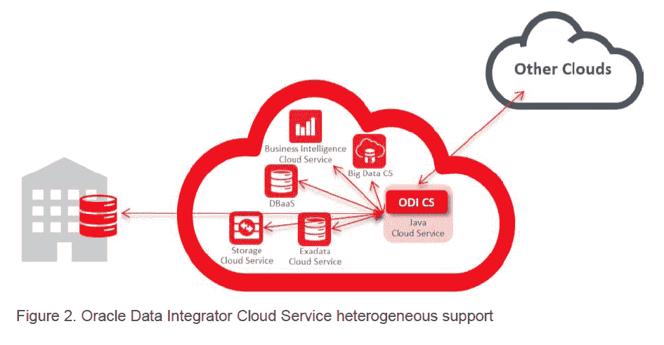

# 甲骨文将其数据集成服务带到了云端

> 原文：<https://thenewstack.io/oracle-takes-data-integration-service-cloud/>

Oracle 已经更新了其数据提取转换和加载(ETL)工具，以作为云服务使用。

[Oracle 的 Data Integrator Cloud](https://cloud.oracle.com/en_US/data-integrator) 在实时企业分析的数据转换方面与开源竞争对手展开较量，尽管它是 Oracle 云套件的一部分，但它并不依赖于其他部分。

Integrator Cloud 是 Oracle 为云重新打包的 Data Integrator 企业版。它可以与甲骨文的堆栈、其他云或客户的数据中心一起使用，并允许用户在诸如 [Hive](https://hive.apache.org/) 、 [HDFS](https://hadoop.apache.org/docs/stable/hadoop-project-dist/hadoop-hdfs/HdfsUserGuide.html) 、 [HBase](https://hbase.apache.org/) 和 [Sqoop](http://sqoop.apache.org/) 等技术之间轻松交换工作，以标准化大规模分析项目的数据格式和语法。

该服务专为异构工作负载而设计，如结合来自 CRM、营销、计费甚至社交媒体应用程序的数据，为一系列 Oracle 和其他应用程序提供[原生适配器](https://cloud.oracle.com/en_US/integration/features)，包括 Gmail、 [MailChimp](https://mailchimp.com/) 、脸书、 [DocuSign](https://www.docusign.com/) 等。

Oracle 产品管理副总裁 [Jeff Pollock](https://www.linkedin.com/in/jtpollock/) 表示，在支持业务分析师和数据科学团队等最终用户方面，它不同于涉及跨 Salesforce 等 SaaS 应用程序移动事务或进行事务集成的消息传递用例。

“无论你决定在哪里托管数据，你都可以使用这项服务将处理过程下推到你的数据位置，而不必通过甲骨文云路由你的数据，如果你不想这样做的话，”他说。

### 将数据留在原位

它基于甲骨文在 2006 年收购法国公司 Sunopsis 获得的技术，Sunopsis 是下推或 T21 ELT 处理的先驱。

“它允许我们在客户架构的任何地方执行数据转换，”Pollock 说。

在传统的 ETL(提取、转换、加载)架构中，数据集被复制到中央引擎进行转换，然后再复制回目标位置。ELT(提取、加载、转换)处理不使用中央集线器，它允许在数据的目的地进行转换。

该服务可以生成程序来转换数据，并将这些算法推送到数据仓库中的源系统、目标系统和大数据系统。Pollock 说，这对于云来说是理想的，因为传统的 ETL 操作涉及网络延迟。

它支持多种数据库、Hadoop、Java API JDBC、XML、JSON、web 服务、REST、JMS、Apache Kafka 等等，集基于数据、基于事件和基于服务的集成于一体。

Pollock 说，该服务提供了基于流程的声明式用户界面以及发布管理功能，允许客户提高生产率和代码管理。

“该工具真正的秘密在于，我们将所有算法作为元数据存储在一个中心位置。我们认为这是一个元数据驱动的过程。所有元数据都可以放在源代码控制中，就像应用程序开发使用源代码控制一样。他说:“它可以与源代码控制库集成，如 [Git](https://git-scm.com/) 或 SVN ( [Apache Subversion](https://subversion.apache.org/) )，在那里，随着时间的推移，更改会被存储为开发生命周期(用于企业代码管理)的一部分。

## 知识模块

放入源代码控制的数据通过知识模块——语义适配器——进行处理，这些模块根据元数据生成转换代码。

“这些知识模块使得这个框架与底层执行分离。开发人员只需创建一次逻辑转换。它存储在元数据中，然后他们可以选择不同的知识模块来执行转换，”他说。

例如，您可以使用 Oracle 之类的关系数据库引擎首次部署您的项目。然后，知识模块会将元数据存储在特定于 Oracle 的 SQL 语言中，以便在 Oracle 数据库中进行转换。但如果一周后你决定使用 Apache Hive 或 Spark 这样的大数据技术，你可以选择不同的知识模块，所有的元数据都保持不变，他解释道。您不必重新构建任何映射或更改任何一行代码。

这可以提高开发人员的生产力，因为他们有能力以各种不同的输出语言生成代码，如 [Spark Streaming](http://spark.apache.org/streaming/) 、Hive、 [IBM Netezza](https://www-01.ibm.com/software/data/netezza/) 数据库、DB2 或 SQL Server，而不必学习任何特定的调用，因为知识模块会生成代码。

波洛克说，甲骨文已经有客户在[亚马逊红移](https://aws.amazon.com/redshift/)进行下推式转型，只有时间才能证明客户是否会选择使用独立于其云平台即服务的服务，其中包括用于实时数据仓库的 [GoldenGate 云服务](https://cloud.oracle.com/goldengate)、数据库云、[数据库云](https://www.oracle.com/engineered-systems/exadata/index.html)和[大数据云](https://cloud.oracle.com/bigdata)。

作为其 PaaS 的一部分，它针对云进行了重组，托管在 [Oracle Java Cloud Service](https://cloud.oracle.com/java) 上，并提供按小时和按月计费的订阅选项。计量用户也可以调用休眠状态，在这种状态下，他们可以选择停止和重新启动服务。部署、配置和生命周期管理已经实现自动化。

## 吹捧云技术

尽管甲骨文被认为是公共企业云游戏中的后来者，但它正在扩大其在该领域的影响力。周二在旧金山举行的高盛技术和互联网大会上，甲骨文联合首席执行官马克·赫德告诉与会者，他认为 AWS 的竞争服务“陈旧”，甲骨文的服务“新鲜”。

首先，甲骨文提供了一个[虚拟化云网络](https://thenewstack.io/oracle-clouds-secret-sauce-virtual-cloud-network/)，这是 AWS 和微软 Azure 还没有的。上个月末，它收购了 API 供应商[apary](https://apiary.io/)，以提升基于云的应用和服务的 API 的设计和管理能力。

它正在全球 20 个城市进行路演，包括 JavaScript、Kubernetes 和 Docker 课程，向开发者和运营团队推销其云平台。

专题图片: [Philippe Put](https://www.flickr.com/photos/34547181@N00/) 的《[熔岩](https://www.flickr.com/photos/34547181@N00/15281365335/in/photolist-phmZw8-pJ4GFM-787FvF-8QDuqn-hmjM4g-sfUoL1-7io128-e7d3es-bxN6z6-pJ87s6-5d2uqm-pJ87sB-dnMedn-5d2uv7-pYoCZU-bFnsYt-9dbXu1-9e8ZbQ-rcVTV9-cqoyhS-erT3Xd-9i6acr-ayDr8X-5cXasV-pJ4Bo2-6wSrqj-eWKEnU-ao5gXp-fKjHLR-7MH2rf-bwuiXt-e1uqTR-q6NSnC-diuHi4-8Hrda9-dZXZfi-e47Uhj-bT8zkR-bpDw96-a3gW9e-9e5UgD-9d8Ra8-aCEY9K-cqiFUw-RcGRSZ-eR7hdr-cSugNs-fzcDhy-e4HdRn-cwvft5)》，CC BY-SA 2.0 授权。

<svg xmlns:xlink="http://www.w3.org/1999/xlink" viewBox="0 0 68 31" version="1.1"><title>Group</title> <desc>Created with Sketch.</desc></svg>