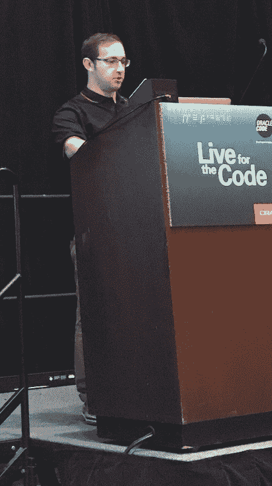
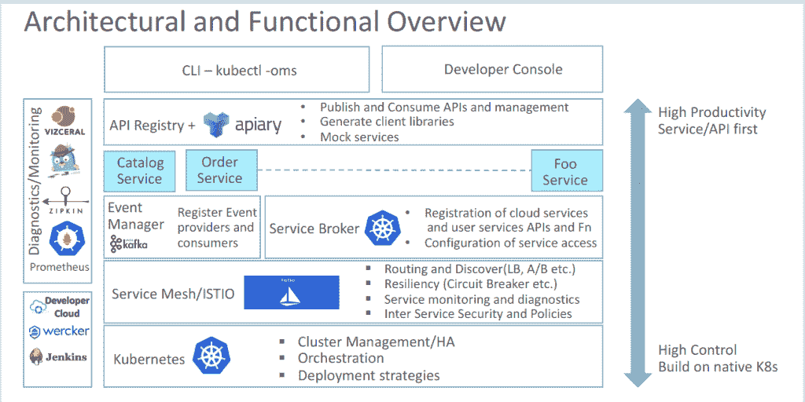

# Oracle 提供微服务友好型云平台的方法

> 原文：<https://thenewstack.io/oracles-approach-offering-microservices-friendly-cloud-platform/>

Kubernetes 和微服务对甲骨文来说仍然相对较新，但去年的 OpenWorld 2017 甲骨文用户大会显示该公司试图快速赶上，通过[迁移到云原生](https://thenewstack.io/oracle-commits-cloud-native/)架构和[无服务器产品](https://thenewstack.io/openworld-oracle-sets-sites-aws-new-serverless-cloud-offerings/)的首次亮相。

甲骨文公司的 Boris Scholl 在甲骨文全球大会 2017 上发表演讲

甲骨文云平台开发产品管理副总裁[迈克·莱曼](https://www.linkedin.com/in/mikelehmann/)在一次采访中说，该公司在支持 Docker、Kubernetes 和其他云原生技术方面投入了大量资金。在过去的几个月里，它还对 Java 进行了大规模的重新启动，以使这种语言与开源和容器更加兼容。

为了帮忙，该公司请来了前微软 Azure 项目经理 Boris Scholl 担任甲骨文云产品开发副总裁。Scholl 的团队有 900 多名开发人员。

其结果是一个专为容器原生微服务操作而构建的 Oracle 平台即服务(PaaS)。在 OpenWorld 大会上，Scholl 与甲骨文产品战略高级总监 Claudio Caldato 合作，为观众提供了一个了解这一堆栈的高峰，以及将微服务与 Java 相结合的经验教训。

## 概观

Scholl 说，Oracle 的微服务整体方法非常以开发人员为中心，他称该公司的框架“规范而开放”，为开发人员提供了 PI 优先的方法来构建微服务。"

Oracle 在平台本身上构建了许多基础设施支持和工具，包括基于 [Zipkin](https://zipkin.io/) 、 [Jaeger](https://github.com/jaegertracing/jaeger) 和 [Vizceral](https://github.com/Netflix/vizceral) 构建的弹性、诊断和监控服务。

Scholl 第一次看到 Vizceral 是在去年的一次会议上，这是一款由网飞开源的交通可视化工具。Scholl 解释说，Vizceral 显示了整个集群的快照，并具有钻取功能。这使您可以看到微服务如何相互通信，使用了多少容器，甚至到 API 版本。“你会看到一张微服务地图，”他说。

此外，Oracle 使用 [Istio](https://istio.io/) 作为[服务网格](/tag/service-mesh/)。“这给了你很多免费的诊断，”卡尔达托说。活动管理器基于卡夫卡，管理通过 [Grafana](https://grafana.com/) 仪表盘完成。服务目录使用甲骨文[去年 1 月](https://www.oracle.com/corporate/pressrelease/oracle-buys-apiary-011917.html)收购的[养蜂场](https://apiary.io/)。

Caldato 向观众展示了一个演示，展示了使用容器化工作流的开发人员可以通过完全集成的管道跟踪数据流，包括代码的检入、测试、打包、构建容器和配置。他说，在 Kubernetes 容器编排软件上构建整个系统，可以根据开发人员的需求提供多种级别的控制。

卡尔达托说，能够管理一个软件包中的所有组件可以节省时间。所有连接外部服务和所有配置设置的艰苦工作都已经完成。

## 挑战

Scholl 警告说，Kubernetes 提供的应用基础设施是有成本的。“它把大部分分布式系统管理留给了应用程序作者，”Scholl 说。所以有一个陡峭的学习曲线。

Scholl 说，对于容器原生架构，“编程模型和基础设施是纠缠在一起的。”由于没有明确的分离，开发人员现在需要理解底层基础设施的工作方式，以及它如何与他们的代码交互。

通过在单一平台 Kubernetes 上构建，他们可以在部署模式上提供灵活性。细节是隐藏的，他说，但如果你想找到它们，它们就在那里。由于平台的构建方式，开发人员可以随意更换组件。Scholl 说，这个平台及其 API 关联与无服务器框架的工作方式相同。“如果你不喜欢 Grafana 仪表盘，想用别的东西代替它，如果你不喜欢 Zipkin，想用 Jaeger 进行诊断，你可以这样做，”他说。

在 [Unsplash](https://unsplash.com/?utm_source=unsplash&utm_medium=referral&utm_content=creditCopyText) 上拍摄的甜冰淇淋特写图片。

<svg xmlns:xlink="http://www.w3.org/1999/xlink" viewBox="0 0 68 31" version="1.1"><title>Group</title> <desc>Created with Sketch.</desc></svg>