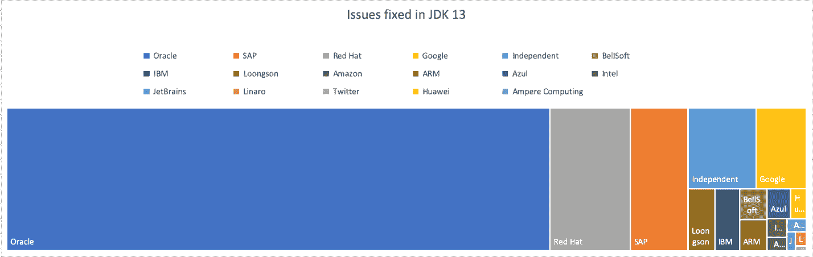

# Oracle 的 Java SE 13 向敏捷性、云原生应用进军

> 原文：<https://thenewstack.io/oracles-java-se-13-marches-toward-agility-cloud-native-applications/>

甲骨文周一在旧金山举行的 [Oracle Code One](https://www.oracle.com/code-one/) 会议上发布了期待已久的 Java SE 13 (JDK 13 ),其中三个新功能旨在提高该语言在现代计算环境中的灵活性和性能，另外两个新的预览功能提供了更高的代码可读性和“简化日常编码”该版本仅比 JDK 12 版本晚六个月，比 JDK 14 版本早六个月(14 版本已经有[版本](http://jdk.java.net/14/)，是甲骨文 2017 年开始的为期六个月的功能发布节奏的一部分。

在过去，Java 是按 3 年多的发布时间表发布的，经常一次捆绑几十个特性和错误修复，如果不是更多的话。在接受新堆栈采访时，[甲骨文公司软件开发副总裁乔治·萨博](https://www.linkedin.com/in/georgessaab)解释说，该公司新的、更敏捷的方法更频繁地带来新功能，并允许更频繁地修复错误。

萨博说:“我们在每隔一年的期望节奏中看到的是，我们经常需要决定要么发布尚未完全准备好的东西，让整个行业在未来 20 年内不得不接受它，要么推迟它，确保它真的准备好了，可能需要另外六个月、一年或有时更长时间来交付它。”“这种六个月一次的转变实际上是试图以一种比 25 年前更容易理解的方式来彻底解决这个问题。”

JDK 13 中包含的两个新预览功能在早期版本中就已经提供，并提供了一些简单的新功能。首先，[文本块](http://openjdk.java.net/jeps/355)允许代码跨越不止一行，增加可读性并避免转义序列。接下来， [switch 表达式](http://openjdk.java.net/jeps/354)使得 switch 既可以用作语句，也可以用作表达式，为[模式匹配](https://openjdk.java.net/jeps/305)铺平了道路。

JDK 13 中包含的其他三个功能包括[动态类数据共享(CDS)档案](http://openjdk.java.net/jeps/350)、[取消提交未使用的内存](http://openjdk.java.net/jeps/351)，以及[遗留套接字 API](http://openjdk.java.net/jeps/353) 的重新实现。北京汽车股份有限公司解释说，动态 CDS 存档功能有助于为微服务提供更小、更优化的构建。

“Java 通常会启动并加载您的所有应用程序、所有类，并随着时间的推移识别热点并优化代码。类数据共享将查看那里正在进行的一切，并将所有这些存储在一个共享映像中，以便下次启动时，它可以快速映射，并使用完全优化的代码快速启动，”萨博说。“这正是你想要的微服务。传统的 Java 运行时堆栈方法的开销，这种方法对于使用大量内存并运行几天、几周或几个月的东西很有效，但你不想支付这种开销。你希望能够快速出现，奔跑，全速做一些事情，然后消失。”

类似地，取消提交未使用的内存有助于在共享云环境中运行容器化的应用程序，而传统套接字 API 的重新实现是[项目 Loom](https://openjdk.java.net/projects/loom/) 的一部分，萨博将其解释为提高可扩展性的努力。

“Java 运行时的可伸缩性本质上受到了本机线程模型的可伸缩性的限制。织机将“纤维”引入 JDK。你可以把纤程想象成一个非常轻量级的线程，线程由 Java 控制，可以映射成千上万个纤程到一个本地操作系统线程。“人们一直试图通过从同步模型转移到异步模型来扩大 Java 中的工作负载。异步编程很复杂，很难理解，很难调试，很难分析，但是它提供了可伸缩性。问题是，它通常以极大的复杂性为代价。通过让运行时本身处理这种映射并处理纤程到线程的缩放，它允许您继续使用简单易懂的同步编程模型。”

根据发布的一篇博客文章，在 JDK 13 中标记为已修复的 [2，126](https://bugs.openjdk.java.net/browse/JDK-8217731?jql=project%20%3D%20JDK%20AND%20fixVersion%20%3D%2013%20AND%20resolution%20%3D%20Fixed%20AND%20comment%20~%20%22URL%3A%20http%3A%2F%2Fhg.openjdk.java.net%22%20AND%20(labels%20not%20in%20(hgupdate-sync)%20OR%20labels%20is%20EMPTY)%20%20ORDER%20BY%20updated%20DESC%2C%20assignee%20ASC) 个 JIRA 问题中，大约 70%由甲骨文负责，其余由包括谷歌、红帽、SAP、Ampere Computing、ARM、华为、Linaro 和龙芯在内的公司处理。萨博指出这些贡献证明了 Java 的持续相关性和重要性。

“在 JDK，我们有更多的人参与到合作中来。我们对此非常高兴，”萨博说。“我们在 Java 领域的许多合作伙伴通常都是 Oracle 最大的竞争对手。我认为这证明了整个行业中每个人对 Java 的重视程度。”

Oracle 和 Red Hat 是新体系的赞助商。

专题图片:“行进的早期课程，1794 年 12 月 24 日”，英国插画家托马斯·罗兰森，[纽约大都会艺术博物馆](https://www.metmuseum.org/art/collection/search/392951?&searchField=All&sortBy=Relevance&ft=marching&offset=0&rpp=20&amp;pos=15)。

<svg xmlns:xlink="http://www.w3.org/1999/xlink" viewBox="0 0 68 31" version="1.1"><title>Group</title> <desc>Created with Sketch.</desc></svg>