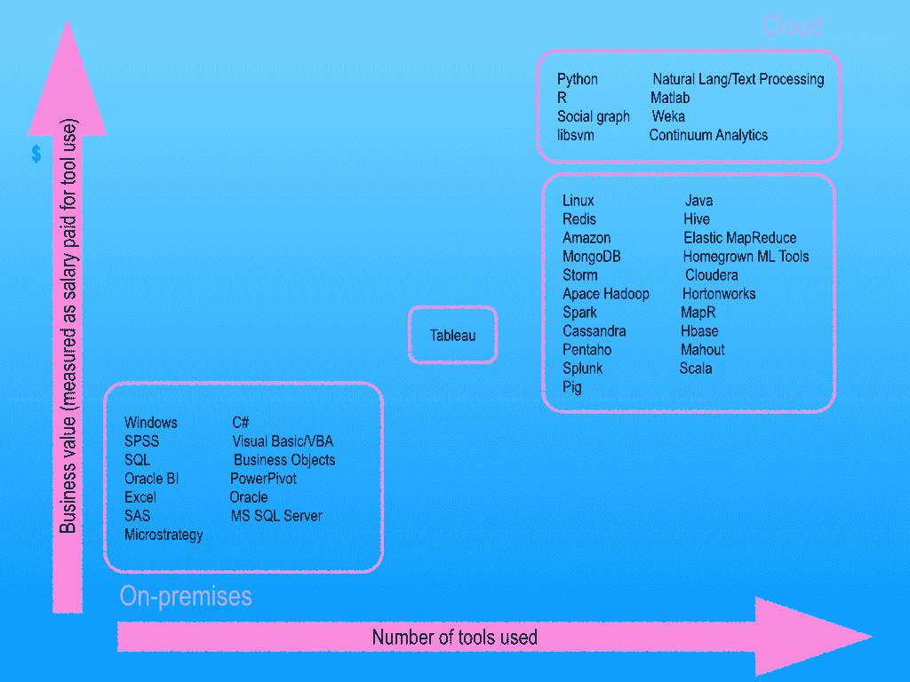
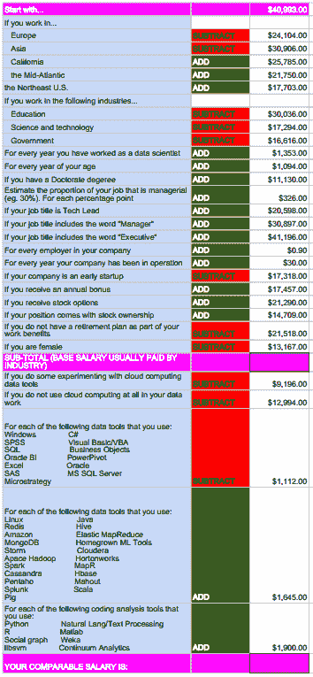

# 奥赖利调查:数据科学家收入丰厚，但女性收入不如男性

> 原文：<https://thenewstack.io/oreilly-survey-data-scientists-make-good-money-but-women-dont-get-paid-as-well-as-men/>

对工作场所中使用的数据科学工具堆栈的调查显示，企业和企业最重视开源工具，并愿意为那些能够在云中管理数据的工具支付额外费用。坏消息是，从事数据科学专业的女性因为性别而受到经济上的惩罚。

上周，在西班牙巴塞罗那举行的 Strata 和 Hadoop World 大会上，O'Reilly Media 发布了 2014 年数据科学调查。它立即成为了大众的最爱，揭示了那些使用 Hadoop 风格的堆栈工作的人获得了更高的工资。在调查了 53 个国家的 816 名数据科学专业人员(尽管三分之二的受访者在美国)后，作者约翰·金和罗杰·马古拉斯发现，开源数据工具——包括那些最近由新堆栈强调的[——对现代堆栈环境至关重要，而来自专有供应商的垂直集成的成熟工具堆栈被认为是一种损害。](https://thenewstack.io/six-of-the-best-open-source-data-mining-tools/)

事实上，一名数据科学家在 Hadoop 生态系统中使用的每个开源工具可以额外获得 1645 美元，而使用 Excel、SPSS、SQL、Oracle 或其他工具的数据工作者预计每个工具可以少获得 1112 美元。

该调查主要使用当前支付的工资作为企业对数据科学工具堆栈的价值的关键指标。然而，作者指出，现在分析包括 JavaScript、Ruby 和 D3 在内的新兴数据工具堆栈的商业价值和影响还为时过早，而 Unix、Perl 和 C++使用频率太低，无法纳入最终分析。

该调查能够清楚地表明，更高的盈利能力(以及对业务的感知价值)与数据科学家愿意尝试一系列工具有关，这些工具可以完成相同或类似的工作，其中 Hadoop 生态系统中的工具价值最高。Hadoop 用户习惯使用多达 18 到 19 个数据科学工具，其中一些可以互换使用。King 和 Magoulas 指出，这表明公司并没有将所有赌注都押在一个数据科学堆栈上，而是希望他们的专业团队能够混合和匹配各种工具，直到可以就哪些工具成为业务的一部分做出商业决策。

该调查将数据科学工具分组。每个集群都是相关的，因此数据科学家更有可能在同一个集群中使用其他工具。这在 Hadoop 生态系统工具集群中尤为明显，但在与编码分析工具相关的集群中也很明显。例如，R 编码人员更有可能使用 Python 工具、社交图工具和 Weka(所有这些都是调查人员分类的第三类的一部分)。编码分析工具也是最受行业重视的:数据科学家在日常数据堆栈中每使用一个编码分析工具，工资就会增加 1900 美元。

对于开源堆栈集群中使用的每个工具，科学家不太可能使用像 Excel 或 SPSS 这样的专有工具。

### 开源和云对企业更有价值

企业最看重能够使用开源工具堆栈的员工:当使用 Redis、Hadoop 或 Elastic MapReduce 时，他们会付给员工更多的工资。有趣的是，如果数据科学家将关系数据库管理服务与开源工具结合使用，他们会赚得盆满钵满，但那些只使用 RDBMS 工具的人赚得就少得多。

Storm 和 Spark 也成为两个最受欢迎的数据工具，被那些在所有被调查的数据科学家中收入最高的人使用。

在云环境中工作的数据科学家也更受重视。这一趋势在云采用生命周期中是显而易见的:那些在云中试验数据的人比那些只在内部环境中工作的人获得了提升。

只有 Tableau 软件处于特定堆栈环境的价值之外:员工使用 Tableau 既不会受到惩罚，也不会受到青睐，使用 Tableau 在开源堆栈爱好者中与那些喜欢成熟的专有工具的人一样普遍。

数据科学家、《自举机器学习》一书的作者 Louis Dorard 在几天前举办了首届国际预测 API 和应用大会(PAPIs.io)后参加了 Strata。在 PAPIs 的 200 多名与会者中，“开源库，如 Scikit-learn(用于机器学习)和 Pandas(用于 Python 中的数据辩论)”是最常被提及的。多拉德还指出了数据科学家对“命令行工具(例如，那些在[数据科学工具箱](http://datasciencetoolbox.org "Data Science Toolbox")中找到的工具)的喜爱，”他说。

虽然多拉德承认他遇到的许多数据科学家倾向于使用各种开源工具——通常可以互换——但工具选择的巨大分歧往往归结为哪些可以用来支持原型开发，哪些适合生产:
“在预测建模中，有两种非常不同的活动:原型开发模型和将它们部署到生产中。两者都很难精通。原型需要快速迭代，并且在笔记本电脑上使用 R 或 Python 来执行。通常人们根据他们的背景和经历有他们自己的偏好。部署到生产需要将原型转换到另一个平台，但这正在改变，在 PAPIs 上看到的工具，如 Yhat 和 Azure ML，可以获取您现有的 R/Python 代码，并将其部署到生产中。”

### 女人又被欺骗了

最令人不安的发现之一是，相对较新的数据科学领域已经在模仿传统的社会分层模式:与男性同行拥有相同技能的女性薪酬比男性低 13，000 美元:在美国大多数行业观察到的[同性薪酬不平等](http://www.bls.gov/cps/%0D%0Acpswom2012.pdf)。作者指出，“性别是最不符合逻辑的预测变量，因为没有工具使用或其他因素可以解释薪酬差距——调查结果中的性别差距似乎没有道理。”

性别不平等在 IT 劳动力中是一个如此严重的问题，以至于即将召开的虚拟程序员会议正在筹集支持资金，以帮助像编码、[代码 2040](http://code2040.org/ "Code2040") 和[黑人女孩代码](http://www.blackgirlscode.com/ "Black Girls Code")这样的组织，所有这些组织都专注于解决 IT 劳动力中的性别和多样性不平等问题。[黑。Summit()](https://hacksummit.org/ "Hack.Summit()") 将于下周一(12 月 1 日)至周四(12 月 4 日)举行，这是一个虚拟会议，由顶尖的行业人才分享各种编程语言的最佳实践。组织者 Ed Roman 表示，会议旨在揭示诸如数据科学等 IT 领域的性别和少数民族不平等现象。

## 你和你的数据科学同行相比如何？

根据数据科学调查的 816 名调查受访者的汇总结果，创建了以下计算器来显示您可能获得的收入。

通过 Flickr 知识共享[发布的专题图片](https://www.flickr.com/photos/oreillyconf/15649775818/in/set-72157648972350727/)

<svg xmlns:xlink="http://www.w3.org/1999/xlink" viewBox="0 0 68 31" version="1.1"><title>Group</title> <desc>Created with Sketch.</desc></svg>