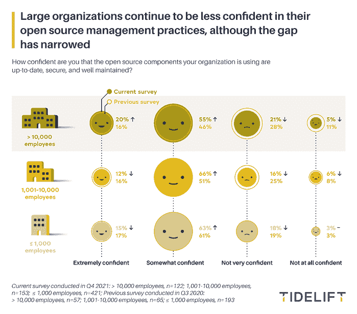

# 调查:对开源“有点信心”就足够了吗？

> 原文：<https://thenewstack.io/organizations-only-somewhat-confident-in-open-source-components/>

根据一项调查，大多数组织都对使用开源软件感到担忧，其中最大的组织对其开源管理实践最没有信心，该调查询问了 700 名技术人员，包括工程师、软件开发人员、DevOps 工作人员和高管。

具体来说，参与者被问及他们是否确信他们使用的开源组件是安全的、最新的和维护良好的。根据开源管理提供商 Tidelift 本月发布的“[2022 年开源软件供应链调查报告](https://tidelift.com/2022-open-source-software-supply-chain-survey)”，15%的组织在这方面“非常有信心”。*新堆栈*的[劳伦斯·赫克特](https://www.linkedin.com/in/lawrence-hecht/)是该项目的研究伙伴，旁边是 Tidelift 的营销主管[克里斯·克雷斯](https://www.linkedin.com/in/chrisgrams)。

Grams 在 7 月的上游虚拟会议上介绍结果时指出，大多数受访者——62%——对他们的开源组件“有些信心”,这一发现并不令人振奋。

“当我看今年的全国冠军赛时，卡罗莱纳州作为一个巨大的失败者进入了全国冠军赛，他们在对阵堪萨斯的半场时领先了 15 分，”Grams 说。“我‘有点自信’卡罗莱纳州会赢得这场比赛，你们当中那些看过比赛的人会记得，卡罗莱纳州实际上输掉了那场比赛。”

“因此，当谈到确保您的组织中的开源组件是最新的、安全的和维护良好的时，有点信心:这就足够了吗？”他补充道。

图片由 Tidelift 提供

另外 22%的人对开源组件的良好管理不是很有信心，或者根本没有信心。尽管如此，仍有改善的迹象，正如 Hecht 在 4 月份的 tweet 中指出的,“大型组织对他们的开源实践感觉更好，但仍然担心。26%的人不太有信心或完全没有信心，去年有 39%的人报告说他们对 OSS 组件的安全性不太有信心或完全没有信心，这种情况有所好转。”

## 组件批准拖累开源开发

报告发现，在大型组织中，获得使用新的开源组件的批准是缓慢而乏味的，一半的受访者需要一天到一周的时间。对于 39%的受访者来说，审批会拖延一个多星期到一个月甚至更长时间。

“对于这 39%的组织来说，需要一周到一个月甚至一个多月的时间，您能想象有 10%的组织需要一个多月的时间才能获得新组件的批准吗？”克说。“我想知道，如果你是一个组织的开发人员，当你坐在那里等待一个新组件获得批准时是什么感觉。”

他补充说，在最大的组织中，情况会变得更加糟糕。在超过 10，000 人的大型组织中，78%的人说引入新的开源组件有某种授权过程，56%的人说批准过程需要一周或更长时间。

“减缓开发者使用开源的能力真的有效吗？”克质疑道。

总的来说，61%的人说他们的组织有使用新的开源组件的批准过程，38%的人说没有过程或者是不需要授权的非正式过程。将近一半的小型组织(员工不到 1000 人的组织)有非正式的授权过程，或者根本没有授权过程。

## 正在流行的最佳实践:中央存储库

IT 分析公司 [Gartner](https://www.gartner.com/) 和 [IDC](https://www.idc.com/) 推荐的最佳实践之一是使用经批准的开源组件的集中管理库。根据该报告，这种方法的主要好处是，当开发人员知道哪些组件被审查时，他们可以更快地行动，并提高安全性。

考虑到大型组织中沉闷的审批流程，这是报告中指出的一个新兴趋势也就不足为奇了。

调查发现，65%的组织已经在使用或正在积极尝试一个经批准的开放软件组件的中央存储库，其中大型组织领先 75%。有趣的是，26%的组织没有使用集中存储库的计划，32%的最小组织说他们没有制定存储库的计划。

“我认为这是一种新兴趋势，”Grams 说。“有趣的是，我们仍然处于早期阶段，但一些组织已经开始使用这一点。”

应该指出的是，Tidelift 在其产品中提供了这样的解决方案。

## 很少有人意识到软件供应链的合规性

一个应该引起开发领导者注意的发现是:只有 37%的受访者知道 2021 年 5 月白宫关于网络安全的行政命令，该命令要求与政府做生意的[组织](https://thenewstack.io/web-apps-and-the-white-house-executive-order-on-cybersecurity/)通过最新的[软件材料清单(sbom](https://thenewstack.io/a-software-bill-of-materials-could-be-a-requirement-for-applications-soon/))来加强其软件供应链中的网络安全。

“白宫行政命令背后的想法是，如果你想向政府出售，你需要提高你的网络安全水平，”Grams 说。“你需要更好地了解你正在使用的组件的来源(例如，它们来自哪里)，你需要了解它们的安全性如何，是谁制造的，并且在开源环境中这可能相当具有挑战性。”

这一低认知度数字可能与调查的时间有关，该调查是在去年 12 月的 [Log4Shell](https://thenewstack.io/log4shell-we-are-in-so-much-trouble/) 期间进行的，所以 Grams 说他预计这一数字将在明年的调查中发生显著变化。

作为后续问题，调查询问当前的软件供应链安全事件(如[网络安全管理软件产品](https://thenewstack.io/solarwinds-the-worlds-biggest-security-failure-and-open-sources-better-answer/))是否对他们处理应用程序安全的方式产生了巨大或极其巨大的影响。

“毫不奇怪，在这些组织中，42%的组织报告称，当前的软件供应链安全事件(如网络安全管理软件产品事件)对他们如何处理应用程序安全产生了巨大或极其巨大的影响，”报告指出。“只有 15%的组织认为没有任何影响。”

也就是说，78%的组织正在使用 SBOMs 进行应用程序开发，或者计划在明年使用。只有 22 个国家没有使用 SBOMs 的计划。同样，大型组织的使用率更高，84%的受访者表示他们正在积极使用 SBOMs 或计划在明年使用。

毫不奇怪，使用 SBOMs 和对开源组件的信任之间似乎存在联系。Hecht [指出](https://twitter.com/LawrenceHecht/status/1516534824281989129?s=20&t=yivUAm-epAmBZG8GubqeSg)87%使用 SBOMs 的组织对他们的开源组件是最新的、安全的和维护良好的有一定的信心；相比之下，39%不使用 SBOMs 的组织对他们的开源组件没有信心或信心不足。

<svg xmlns:xlink="http://www.w3.org/1999/xlink" viewBox="0 0 68 31" version="1.1"><title>Group</title> <desc>Created with Sketch.</desc></svg>