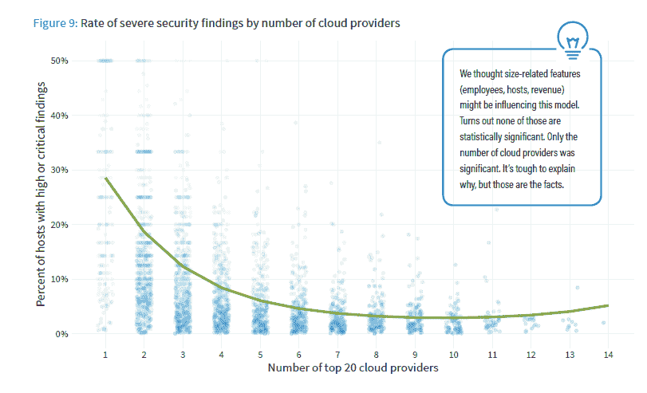
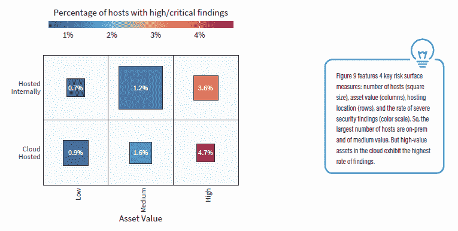

# 在更多云上运行的组织不太可能发现安全威胁

> 原文：<https://thenewstack.io/organizations-running-on-more-clouds-less-likely-to-see-security-threats/>

对边界的混淆，无论是在云之间还是地理位置之间，都会使云安全面临挑战。有几种方法旨在解决管理多个云环境安全性的复杂性，但有一个指标实际上显示了拥有更多云提供商的组织的安全性改进。

根据 RiskRecon 和 Cyentia Institute 的“[云风险表面报告](https://www.riskrecon.com/cloud-risk-surface-report)”的数据，仅使用一个外部云的组织中有近 29%的组织拥有一个面向互联网的主机，该主机具有高度或关键的安全相关发现，该报告基于对 18，000 个组织的分析。拥有四朵云的公司平均只有四分之一的曝光率。仅使用一两个云的公司可能处于公共云采用的早期阶段。尽管常识表明大公司拥有更好的安全云安全态势，但这项研究并不支持这种说法。

来源:RiskRecon 和 Cyentia Institute 的“云风险表面报告”

在云提供商托管的环境中运行高价值工作负载的主机中，有 4.7%出现高或关键发现，但大部分工作负载面临较低的安全威胁级别，并且在内部托管。总的来说，研究发现本地主机不太可能有安全发现。

来源:RiskRecon 和 Cyentia Institute 的“云风险表面报告”

该研究中三分之一的主机位于国外，但三分之二的主机位于外部网络，无论其物理位置如何。使用相同的数据，早期的[分析](https://www.riskrecon.com/internet-risk-surface-report)基于云相关和物理边界两方面研究了互联网使用情况。它发现地理不是命运，而是一个持续的障碍；94%的中型企业面向互联网的主机位于其本国。

[GDPR](/wasting-money-on-public-cloud-storage/) 对于迁移到公共云的组织来说是一个巨大的问题，本地数据保护要求给企业和云提供商带来了许多挑战。然而，定义不同云的界限是安全性和云供应商更关注的。

## 其他报告中的混乱和复杂性问题

*   **需要经理中的经理**
    *   *"* [监控问题阻碍了混合、多云部署](https://thenewstack.io/monitoring-concerns-hamper-hybrid-multicloud-deployments/) *"* 表明安全和监控系统并未经过优化，无法同时跟踪内部和云环境。
    *   根据 2018 年 Enterprise Strategy Group [的调查](https://www.csoonline.com/article/3317563/cybersecurity-professional-impressions-on-cloud-native-security.html)，超过一半(56%)的网络安全和 IT 专业人士认为，云服务提供商提供的安全控制也应该支持其他 IaaS/PaaS 环境。
*   **复杂性焦虑:** 66%的 IT 决策者认为 IT 环境比两年前更加复杂，[根据](https://research.esg-global.com/reportaction/tect0411201901/Toc)企业战略集团。尽管新技术被认为能让人们的工作变得更容易，但采用它往往会带来短期的痛苦。
*   **要求补充云提供商的安全性:**在云安全联盟的[调查中，70%的受访者目前使用云提供商的本地网络安全控制来保护公共云部署。在 CyberArk 的](https://cloudsecurityalliance.org/artifacts/cloud-security-complexity/)[调查](https://www.cyberark.com/resource/global-advanced-threat-landscape-2019-focus-on-cloud/)中，75%的受访者依赖云供应商的内置安全性，但该群体中大约一半的人认为这并不能提供足够的保护。
*   **认知与现实不符:**根据调查受访者的说法，一般组织认为其员工使用 452 个云应用程序，但赛门铁克自己的数据显示，“影子 IT”应用程序的实际数量为 1，807 个(“适应不断发展的云威胁的新现实”)。
*   **云安全架构师是一个真实的角色**
    *   近一半(46%)的调查受访者表示，他们必须投入至少一种资源来应对理解不同云服务提供商之间的共同责任安全
        模式差异的挑战([《甲骨文和毕马威 2019 年云威胁报告》](https://www.oracle.com/cloud/cloud-threat-report/))。
    *   Oracle/KPMG 报告中 41%的受访者有云安全架构师角色。然而，没有管理这一职能的标准方法，33%的云安全架构师向首席信息官报告，31%向 CISO 报告。

## 无云:一个解决实际问题的愚蠢术语

我开始写这篇文章是因为研究了一种叫做“无云”的东西，这是一个由供应商创造的术语，描述了一种消除私有云和公共云之间区别的方法。其核心是，它承诺抽象出给开发人员、it 运营和安全团队带来诸多复杂性的界限。在这种情况下，“无云”是对混合云和多云乌托邦的重新诠释。实现这一理想未来的紧迫性有待讨论，尽管这个主题仍然是那些致力于解决云安全挑战的人的首要问题。

云访问安全代理(CASB)和特权访问管理(PAM)是解决与多云、多位置 IT 环境相关的一些挑战的两种方法。一个[零信任安全模式](https://www.twistlock.com/2019/04/08/zero-trust-security-means-achieve/)也通过处理遍布全球的多个云提供商的独特基础设施和安全状况的方法来解决相关问题。

Twistlock 是新堆栈的赞助商。

图片由 Pixabay 的 lmaresz 提供。

<svg xmlns:xlink="http://www.w3.org/1999/xlink" viewBox="0 0 68 31" version="1.1"><title>Group</title> <desc>Created with Sketch.</desc></svg>