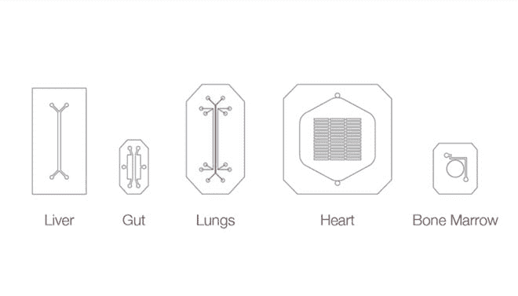
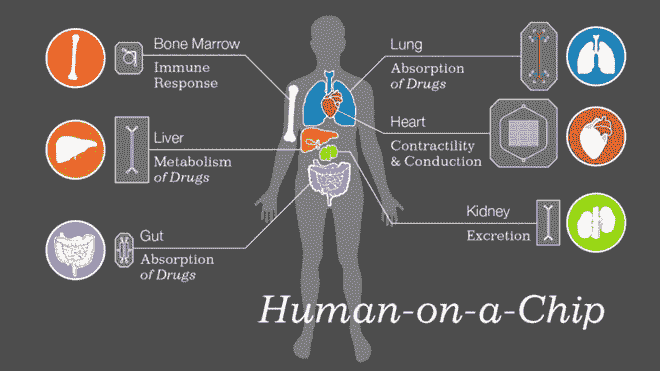
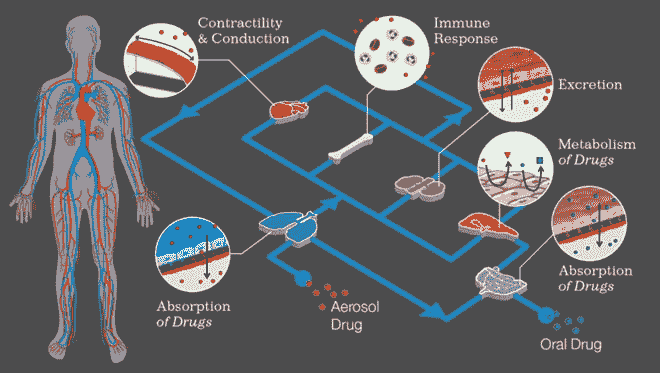
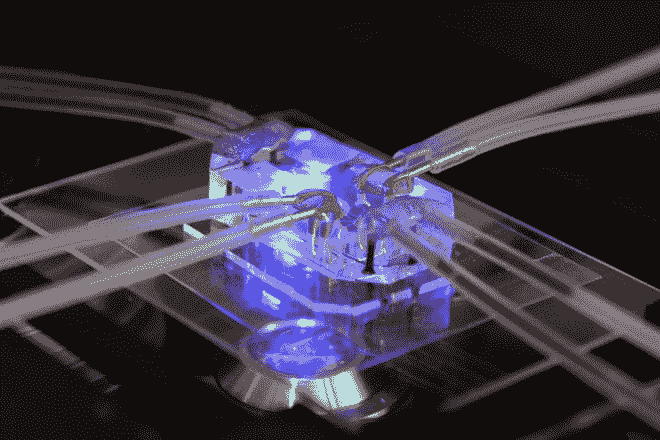
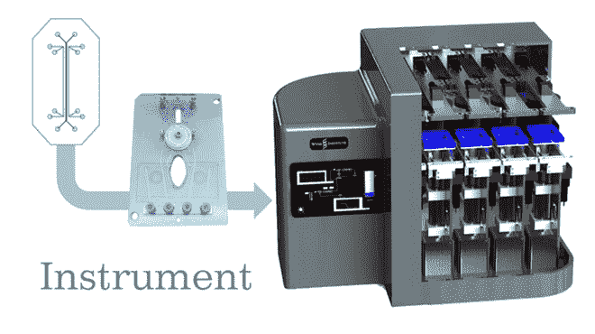

# 片上器官模拟人体器官，用于更好的生物医学测试

> 原文：<https://thenewstack.io/organs-on-chips-emulates-human-organs-for-better-biomedical-testing/>

编者按:新的堆栈是关于大规模应用程序开发和管理影响我们生活和工作方式的方式。这些技术的文化影响，如芯片上的器官，为我们日常探索的核心技术提供了一个不同的视角。通常我们在周末刊登这些报道。我们的目标是写更多这样的故事，并在一周内连续播放。我们正在寻求捐助。如有兴趣，请联系我们。

生物医学研究和药物开发目前是一个漫长而昂贵的过程，几乎没有成功的保证。这些模仿人体器官的微芯片会是一种选择吗？

今天的生物医学测试依赖于培养皿中分离的细胞培养和动物测试等工具，这两种工具都无法准确模拟人体的动态环境。即使在动物试验中成功的药物也经常在人体临床试验中失败，浪费了数百万美元和数年的研究。但是哈佛大学多学科 Wyss 研究所的科学家和工程师们正致力于通过一种芯片来改变生物医学测试的冷漠、随意性，这种芯片旨在更准确地模拟人体器官——降低成本，更好地预测药物反应，并消除动物测试的需要。

## 芯片上的器官

怀斯研究所的[芯片器官](http://wyss.harvard.edu/viewpage/461/)将微制造技术与现代组织工程相结合，生物模拟了肺、心脏、肾脏、肝脏和肠道等器官的机械和生物化学行为。这些假器官是使用多层光刻技术制造的，这是一种从计算机芯片制造商那里借来的制造方法。这一过程创造了微观的中空室、通道和阀门，它们可以被雕刻在透明聚合物的粘合层内，血液等流体可以通过它们泵送。此外，这些“微流体”设备具有多孔膜，可以衬有各种人体器官细胞。

Wyss 的创始董事 [Donald Ingber](http://wyss.harvard.edu/viewpage/121/donald-e-ingber) ，他在 2010 年与前 Wyss 技术开发研究员 [Dan Dongeun Huh](http://goldsea.com/Text/index.php?id=13847) 一起开发了第一个[芯片上的肺](https://en.wikipedia.org/wiki/Lung_on_a_chip)，解释了这些设备将如何改变生物医学测试一度零碎的性质，使其成为更全面的实践，反映人体的实际工作方式:

> 人体片上器官设计的一个关键部分是它们能够机械地反映活体器官中的动态物理微环境。包括类似于呼吸和蠕动过程中看到的流动液体和组织变形，这使它们能够复制整个器官的功能。

## 受张拉整体的启发

令人惊讶的是，尽管早在 20 世纪 70 年代就主修分子生物物理学和生物化学，但 Ingber 在这些微器官背后的灵感却意外地来自他在耶鲁大学本科生雕塑课上的经历，当时学生们正在制作刚性的三维雕塑，阐释[张拉整体性](https://en.wikipedia.org/wiki/Tensegrity)(张力整体性或浮动压缩)的概念。

通过科学家的思维透镜，英格伯意识到细胞有自己的生物机械张力整体，这使它们能够与环境相互作用，并被环境塑造。Ingber 将这些动态结构概念整合到他当时正在进行的细胞研究项目中，并最终与当时正在试验计算机芯片的哈佛化学家 George Whitesides 合作，使他们的研究小组为开发这些革命性的设备奠定了基础。

## 一个完整的人体在芯片上？

现在，Ingber 和他的同事们希望开发连接这些不同的芯片器官的方法，以复制整个人体的工作方式——如果你愿意，可以称之为芯片人体。

[说](https://www.youtube.com/watch?v=CpkXmtJOH84) Wyss 高级首席科学家和生物研究员 Geraldine Hamilton 说:“我们的目标实际上是做整个人体，然后我们可以流体连接多个芯片来捕捉不同器官之间的相互作用，并最终在芯片上重建一个身体。”。

Wyss 的科学家还与制造公司合作，为这些芯片组创建易于使用的界面和仪器，以创建一个“即插即用”的实验和临床试验环境，这将使生物医学研究和测试更加简单和全面。

除了加快生物医学的研发周期，芯片上的器官还预示着一个“个性化”医学的新时代，在给药之前，个人的干细胞可以在芯片上用来预测他们对某种药物的反应。风险有所降低，药物疗效有可能增加，并且有可能以 [3D 打印药物](http://www.telegraph.co.uk/news/health/11202016/3D-printed-drugs-could-revolutionise-prescriptions.html)的形式为个人定制药物。化妆品可以更容易地进行测试，针对不同人群的感染和遗传疾病的专门治疗方法可以更快地被发现。

但这不仅仅是研发药物；包括国防高级研究计划局(DARPA)和美国美国食品药品监督管理局(FDA)在内的几个政府机构正在资助片上器官。可以理解的是，使用这些设备来寻找针对生物武器的保护[、全球流行病或产品安全测试，对于国家安全和健康具有重大意义。](http://www.scientificamerican.com/article/biodefense-aims-to-simulate-human-bodies-by-linking-mini-organs-on-chips/)

计划是通过生物技术初创公司[模仿](http://www.emulatebio.com/)将[这些创新的芯片器官](http://www.betaboston.com/news/2014/07/28/harvard-incubated-emulate-aims-to-solve-biotech-drug-failure-woes-by-fusing-microchips-with-human-tissue/)商业化，有望在 2016 年实现。毫无疑问，目前细胞培养和动物试验的局限性确实需要更好的替代方案，但考虑到人体作为一个动态整体的巨大复杂性，在这些仿生芯片器官充分再造一个生命体之前，仍需要一些时间和更多的发展。然而，最初的结果看起来很有希望，我们急切地想知道这些小而不起眼的设备是否会改变我们所知道的生物学研究的面貌。更多信息，请访问 [Wyss 研究所](http://wyss.harvard.edu/)和[仿真](http://www.emulatebio.com/)。

观看 Wyss 生物研究员 Geraldine Hamilton 在 TED 上解释芯片器官:

[https://www.youtube.com/embed/CpkXmtJOH84?feature=oembed](https://www.youtube.com/embed/CpkXmtJOH84?feature=oembed)

视频

<svg xmlns:xlink="http://www.w3.org/1999/xlink" viewBox="0 0 68 31" version="1.1"><title>Group</title> <desc>Created with Sketch.</desc></svg>