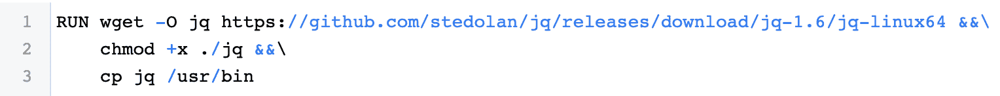

# Orion:超越 SBOM 的软件包管理器发现

> 原文：<https://thenewstack.io/orion-go-beyond-package-manager-discovery-for-your-sbom/>

[](https://www.linkedin.com/in/shripad-nadgowda-8196949/)

 [施里帕德纳德戈达

施里帕德是 IBM 研究院的高级技术人员。他热衷于推动研究创新，为云计算带来与众不同的功能。他目前的研究领域包括 DevSecOps、开发人员工具以及基本上所有与容器安全相关的东西。](https://www.linkedin.com/in/shripad-nadgowda-8196949/) [](https://www.linkedin.com/in/shripad-nadgowda-8196949/)

软件供应链的安全性和完整性是网络安全整体评估的基本要求之一。确保软件供应链安全的第一步是能够提供完整、准确且可审计的记录，记录构建可交付软件产品的每个依赖项，通常称为软件材料清单(SBOM)。

正如国家电信和信息管理局(NTIA)的一份报告所指出的，“如果没有 SBOM，软件系统的贡献者、组成和功能缺乏透明度，将极大地增加网络安全风险，并增加开发、采购和维护的成本。”

已经有许多开放源码和商业工具可以满足这种需求，并且正在建立定义良好的规范标准。一些软件供应商和开发者已经开始将 SBOM 的生成和发布作为他们软件交付管道的一部分。那么，我们在这篇文章中讨论的新内容是什么呢？

今天的 SBOM 生成技术在很大程度上局限于发现受管理的、能够通过包管理器查询的依赖关系。比如`pip list`或者`dpkg -l`或者一些包裹舱单中明确记录的，比如`package-lock.json`。

另一方面，开发人员不仅限于通过包管理器引入依赖关系。在某些情况下，所需的软件依赖项无法通过软件包管理器获得。例如，一些软件发行版是以预编译的二进制形式提供的，开发者可以简单地`wget`，而其他的是以`tar.gz`的原始代码提供的，开发者可以`make && make install`。

 [劳拉·栾

Laura 是 IBM 计算资源管理和自动化研究所的软件工程师。她目前关注的领域是云安全合规性，特别是自动化软件清单的工具、最佳实践的实施和 DevSecOps 流程中的集成。](https://www.researchgate.net/profile/Laura-Luan) 

这是确保 SBOM 完整性的一个关键缺口。我们找不到任何可靠的开源工具来解决这个问题，所以我们决定建立一个——那就是 [orion](https://github.com/tap8stry/orion) 。

首先，在猎户座中，我们不试图复制现有的 SBOM 一代工具。所以 orion 不会发现任何包管理器依赖性。它发现通过软件包管理器之外的设备安装的依赖项。所以它是对现有 SBOM 生成工具的补充。此外，目前，orion 只关注微服务应用构建模式。

话虽如此，现在让我们更仔细地看看猎户座是做什么的。

Orion 作为 CLI 提供，可以在本地或任何 CI 管道中执行，如下所示:

```
$  sudo orion discover  -d  orion-test-app/Dockerfile  -f  orion-result.spdx  -i  icr.io/gitsecure/orion-test:1.0  -n  orion-test-app

```

对于微服务，可交付的软件产品通常是通过 docker 文件中定义的配方构建的容器映像。Dockerfile 允许开发者表达不同的模式和策略来构建他们的应用程序。

因此，orion 从扫描 Dockerfile 开始。在扫描过程中，它解析命令，如`wget`、`curl`、`git clone`、`tar`等。，这表明包含了一些第三方依赖项，并创建了一个中间“跟踪”对象。

跟踪本质上保存了每个依赖项的出处信息——例如，从下载 URL 到它在图像中的 untar 位置的映射。此时，我们有了所有软件依赖关系的记录。但是我们遗漏了 SBOM 所需的这些依赖项的另一个非常关键的细节:唯一可识别键。

[](https://cdn.thenewstack.io/media/2021/12/0f09c5cd-image1.png)

图 1:样本 Dockerfile 文件模式

在某些情况下，如图 1 所示，这些依赖项在其下载 URL 或文件名中列出了发布版本。但这不是一种可靠或一致的技术。因此，对于所有的依赖项，我们散列它们的文件内容作为密钥。

接下来，我们应该何时计算密钥？一种选择是在跟踪计算期间下载这些预构建的依赖项，并从结果文件中测量密钥。

另外，在某些情况下，开发人员下载带有`latest`或`stable`发布标签的依赖项，在实际构建过程中可能会有不同的解析。因此，orion 需要引用最终构建的映像，它使用该映像来发现最终的唯一密钥。Orion 最终以 SPDX 输出格式发出报告。

目前，还有一个重要的细节尚未得到完全支持:这些依赖项的许可证的发现。这也是因为没有标准的发现技术可以用来涵盖托管这些依赖关系的各种方式，尽管我们正在慢慢增加对一些托管平台的支持。

值得一提的是我们在开始时考虑的一种方法:“我们能不能不使用 Dockerfile，只从一个图像构建这个 SBOM？”这似乎是可行的，因为对于 docker 文件中的每个操作，图像通常都有一个新的独立层。

但是当我们调查不同的构建模式时，我们意识到这种方法的局限性，特别是当开发人员遵循多阶段构建或者为了空间效率而压缩映像中的所有层时。

这种方法的另一个缺点是缺少组成每一层的软件的源信息。来源信息可以很容易地从 Dockerfile 文件中找到。所以我们决定采用多管齐下的方法，使用 Dockerfile 扫描进行跟踪收集，使用 image 扫描进行最终的工件 ID 映射。

我们这个项目的任务是为微服务应用实现完整和准确的 SBOM 生成。猎户座目前的状态只是我们朝着这个方向迈出的第一步。因此，我们欢迎每个人的反馈和评论，以使我们的软件构建更加透明和负责。

<svg xmlns:xlink="http://www.w3.org/1999/xlink" viewBox="0 0 68 31" version="1.1"><title>Group</title> <desc>Created with Sketch.</desc></svg>