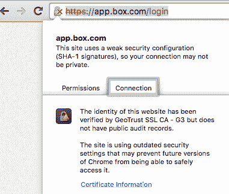

# OS X El Capitan 就是一个 bug，那么一个应用开发者能做什么呢？

> 原文：<https://thenewstack.io/os-x-el-capitan-is-a-buggy-one-so-what-can-an-appdev-do/>

你对 OS X El Capitan 感到兴奋还是紧张？如果您是 web 应用程序的开发人员或运营团队，或者与任何认证机构打交道，如果您现在不解决您的 512 位加密认证问题，OS X El Capitan 的发布将会让您陷入恐慌。

我已经在我的生产机器上使用 OS X El Capitan 和 iOS 9 有一段时间了。不是什么好主意，但我忍不住。

无论如何，在我看来，这是苹果发布的最有问题的版本之一，主要是因为现有应用程序与操作系统直接向后兼容。两个操作系统——OS X El Capitan 和 iOS 9——都很紧凑。但是，尝试运行 Chrome 或其他与网络高度连接的应用程序，你会发现到处都是崩溃和警告。

为什么？原因很简单:苹果不再支持小于 1024 位的 SSL 证书通过协议安全网络(HTTPS) 、企业 Wi-Fi (802.1X)、安全电子邮件(IMAP、POP、SMTP)、打印服务器(IPPS)等。这里是 OS X v10.11 和 [iOS 9](https://developer.apple.com/library/prerelease/ios/releasenotes/General/RN-iOSSDK-9.0/) 的发行说明。

当这些应用程序连接时，你要么在 Safari 中得到警告，在 Chrome 中得到漂亮的无效认证指示，要么应用程序功能完全受阻。结果我意识到很多应用证书都不是 1024 位或者更高。

雪上加霜的是，大约在苹果开发者测试版发布的同时，谷歌发布了 Chrome 的更新，该更新还标记了由当局颁发的证书没有公共审计记录的网站。这在某种程度上是一个哲学问题，而不是技术问题，但仍然不太妙。这迫使证书颁发机构(CA)公开他们给谁颁发了证书——这确实有助于区分那些在假安全背后进行网络钓鱼的黑客。

我同意这两个变化。像这样的中断从来都不好玩，尤其是对于运营和技术支持团队来说。但是这是一个必要的举措，因为现在有越来越先进的黑客能力。 [RSA 因式分解挑战](https://en.wikipedia.org/wiki/RSA_Factoring_Challenge)证明了甚至早在 2009 年，768 位及更低的加密就已经被因式分解了，而且基本上被证明是可破解的。随着所需工作量的减少，这种攻击的频率将会增加。

修复 web 应用程序加密和权限相对容易。更新您的证书，或更改授权，让它传播，完成。但是，当加密是在您的 API 的端点时，客户端应用程序正在使用，这是一个更大的问题。在这种情况下，您的应用程序可能会产生一个错误，或者基于一个未处理的异常而完全崩溃。

这可以从 Skype 和 VMware Fusion update 客户端看出。这让我想知道，如果你傻到像我一样使用测试版，下一轮更新是否必须是手动的。除了更新客户端，它还影响了生产力工具，如 [LogMeIn](https://secure.logmein.com/) 和 [Box Sync](https://www.box.com/personal/file-sync/) 。业务用户已经启动并运行的客户可能会在操作系统更新后收到令人不快的惊喜或电子邮件。

在 iOS 9 beta 中，行为是相似的。我在自己的一些应用中注意到了这一点，包括 Cirrus Insight 和 Bill.com。

供应商将有几个月的时间来纠正这些问题，为那些没有获得测试版的人发布自动更新。但我认为，客户会问更多的问题——我的机器暴露了吗？我的企业文档安全吗？他们以前不安全吗？—这可能会影响客户对产品的信任，即使这个问题就像没有公共记录的 CA 一样简单。或者连接安全性不同于内容传输加密。如果行动迅速，一些供应商将能够悄悄地纠正这些问题。

如果你担心，《我的世界》和蒸汽仍然在工作。这是我现在最关心的事情。

如果您的应用程序面临同样的问题:现在就解决它，或者在几个月后感受痛苦。在最好的情况下，你的客户会起疑心(这不是你想要的)。在最坏的情况下，当您的应用程序试图协商客户端和您的云服务之间的连接时，它将开始崩溃。

作者披露:Box 是我的一个客户；这里我的观点是我自己的。

专题图片:[安妮塔·里泰诺尔](https://www.flickr.com/photos/puliarfanita/)的《[埃尔·卡皮坦——最后的光](https://www.flickr.com/photos/puliarfanita/4657574571/in/photolist-86zhDR-gEAra9-7LewNk-dGMeu2-qbe8aW-8VXdyd-6tbxrV-8KmKN8-eAmBTy-e6tA7g-onYXiV-ncgjuW-77Rnh9-pGAHCJ-pW8cmK-9iYinP-ug9sms-cbJBk7-eAgpyt-oqqNcD-8Sdmr6-9P4bYK-7zPKuW-7cfiUJ-pgzrko-oXJgeT-dtMpc4-9nWjGh-8VQJZj-quZUmX-6rkbiU-pVZFaA-9TcKqL-pW9z6T-d1ytqY-bjJS2s-7zPKzb-7K3cUs-bqQb8R-fFHhQX-bUjBU3-8Wddbz-v4Lvm-dYDezZ-4Gcc2R-6RMvG-eAKwK6-8tve1f-7FSydE-2qNBj)》获得了 [CC BY-2.0](https://creativecommons.org/licenses/by/2.0/) 的授权。

<svg xmlns:xlink="http://www.w3.org/1999/xlink" viewBox="0 0 68 31" version="1.1"><title>Group</title> <desc>Created with Sketch.</desc></svg>