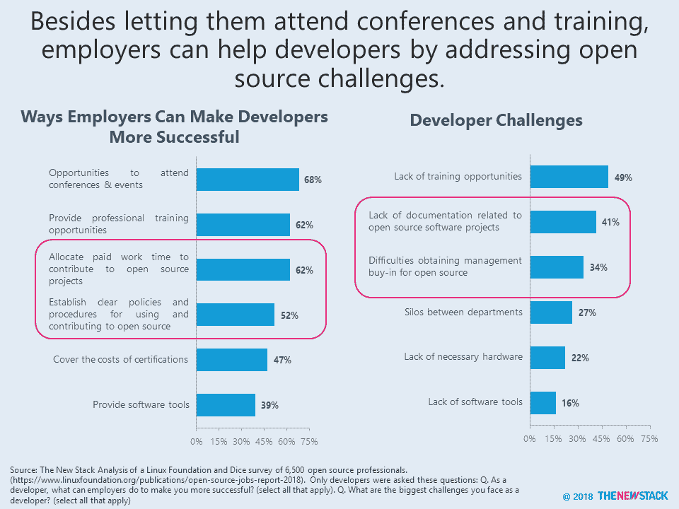
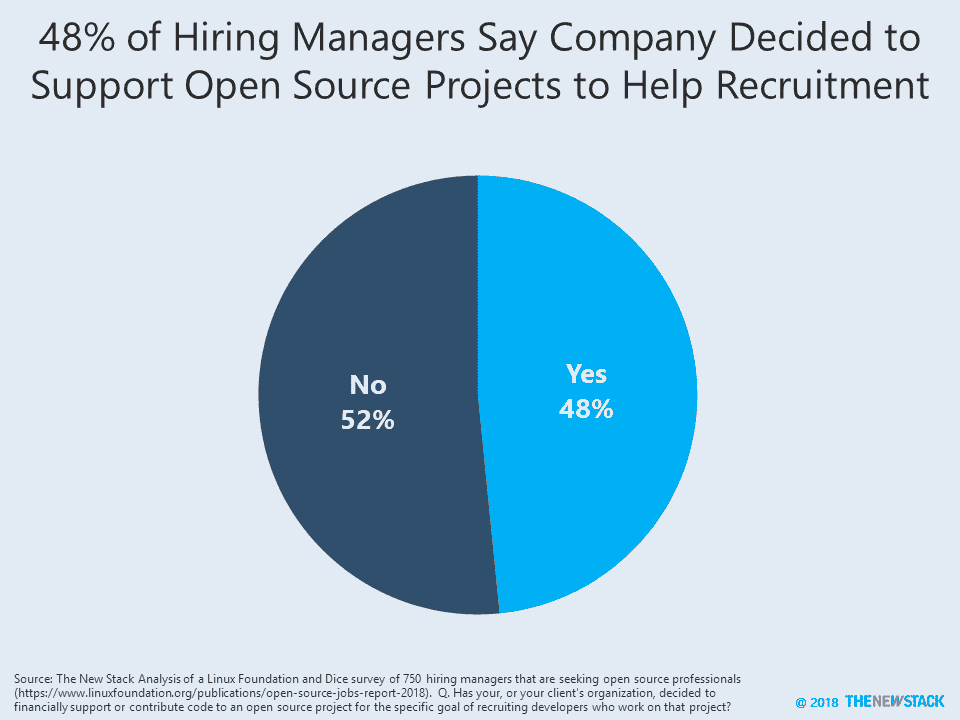
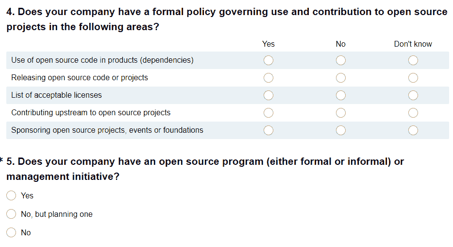

# 雇主如何帮助他们的开发者:开源项目的时间到了

> 原文：<https://thenewstack.io/oss-employers-developers/>

最新的 2018 年开源工作报告指出了雇主帮助开发者的几种方式。基于对 750 多名招聘经理和 65000 名专业使用开源软件的人的调查，Linux 基金会和 Dice 的研究表明，开发人员最希望从他们的雇主那里得到的是参加会议和活动的机会。

虽然专业培训和认证的资金也是需要的，但是开发人员通常只是想在工作时间学习并为开源做出贡献。事实上，62%的开发人员表示，如果他们能够分配带薪工作时间来为开源项目做贡献，他们会更加成功。

这在实践中如何运作也悬而未决。因此，52%的开发者希望他们的雇主能够为开源软件的使用和贡献制定明确的政策。通常，这些政策与知识产权的许可和所有权有关，但是开发者通常面临更广泛的挑战。

当被问及他们最大的职业挑战时，41%的开发人员表示缺乏与开源软件项目相关的文档，34%的开发人员表示获得管理层对开源软件的认可很有挑战性。缺乏硬件或软件工具不太可能抑制开发人员。

## 雇主的观点

雇主希望招聘和留住高技能和高产的开发人员。如何最好地实现这一目标是招聘经理永恒的问题。当然，高薪和良好的福利会有所帮助。拥有一个多元化、包容性的工作环境也是如此。根据招聘经理的说法，37%的人有多元化培训计划，31%的人说多元化小组在公司内部得到了赞助。

培训和认证越来越多地被用来留住员工。在这项研究中，明确表示为培训付费是留住人才的激励措施的雇主比例连续三年上升——从 2016 年的 26%，到 2017 年的 33%，再到 2018 年的 42%。

由于这是一项针对开源专业人士的调查，因此毫不奇怪，几乎一半的招聘经理(48%)表示，他们的公司决定在财务上支持或贡献开源项目来帮助招聘。尽管这听起来令人难以置信，但质疑招聘经理对开源管理到底了解多少是合理的。由于 57%的招聘经理说他们的公司为开源项目做贡献，粗略计算表明，84%的公司为开源做贡献，至少部分是为了获得新员工。

付费赞助一个会议是很重要的，但是我相信，与其说这是一个主要的决策驱动力，不如说支持一个开源项目的一个附带好处是，一个公司在会议上获得了更多的能见度，在那里他们可以见到开发者。

当决定雇佣一名开源专家时，最重要的技能是能够构建一个基于开源软件的解决方案。各种技术和方法的经验和知识也很重要。

与开发人员面临的最大挑战相关的技能在招聘经理寻找的名单中排在最后。尽管开源文档是开发者面临的最大挑战，但只有 21%的招聘经理在寻找具备这种技能的人。类似地，尽管建立开源程序是开发者成功的关键因素，只有 20%的招聘经理在寻找开源程序管理的技能。当然，在大多数公司中，开源程序仍然是一个新生事物。如果招聘经理正在寻找开源项目管理，那么也许有一个正式的计划可以解决被压抑的需求。

幸运的是，新的 Stack 和 Linux 基金会已经合作调查社区关于标准化和以编程方式促进开源政策的方法。我们鼓励读者参与。

[调查](https://www.surveymonkey.com/r/oss-program)重点关注公司推广采用开源的具体方式。

通过 Pixabay 的特征图像。

<svg xmlns:xlink="http://www.w3.org/1999/xlink" viewBox="0 0 68 31" version="1.1"><title>Group</title> <desc>Created with Sketch.</desc></svg>