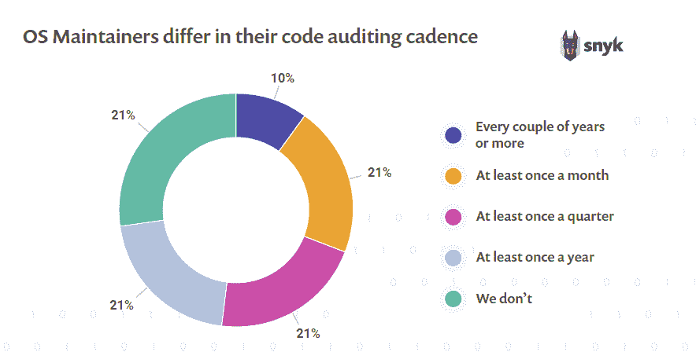
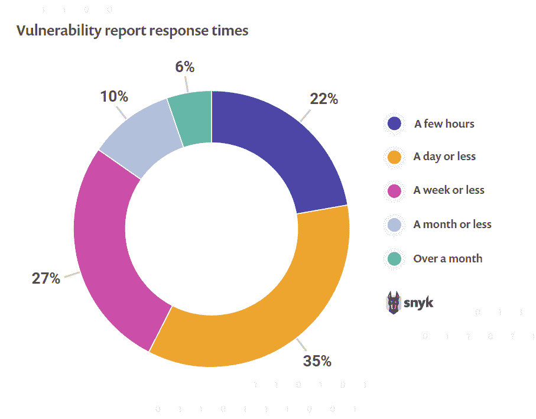
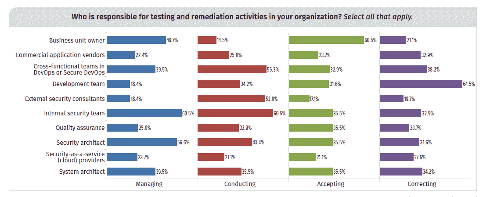

# 开源维护者希望降低应用程序的安全风险

> 原文：<https://thenewstack.io/ossmaintainer_security/>

根据 DigitalOcean 去年的一项调查，在糟糕的文档之后，负面的安全记录是公司不使用开源技术的首要原因。由于应用程序中依赖开源组件的数量，漏洞的数量激增。尽管有这些令人担忧的趋势，开发人员比以往任何时候都更加认为他们能够承担起对安全性负责的任务。

根据 Snyk 的“[State of Open Source Security Report 2019](https://snyk.io/opensourcesecurity-2019/)”调查了 500 多名开源用户和维护者，30%维护开源(OS)项目的开发人员对自己的安全知识非常自信，这一比例高于去年的 17%。此外，与去年的调查相比，对项目进行安全审计的操作系统维护人员的比例上升了 20 个百分点，达到 74%。然而，只有 42%的维护人员每个季度至少审计一次他们的代码。这是一个问题，因为开发速度的目标比几年前高了很多。

新堆栈和 Linux 基金会对开源领导者的[调查](https://thenewstack.io/open-source-culture-starts-with-programs-and-policies/)发现，超过三分之二的公司的平均开发团队将代码发布到产品中。其他[研究](https://thenewstack.io/add-it-up-c-suite-doesnt-have-a-clue-about-app-dev/)不太乐观，指出只有大约四分之一的公司达到了这个速度水平。

开源维护者认为，当他们听到漏洞时，他们反应非常迅速，57%的人说他们会在报告后的一天内解决问题。我们怀疑维护人员是否有那么快。一项 Tidelift 研究发现维护人员很难找到时间进行项目，其他研究发现开发人员担心他们没有时间来解决安全问题。

正如我们[上周](/information-security-spending-dont-be-fooled-by-overconfidence/)所报道的，公司对他们的安全状况存在过度自信的风险，Snyk 提供的证据表明，这种情况已经影响到了开发团队，因为 81%的调查对象认为开发人员应对安全负责，而只有略多于四分之一的人承认安全团队有责任。

Snyk 的首席产品官安内尔·马祖尔认为，开源维护者会很乐意解决手工耗时的方法所抑制的安全问题。将漏洞扫描添加到 CI/CD(持续集成和/或部署)管道中是解决方案的一部分。在那些有持续集成的人中，57%的调查受访者说他们测试开源依赖，但 37%的人也说他们在 CI 期间没有自动化的安全测试。

马祖尔解释说，Snyk 让开发者更容易解决间接的安全漏洞——那些不是直接来自开源组件，而是来自该组件的一个依赖项的漏洞。Snyk 还试图解决这样一个事实，即开发人员已经使用了太多的工具，并希望使用更少，而不是更多。因此，Snyk 与 IntelliJ 等 ide 和 GitHub、GitLab 和 Bitbucket 等版本控制工具相集成，在开发人员每天都在使用的软件中提供警报。

当它们存在时，应用程序安全团队和云架构师一直在积极推动 Snyk 等工具的使用，这很重要，因为他们可能会为这些工具付费。现在让我们看看开发人员实际使用它们的程度。

## 来自其他报告的上下文

*   **开发期间的测试仍处于早期:**只有 25%的公司在代码开发期间进行自动化安全测试([网络安全内部人士 2018 年应用安全报告](https://crowdresearchpartners.com/portfolio/application-security-report/))。即使在拥有成熟开发运维实践的公司中，也只有 52%的公司在开发期间应用自动化应用安全分析( [DevSecOps 社区调查 2018](https://info.signalsciences.com/hubfs/signal-sciences-resources/2018-devsecops-community-survey.pdf) )。
*   **感知风险大于现实:**59%的信息安全专家认为面向公众的网站和第三方或开源依赖都有风险。然而，当被问及实际事件/漏洞发生在哪里时，调查受访者说是网站的可能性(16%)几乎是说是依赖关系的两倍(9%)(“[安全开发运维:事实还是虚构](https://www.veracode.com/blog/managing-appsec/key-takeaways-sans-report-secure-devops-2018-fact-or-fiction)？”).
*   **漏洞管理非常耗时:**几乎 75%的开发人员每月花费超过 10 个小时处理开源漏洞([开源漏洞管理状态](https://www.whitesourcesoftware.com/open-source-vulnerability-management-report))。

来源:“[安全 DevOps:事实还是虚构](https://www.veracode.com/blog/managing-appsec/key-takeaways-sans-report-secure-devops-2018-fact-or-fiction)？”由 Veracode 发起的 SANS 研究所调查。65%的信息安全专家承认，开发人员有责任实际补救应用程序安全挑战。

通过 Pixabay 的特色图片。

<svg xmlns:xlink="http://www.w3.org/1999/xlink" viewBox="0 0 68 31" version="1.1"><title>Group</title> <desc>Created with Sketch.</desc></svg>