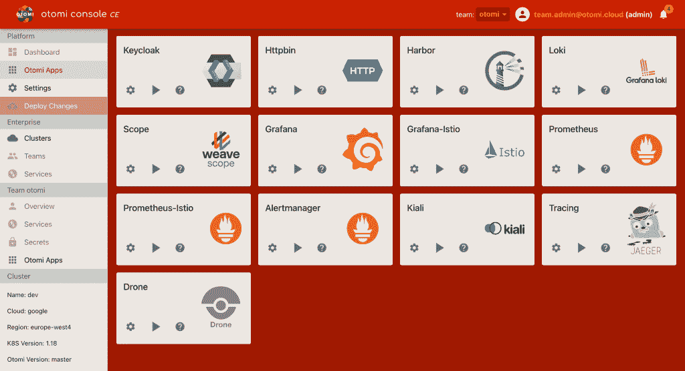

# Otomi 容器平台提供了一个集成的 Kubernetes 包

> 原文：<https://thenewstack.io/otomi-container-platform-offers-an-integrated-kubernetes-bundle/>

如果您想享受 Kubernetes 的好处，配置和安装软件本身可能只是许多深奥的技术和经常令人困惑的步骤中的第一步。为了简化这一点，许多主要的云提供商提供托管 Kubernetes 服务，但即使这样，您可能也需要安装辅助服务来处理跟踪、日志记录、监控、身份访问管理等任务。 [Otomi Container Platform](https://otomi.io/) 试图通过捆绑 30 多个不同的 Kubernetes 插件来解决这种复杂性，并提供它所谓的“类似 OSX 的接口”，今天该项目已经在 Apache 2.0 许可下开源了一个社区版。

“仅有 Kubernetes 是不够的。Kubernetes 是一个可以用来搭建平台的平台。建立一个基于 Kubernetes 的平台需要很多时间和专业知识，”Otomi 背后的公司 [Red Kubes](https://redkubes.com/) 的创始人兼首席执行官[桑德·罗登休斯](https://www.linkedin.com/in/srodenhuis/)在一封电子邮件中写道。“您需要为日志记录、安全性、监控、可追溯性、可审计性和联网安装和配置解决方案。这些都是独立的解决方案。当您开始集成这些解决方案时，您将最终获得技术深度。没有花在 Kubernetes 上的时间可以用来为您的客户开发新功能！”

Otomi 由多个组件组成，首先是 Otomi Core，这是一套应用程序，包括 Prometheus、Grafana、Loki、Istio、Jaeger、Keycloak、Knative、Harbor 等云原生标准。然后是具有附加功能的企业版，以及 Otomi 控制台，它提供了前面提到的“类似 OSX 的界面”，社区版中包括简化版本，企业版中提供了具有自助服务功能的更高级版本。所有这些都可以作为一个可部署的解决方案，可以安装在任何 Kubernetes 集群上，无论是 AWS、Azure、GCP，甚至是内部部署。Otomi 本身可以通过运行 Docker 容器来安装。

Otomi 的一些核心功能包括单点登录、多租户入职、集中策略管理、跨集群和云保持集群同步的能力、自动部署以及网络和服务配置的管理，如 DNS、证书供应和入口配置。

Rodenhuis 解释说:“你可以将它视为一个单一的 Kubernetes 附加组件，包括 30 多个不同的附加组件和开源解决方案，所有这些都是预先配置好并粘在一起的。“因为 Otomi 是 100% Kubernetes 原生的，所以你不需要使用额外的云服务。这使您能够以一种与云无关的方式运行容器工作负载。工作负载可以在云之间移动，无需任何额外工作。”

除了将这些应用程序捆绑在一起并简化它们的安装，Rodenhuis 进一步解释说，Otomi 包括一个基本配置，进一步消除了对最终用户专业知识的需求。Rodenhuis 写道:“我们还增加了最佳实践，所有应用程序都是预配置的。“我们不仅安装了 OPA，还添加了很多策略。”

对于 Otomi 的未来功能，该项目有一个开放的[路线图](https://otomi.io/about/roadmap/)，其中包括 Hashicorp Vault 集成和订阅项目发布的 alpha、beta 和稳定渠道的能力，以及未来几个月的其他预期功能。对付费企业版感兴趣的用户可以请求一个[演示](https://redkubes.com/request-demo-otomi-container-platform/)。

<svg xmlns:xlink="http://www.w3.org/1999/xlink" viewBox="0 0 68 31" version="1.1"><title>Group</title> <desc>Created with Sketch.</desc></svg>