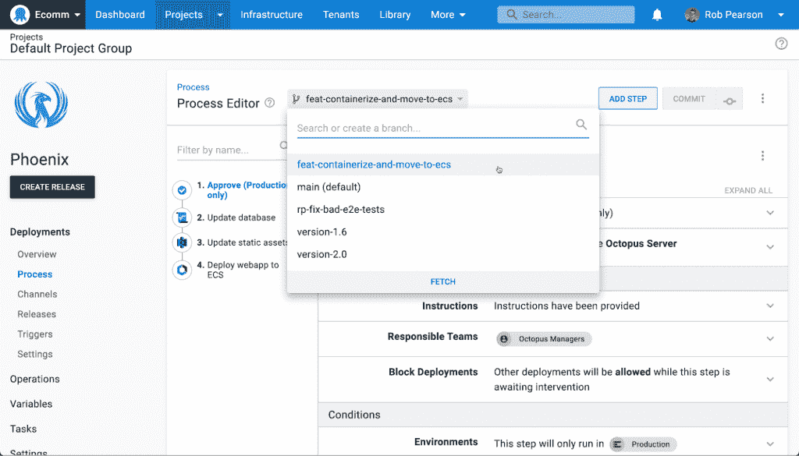
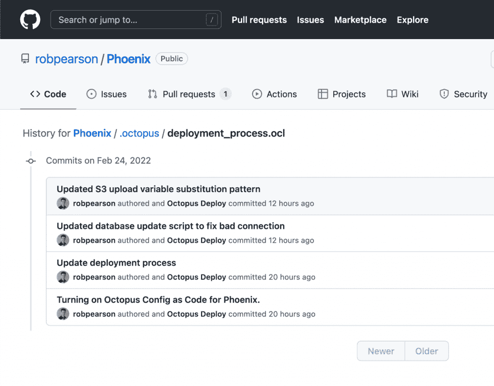
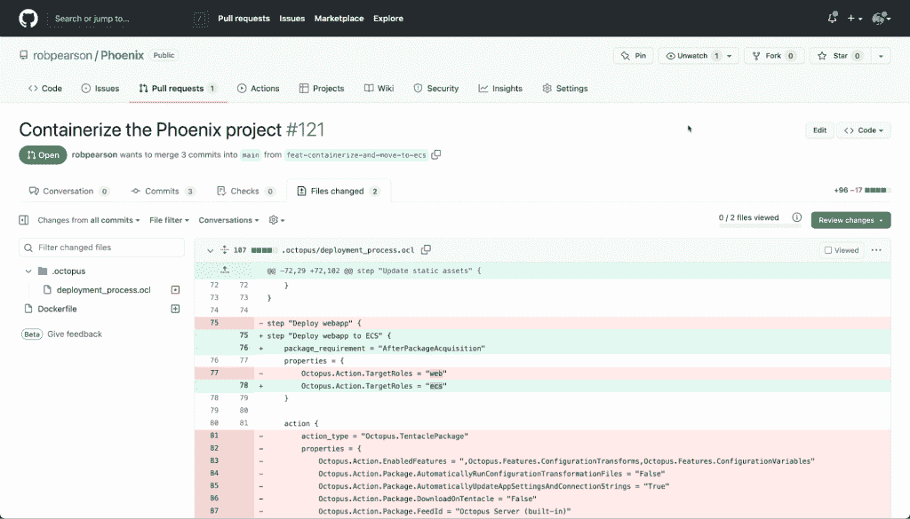
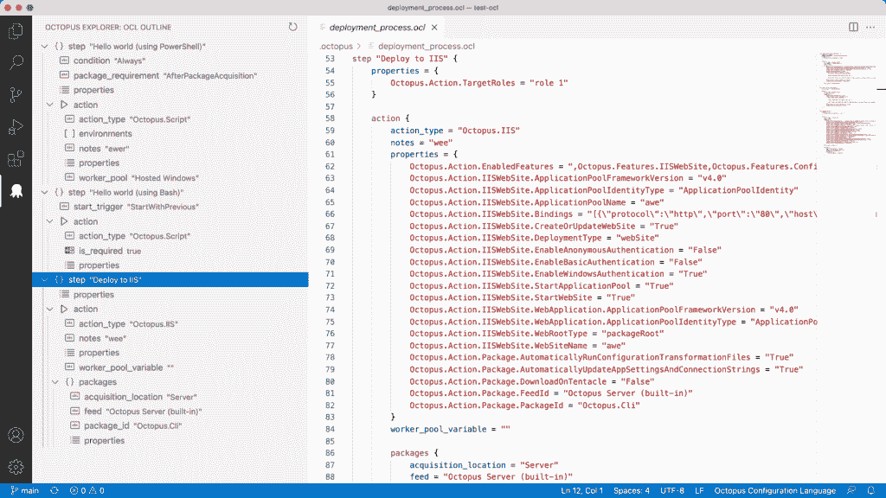
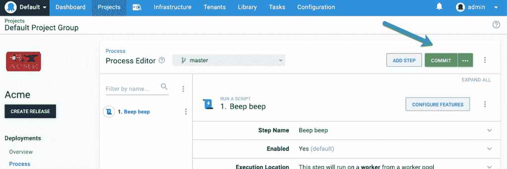

# 我们在 Octopus 部署时按代码配置的方法

> 原文：<https://thenewstack.io/our-approach-to-config-as-code-at-octopus-deploy/>

Octopus Deploy 的客户长期以来一直要求一个配置即代码(CaC)解决方案，经过两年的开发期，我们在 3 月份发布了它。

 [特伦斯·王

Terence Wong 是一名软件工程师，热爱解决问题和技术。特伦斯喜欢了解新技术，并与不同的受众交流复杂的信息。作为 Octopus 的技术内容创建者，Terence 与 DevOps 和云技术合作，了解并撰写客户面临的问题。](https://www.linkedin.com/in/terenceywong/?originalSubdomain=au) 

虽然这是我们最需要的功能之一，但实现它比预期的时间要长，但我们在这个过程中学到了一些有价值的经验，我们真的为这个关键功能感到自豪。

CaC 在一个受源代码控制的环境(比如 Git)中捕获配置设置，使得在分支中测试配置更改并通过 pull 请求批准更改成为可能。

为像 Octopus Deploy 这样的部署工具开发配置即代码特性是有意义的。我们的客户需要它，我们希望在内部使用它，但它是一个跨越应用程序所有层的特性，不能简单地“附加”

我们相信我们已经开发了一个业界领先的 CaC 实施，许多组织都可以从中学习。在这个帖子里。我将分享我们的开发过程，我们做出的设计决策，我们的 CaC 特性的好处，我们的发布过程和我们的 CaC 理念。

## 我们为什么要实施 CaC？

两年前，从客户反馈中可以清楚地看出，CaC 是我们平台的下一个合理步骤，但是看了看其他供应商的 CaC 实现，我们希望以不同的方式做得更好。

我们的客户也告诉我们，从可用性的角度来看，CaC 通常是一种倒退。当 CaC 打开时，用户淹没在 YAML 中，并且在 UI 中经常有几个妥协来适应 CaC 特性。尽管有所妥协，客户还是忍受了，因为没有其他选择，而且拥有 CaC 功能有明显的好处。我们希望构建一个 CaC 实现，它具有 CaC 的所有优点，但没有随之而来的可用性损害。

## 开发过程

我们的 CaC 之旅始于在六周内构建的一次性概念验证。这是我们第一次构建一个主要的一次性功能。在这个阶段，有很多未知，我们测试并验证了很多假设。

一个源代码控制的实现有分支的概念，我们需要试验这在 Octopus 中是如何工作的。

当我们开始设计 CaC 时，我们突然需要考虑多个持久层。在 CaC 实现中，没有单一版本的系统——用户可以通过分支在系统的不同状态之间切换。需要一个持久层来捕获系统的所有不同状态。如果你想了解更多，[我们写了一篇关于 CaC](https://octopus.com/blog/config-as-code-persistence-ignorance) 持久性的博客。

在验证了概念证明之后，我们用了一年的时间真正构建了 CaC。年底，工程团队吸取了许多经验教训，希望在发货前改变一些基本的设计选择。这些经验教训要求我们在前进两步之前先后退一步。例如，我们的团队将最初的 CaC 实现包装在命令行上，但是性能问题意味着我们必须将它换成 LibGit2Sharp 库。

现在有一个可发布的产品和知道我们可以做得更好之间的紧张关系导致了在正式发布之前额外一年的开发。我们选择发布一个令我们兴奋不已的版本，而不是一个在截止日期前刚刚好的版本。

当我们回顾两年的旅程和我们接受的权衡时，我们相信结果是值得的！

## 设计决策

当使用现有的 CaC 供应商解决方案时，用户必须在 UI 或 CaC 实现之间做出选择。我们不希望我们的用户必须做出选择。我们希望利用 CaC 的强大功能，同时保持我们所有的 UI 功能。

### 基于 Git 的

我们发现 Git CaC 实现分为两类:

一方面，用户使用 Git 作为同步机制，用户只使用 Git 作为数据库。这种方法并不理想，因为 Git 的真正功能并没有得到利用。

另一边是 Git-native 实现，有分支和拉请求，但没有 UI。在这种情况下，用户淹没在过度的 YAML 中，并且没有简单的方法在没有深入代码的情况下进行简单的更改。

我们希望通过 Git 原生能力提供全功能的 UI 体验，这样用户就可以使用 UI 进行微小的更改，或者深入 Git 中的配置语言并在那里进行更改。我们选择使用 Git 概念，比如分支和拉请求，而不是将这些概念抽象成 Octopus 特有的术语。使用 Git 术语可以让新用户理解我们公开的 CaC 概念，而无需成为 Octopus 专家。

### 配置语言

任何 CaC 实现都需要一种配置语言。

我们的配置语言必须易于阅读、编写和编辑复杂的文档。我们知道，基于 YAML、XML 和 JSON 在其他工具中的广泛应用，它们是强有力的候选者。

JSON 是最容易实现的，但是它适合于序列化的对象，而不是文档。

《YAML》是可读的，但编辑起来可能有些棘手。YAML 对琐碎的文档也更好，但对复杂的文档就更难使用了。

与其他语言相比，XML 太冗长了。

Hashicorp 配置语言(HCL)是一种人类可读的语言，但也适合编辑。

基于 HCL 在未来版本中的发展方向，我们决定创建我们的基于 HCL 的语言，称为 Octopus 配置语言(OCL)，它完全独立于 HCL。我们已经构建了自己的解析器/序列化器，我们没有义务遵循 Hashicorp 的任何指示，也没有任何东西阻止我们做出改变。

事实上，这些语言选择中的任何一种都可以发挥作用，因为它们在行业中很受欢迎。我们做了我们认为最适合我们的事情。

### 在 UI 或代码中工作

在我们的 CaC 实现中，用户可以使用 UI 或源代码控制的实现。两种模式都有完整的功能。如果一个用户只喜欢使用 UI，他们可以和另一个选择使用源代码控制版本的用户完成一样多的工作。这两个用户也可以使用他们喜欢的模式一起工作。

## CaC 的好处

正如我前面提到的，Octopus Deploy 中的 CaC 允许用户在编写应用程序代码的同时改进他们的 Octopus 配置。以下是我们认为我们的 CaC 实施提供的一些好处:

### 作为核心概念的分支

Octopus Deploy 充分展示了 Git 分支的威力，您可以:

*   在 Octopus UI 或您喜欢的 Git 客户端中切换分支或创建新的分支。
*   在分支上提交对部署流程的更改。
*   当您更改您的部署过程时，添加(可选)提交消息，以便其他人了解它更改的原因。
*   从您的分支创建发布，并部署以测试您的更改，从而支持您的部署过程的许多版本。
*   安全地发展您的部署，而不用担心破坏其他团队的部署。
*   如果出现问题，回滚到部署过程的前一个版本。

### 可审计性/可追溯性

用户可以将配置回滚到以前的设置，并且用户可以查看整个审核历史。提交历史改进了对部署过程的变更的可追溯性。用户知道什么改变了，什么时候，谁改变了，最重要的是，为什么。用户不必搜索审核日志来确定其配置更改的原因。Git 历史和差异提供了清晰的可追溯性，讲述了完整的故事。Octopus 甚至在 Git 历史中记录提交者的详细信息。

### 将请求提取为批准

Pull 请求内置在 Git 中，可以作为部署过程中的批准过程。拉请求、受保护的分支和代码所有者启用了一组新的工作流来提高发布的质量和安全性。通过合并拉取请求，我们可以帮助减少不良部署造成的停机时间，并提高发布的质量。

### 文本编辑器和 Visual Studio 扩展

Octopus UI 有一个文本编辑器来修改配置代码，这比在 Git 中直接修改代码更容易。为了使使用 OCL 更容易，我们为 Visual Studio 代码构建了一个扩展来补充 Octopus UI。

OCL 的编辑经验包括:

*   语法突出显示
*   步骤和操作的代码片段
*   在文件中导航节点的集成树视图

### 提交消息

为了维护 Git 的概念，我们用 Octopus UI 中的“提交”按钮替换了“保存”按钮。在发布场景中，有两种类型的提交:

*   其中一个对部署流程进行了重大更改，需要提交消息。
*   与修复同一问题相关的一系列提交中的一部分。当每次提交的唯一提交消息没有什么价值时，这种情况很有用。

Octopus 迎合了这两种情况，并允许用户接受默认提交消息或提供自己的消息。

## 

## 发布流程

我们发布了一个早期的访问预览版，允许用户提供反馈，为正式发布提供信息。

Config as 代码现在可用于部署，但为变量和 runbooks 提供 CaC 也是有意义的，这是我们正在努力的事情。我们分享了一个[公共路线图](https://octopus.com/blog/octopus-release-2022-q1)，通知用户即将到来的工作和计划的功能。

## 我们的配置作为代码哲学

从客户和开发人员的角度来看，配置代码听起来很棒。我们的客户可以使用它，我们可以在内部构建和使用它，这是一个双赢的局面！

这种方法的自然延伸是最终将一切都作为代码(EaC)来实现。部署过程的每个方面都可能是代码，但是像环境和租户这样的概念的附加值可能很低。还有人担心秘密会成为代码，因为它们不应该存储在版本控制中。一旦部署、操作手册和变量成为 Octopus 中的代码，与我们可以开发的其他功能相比，开发 EaC 系统的回报会越来越少。

随着 Octopus 的 CaC 的成熟，它将自然地与基础设施即代码(IaC)交叉，团队正在为这个交叉做准备。

理想情况下，用户可以使用 OCL 语言来提供基础设施。一个更成熟的场景是使用 EaC 在本地开发环境中复制生产环境中的所有东西进行测试。这将在发布之前验证对整个生产环境的任何更改。在 EaC 中，所有东西都变成了一次性的，因为所有东西都是代码。

要回答的大问题是 DevOps 管道的哪一部分是一次性的？

在版本控制系统中，我们需要抽象管道的每个方面吗，或者管道的某些部分更适合传统的存储方法吗？随着 Octopus 中 CaC 的发展，该团队将继续解决这些问题以及更多问题。

<svg xmlns:xlink="http://www.w3.org/1999/xlink" viewBox="0 0 68 31" version="1.1"><title>Group</title> <desc>Created with Sketch.</desc></svg>