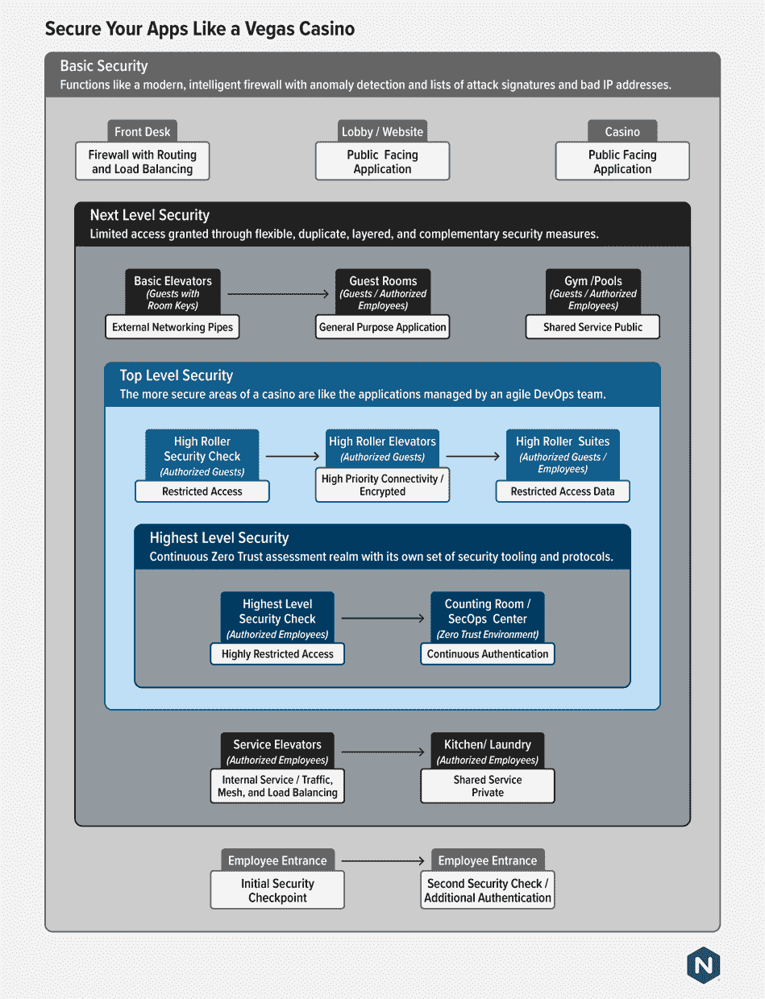

# 智胜十一罗汉:像拉斯维加斯赌场一样保护您的应用程序

> 原文：<https://thenewstack.io/outwit-oceans-eleven-secure-your-apps-like-a-vegas-casino/>

[Rajiv Kapoor](https://www.linkedin.com/in/rajiv-kapoor-682235/)

[Rajiv 是 F5 旗下 NGINX 的产品营销经理，负责 NGINX 的应用安全产品组合和相关活动。在爱尔兰都柏林大学获得 MBA 学位之前，他在印度孟买大学学习经济学。他在华盛顿州的西雅图工作。](https://www.linkedin.com/in/rajiv-kapoor-682235/)

高科技赌场抢劫案是好莱坞的绝佳素材。它们还为企业可能想要模仿的应用程序和基础设施安全提供了一个相关的模型。这个想法很简单:高端拉斯维加斯赌场使用多层安全模型，在前门设置警卫来建立信任区的边界，并在边界内设置更多机制来进一步保护区域内的特定区域。

最强的安全措施保护着计数室和芯片笼——如此强大，以至于在经典的抢劫电影“[十一罗汉](https://en.wikipedia.org/wiki/Ocean%27s_11)”中，一队狡猾而熟练的小偷只能通过切断整个拉斯维加斯的电源才能进入那些区域。在安全范围的另一端是赌场楼层，它对街上任何一个在入口工作人员看来不可疑的人开放。介于两者之间的有:

*   “高辊”赌场，比普通赌场更安全和监控，只允许预先批准的富裕玩家进入。
*   任何有房间钥匙的人都可以通过电梯到达客房楼层。
*   除房间钥匙外，电梯需要另一种类型的安全令牌的受限 VIP 楼层。

同样，员工可以根据他们的工作角色进入赌场的特定区域，例如，厨房员工的徽章限制他们只能进入厨房、餐厅和员工浴室，而安保人员可以去任何地方。

对于现代应用程序和微服务环境来说，这种棘手的需求是一个很好的类比。功能和需求与每个服务紧密相关。所有客人都需要使用电梯和酒店健身房等整体服务。用于计数芯片或提供食物等功能的微服务对应用程序安全性、延迟和弹性有自己的要求。每个服务可能有自己的迭代和变更速度。菜单每天都在变，而房间清洁程序和便利设施每年都要变一次，如果是这样的话，或者是因为百年一遇的疫情。最敏感的服务必须足够强大和有弹性，以经受住地震——真实的或模拟的，这是“海洋”三部曲第三部中抢劫的关键——大规模电子冲击和整个系统崩溃。

## 设计应用程序来阻止一群小偷

赌场是建筑和设计的迷人练习，模拟了现代混合应用环境的现实。它们也唤起了零信任的一些物理世界属性。也许除了航空公司之外，赌场比其他任何组织都更重视通过环境的人，就像对待具有不同特权和认证级别的数据包一样。

前台和门卫是基本的安全检查点。他们观察人们进来寻找任何明显的麻烦迹象。因为赌场希望每个游客都去赌博或吃饭，或者两者兼而有之，所以他们不会在门口发放通行证或钥匙卡，但总有人在看着。赌场有无处不在的生物识别后端，部分原因是他们需要提防算牌者和团伙，他们一起合作，在玩 21 点等游戏时获得优势。因此，尽管感觉你可以在公共场所自由活动，但你还是被监视着。不受欢迎的人进入时往往会被发现，并被立即要求离开。从这个意义上来说，赌场的公共区域就像一个现代化的智能防火墙，可以对攻击签名和不良 IP 地址(算牌者)列表进行异常检测。

下一个安全级别是进入有客房和设施如温泉或健身房的楼层。这些区域甚至有等级之分。大多数赌场都有一套专为豪赌客准备的专属邀请区。赌场的运营或安全团队可以确定哪些房间可供哪些类型的顾客进入，并可能增加补充层更复杂的安全措施，如指纹读取器或视网膜扫描仪。分层的优点是安全团队可以在有限的范围内进行必要的更改，而不必更换大厅中的所有摄像头并重新配置赌场楼层的布局。重复、分层、互补的安全等于更有效、更灵活的安全。

赌场中更安全的区域就像由敏捷开发团队管理的应用程序。就像 DevOps 团队决定独立于其他服务更新服务的频率一样，负责豪赌客的礼宾员可以在没有获得总经理批准的情况下，订购其中一个人玩扑克时喜欢的特色小吃。专为豪赌者服务的安全团队可以为不同的分区设置不同的安全级别。例如，在特定时间开始的游戏中，只有玩家才可以进入牌室，而所有的豪赌客在逗留期间可以随时去水疗中心。安全团队还可以针对不同的情况修改标准和程序:如果世界上最富有的人来赌博，他们可能去的地方的安全措施应该比平时严格得多。

最安全的地方是数钱或存放钱的地方。在这些领域，安全性是唯一重要的衡量标准；警卫、摄像头、动作捕捉、机器视觉和许多其他高科技措施都很常见。如果没有严格的审查和通常的多重身份验证，人们就无法进出这些区域。为了进入这些场所，工作人员通常必须通过几名保安和多个摄像机。与应用程序世界类似的是应用程序中处理金融信息或个人身份信息的部分(PII)。赌场将其应用程序的这一部分分割出来，成为一个持续的零信任评估领域，依靠自己的网络和自己的一套安全工具和协议。

然而，所有进入计票室的人和物仍然必须通过基本的安全程序——例如，在员工入口处读取他们的胸卡。有适用于每个人的基本政策，然后，为了进入更敏感的领域，政策变得更加复杂和独立。可以把前台和赌场楼层的安全看作是 SecOps(守卫周界和公共空间)的利器，而守卫高度敏感区域的更复杂的安全措施就像 DevSecOps 一样，守卫着皇冠上的宝石，被赋予了更多的敏捷性和灵活性。同样，补充安全系统是赌场和具有良好安全态势的组织处理不同应用的不同安全要求的方式。

## 如何(不)用现代应用程序掷出安全骰子

就像上面描述的赌场一样，现代应用环境是复杂的，并且在安全性、交付和代码开发速度方面有不同的需求。例如，不断加速您的数据库架构可能是不明智的，但是不断更新您的前端代码以进行小的改进和实现新的面向用户的特性是明智的。此外，随着时间的推移，越来越多的前端将接入外部 API 和服务。然而，后端不会。

类似地，服务的功能在安全性方面也非常重要。处理支付的服务比处理图像的服务需要更高的安全级别。安全考虑也不总是显而易见的。你认为在现代应用中保护内部服务到服务流量[可能更重要。尽管流量看起来像是沿着一条封闭的走廊行进，但它可以为横向遍历和权限提升提供一条简单的路径。在 Kubernetes 驱动的环境中尤其如此，在这种环境中，所有的通信都是通过 API 进行的，其功能非常类似于公共互联网上的通信。](https://www.nginx.com/products/nginx-app-protect)

与此同时，微服务应用程序必须与遗留的单片应用程序愉快地共存，这些应用程序可能会存在几十年。(如果你不相信我，那就和我一起实地考察几家大银行的数据中心吧——一定要提前温习一下你的 Fortran 技能。)整体应用程序变化较慢，通常从 CI/CD 流程中移除，并且在与微服务完全不同的部署环境中运行。由此产生的混合开发和部署模式为所有试图完成工作的团队带来了挑战，从单个开发人员到 DevOps、DevSecOps 和 NetOps 团队，一直到 CTO 和 CIO。您如何制定规则、政策和工作流程来满足他们的所有需求，而不必不断地进行改造？答案是建立附加和补充的安全轨道。

## 结论:安全灵活性确保敏捷性

我们经常认为安全是严格的，由安全警察推动的，也就是说“不！”团队。CISOs 们从来没有享受过这种描述。随着云计算和现代应用程序的快速发展和大量代码的发布，“说不”不再是一个选项。企业必须弄清楚如何将基本安全性应用于整个组织，同时为以不同方式运行不同应用程序的团队提供不同级别的安全性，以及控制安全性设计和应用方式的能力。这就是为什么世界上最偏执的企业，拉斯维加斯赌场，在每个使用案例的基础上提供具有极大灵活性的补充层，并提供您可以带到银行的高级别安全性。

<svg xmlns:xlink="http://www.w3.org/1999/xlink" viewBox="0 0 68 31" version="1.1"><title>Group</title> <desc>Created with Sketch.</desc></svg>