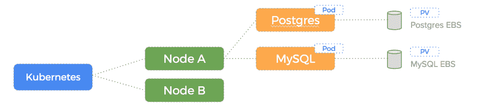
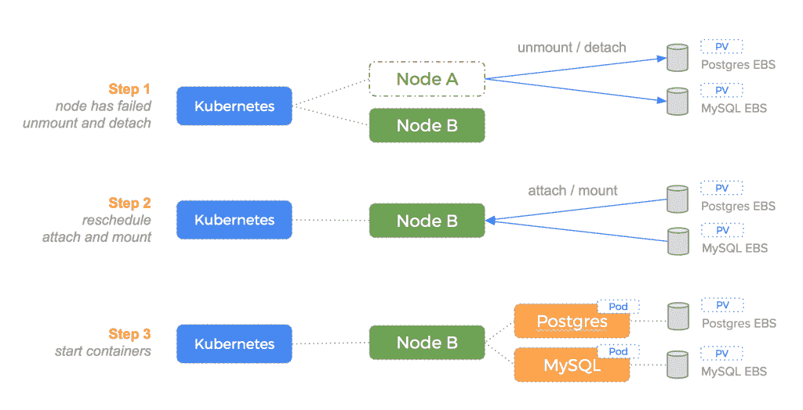
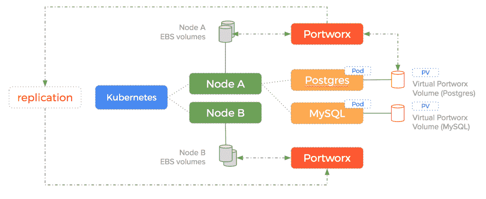
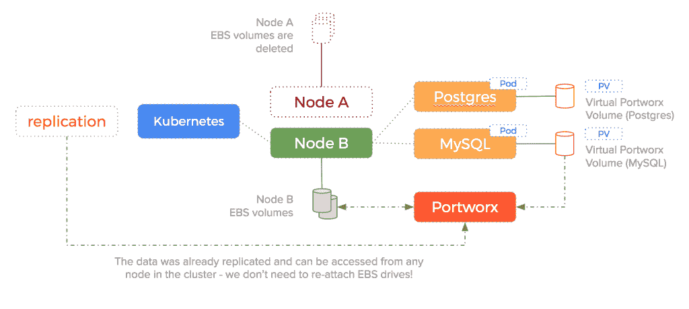

# 在 AWS 上运行有状态容器时如何克服 EBS 卷阻塞

> 原文：<https://thenewstack.io/overcome-stuck-ebs-volumes-running-stateful-containers-aws/>

 [苟饶，Portworx

苟饶，Portworx 联合创始人兼首席技术官，曾任戴尔数据保护部门和思杰系统 ASG 公司首席技术官；Ocarina Networks 和 Net6 的联合创始人兼首席技术官；也是英特尔和洛克希德·马丁公司的主要架构师。他拥有计算机科学学士(班加罗尔大学)和硕士(宾夕法尼亚大学)学位。](http://www.portworx.com) 

我最近撰写了一篇关于新堆栈的文章，名为“不使用 AWS 弹性块存储进行有状态容器操作的 4 个理由”，该文章认为，尽管 Amazon Web Services 是运行容器的好地方，但您应该避免完全依赖 AWS 的弹性块存储进行持久存储。我的经验是:我们在 AWS 上运行容器化应用的客户一次又一次地遇到了这些问题:

1.  缓慢的装载时间和停滞的卷，这会导致缓慢的部署。
2.  故障转移速度慢，这意味着没有高可用性。
3.  I/O 很差，除非你愿意花大价钱去改善。
4.  通过存储连接器的脆弱卷编排。

在那篇文章中，我提出了 EBS 的问题。但许多读者很快会问:解决方案是什么？因此，今天，我将重点讨论解决方案。

在 Portworx 公司，我们为自己开发的技术感到自豪。但是对任何技术的最终考验不是骄傲，而是它如何经受住生产过程中出现的各种各样的失败。在第一天，几乎所有事情都像记录的那样工作。第二天、第三天和第 100 天是不同的故事。在生产环境中生存 100 天，网络分区、服务器故障、软件崩溃总是随着时间的推移而出现，这意味着一项技术在进展顺利时表现良好，在进展不顺利时也具有弹性。

归根结底，我们反对仅仅依赖 Amazon EBS 作为容器的持久层的观点就是建立在这些方面的。基于失败测试，EBS 本身不能胜任容器的任务。

在深入研究解决方案之前，让我们详细了解一下常见的容器故障模式，Kubernetes 和其他编排框架应该能够很好地处理这种模式:节点故障。下面是一个例子，说明如果使用 EBS 作为有状态容器化应用程序的持久层，并使用 EC2 实例在 Kubernetes 上运行 Postgres 和 MySQL 数据库，那么故障转移会是什么样子。

此图展示了我们在节点故障前的设置—我们的 EBS 驱动器连接到节点 A:

如果运行数据库 pod 的节点出现故障，我们不会丢失数据，因为数据集中存储在 EBS 上。相反，我们只需要在其他地方重启 pod 并重新连接 EBS 卷。

这种通过 Kubernetes 实现自动化的解决方案的前景，在故障发生在午夜时是显而易见的。随叫随到的操作人员不需要被呼叫；相反，Kubernetes 做了以下工作:

*   注意到该节点已经死亡。
*   将 Postgres 和 MySQL pods 重新调度到另一个节点。
*   从旧节点分离 EBS 卷。
*   将它们附加到新节点。
*   使用 EBS 驱动器在新节点上启动 Postgres 和 MySQL 容器，保持数据完整。

下图说明了这一过程:

这听起来像是梦想成真，对吗？

但是通过与许多从一对一的 EBS 到容器的卷映射开始的客户交谈，我们发现问题在于这个理论上简单而优雅的例子在实践中会出现许多错误。

最常见的问题是 EBS 卷卡住；这需要手动干预来重启 EC2，这会导致应用程序停机。

## 用 Portworx 解决 EBS 卷卡住的问题

那么，你如何克服 [EBS 卡住连接](https://portworx.com/ebs-stuck-attaching-state-docker-containers/)的问题呢？一个答案是使用 Portworx。

Portworx 采用了一种不同于上面概述的方法。Portworx 不是为每个有状态容器提供一个 EBS 卷，并在每次容器在主机上启动时附加、分离、安装和卸载它，而是将底层 EBS 驱动器汇集到单个数据层中，并根据需要在此存储之上动态配置虚拟卷。这意味着容器可以在需要时获得底层存储池的虚拟切片，从而大大避免了与连接块设备相关的“容器启动代价”。

> 您可以重新安排您的 pod 一次、10 次、20 次或 100 次，但您永远不必等待 EBS 再次挂载。

此外，因为 Portworx 将数据复制到多个节点，所以故障转移与重新安排 pod 一样快；您不必等待 EBS 设备装载，也没有这些装载被卡住的风险。事实上，有了 Portworx 复制，您甚至根本不需要使用 EBS。您可以使用 EC2 实例本身提供的廉价、快速的存储。是的，这种存储是短暂的，但是 Portworx 提供了超越宿主寿命的持久性，这无关紧要。

### Portworx 为容器提供了数据层

让我们更深入地研究一下我们刚刚陈述的内容。当您在要运行 Kubernetes pods 的集群中的每台主机上运行 Portworx 容器时，Portworx 会“采集”这些主机上的可用存储空间，并将其与集群中所有其他主机上的可用存储空间组合成一个集群范围的数据层。如果您在安装了一两个 EBS 设备的主机上运行 Kubernetes pods，那么 Portworx 会在这些 EBS 设备上提供虚拟容器卷。

如果每个主机只有本地 EC2 实例存储，它将使用该磁盘来创建虚拟卷。这一切的关键是 Portworx 打破了块设备到容器卷的一对一映射。每个 EBS 实例或本地磁盘可以提供数百个虚拟卷，每个虚拟卷都是即时调配的。这完全避免了成本高昂且容易出错的卷连接/分离操作。

如果 Portworx 使用 EBS 作为底层存储，它如何避免附加和分离 EBS 卷？使用 Portworx，每个 EBS 驱动器在加入存储池时只需创建、连接、安装和格式化一次。通常，这些过程是在您配置每台主机运行 Kubernetes 的同时完成的，而不是在实际部署 pod 时。您可以重新安排您的 pod 一次、10 次、20 次或 100 次，但您永远不必等待 EBS 再次挂载。由于 Portworx 将底层存储从容器卷中分离出来，因此可以使用与最初配置为集群的一部分相同数量的 EBS 驱动器启动数千个容器。

使用 EBS，无论主机有多大，每个主机最多只能有 40 个卷，而使用 Portworx，每个主机可以运行数百个容器，每个容器都有自己的卷。容器应该是轻量级的，所以我们可以密集地打包它们，但是一对一的 EBS 映射打破了这种模式。AWS 文档记录了以下内容:

*重要信息–将 40 个以上的卷连接到一个 Linux 实例仅在最大努力的基础上得到支持，并不保证。*

下面是使用 Portworx 本地 [Kubernetes 卷驱动程序](https://docs.portworx.com/k8s-samples/README.html)时 EBS 驱动器的消耗情况:

如您所见，Portworx 消耗底层存储，但将实际驱动器从它呈现给容器的卷中分离出来。由于数据被复制，，前面讨论的故障转移场景变得更加简单(因此更不容易出错)。

使用 Portworx 卷，Kubernetes 将执行以下操作:

*   请注意，该节点已经死亡，
*   将 Postgres 和 MySQL 容器重新调度到另一个节点，
*   使用新主机上已经存在的 Portworx 卷副本在新节点上启动 Postgres 容器(如果我们使用放置约束，Portworx 确保 k8s 将在已经拥有该卷的主机上调度容器)。

下图说明了 Kubernetes 在使用 Portworx 卷时如何处理故障转移:

因为我们不再强制 EBS 驱动器和容器之间的一对一关系，所以不再需要以下顺序:

*   从无响应旧节点分离块设备，
*   将块设备连接到新节点，
*   将 block 设备安装到新容器上。

### 将 Portworx 与 Kubernetes 持久卷和持久卷声明一起使用

现在我们已经了解了如何使用 EBS 避免容器启动损失，让我们看看如何通过 Kubernetes 使用 Portworx。

假设我们有三个节点，每个节点有两个 EBS 卷:

*   100GB 旋转磁盘—低 IOPS—/dev/xvdf
*   50GB–SSD 配置的 IOPS –/ dev/xvdg

当 Portworx 安装在所有三台主机上时，我们的三节点集群将有 3 x 100GB + 3 x 50GB = 450GB 的总存储池可用。

这个异构池由两种类型的存储组成，可用于具有不同性能要求的应用程序。

使用 **[pxctl](https://github.com/portworx/px-dev/blob/master/cli_reference.md)** (控制 Portworx 存储集群的命令行工具)或我们的调度程序或选择的 CLI，我们可以从 EBS 卷提供的底层存储创建卷。下面是一个为 Postgres 数据库创建 10GB 卷的示例，该卷具有三重复制和高 I/O 优先级(**io _ priority = high**):
`$ pxctl volume create \
--size 10G \           # a 10GB disk
--repl 3 \             # maintain 3 copies of the data
--io_priority high \   # control the class of storage used - EBS drives with provisioned iops can be used here
--fs ext4 \            # what filesystem is presented to the container - this can be different per container
postgres-production-volume`

然后我们可以使用 [Kubernetes 卷驱动程序](https://docs.portworx.com/k8s-samples/README.html)来创建一个[持久卷](https://kubernetes.io/docs/user-guide/persistent-volumes/):

`apiVersion: v1
kind: PersistentVolume
metadata:
name: postgres-production-volume
spec:
capacity:
storage: 10Gi
accessModes:
- ReadWriteOnce
persistentVolumeReclaimPolicy: Retain
portworxVolume:
volumeID: "postgres-production-volume"
fsType:   "ext4"`

然后我们创建一个[持久卷声明](https://kubernetes.io/docs/user-guide/persistent-volumes/#persistentvolumeclaims):

`apiVersion: v1
kind: PersistentVolumeClaim
metadata:
name: pvc0001
spec:
accessModes:
- ReadWriteOnce
resources:
requests:
storage: 10Gi`

最后运行我们的 Postgres pod，它将使用这个声明:

 `apiVersion: v1
kind: Pod
metadata:
name: postgres
spec:
containers:
- name: postgres
image: postgres
volumeMounts:
- name: postgres-prod
mountPath: /var/lib/postgres/data
volumes:
- name: postgres-prod
persistentVolumeClaim:
claimName: pvc0001`

因为我们已经为我们的 pod 设置了一个永久卷声明，所以如果运行我们的 pod 的主机死亡，它将自动重新安排到一个新主机，而无需等待 EBS 卷被分离并重新连接到新主机，从而减少应用程序停机时间。

## 结论

亚马逊是运行容器的好地方。然而，依赖于每个容器一个 EBS 卷有许多问题。其中包括:

1.  缓慢的安装时间和停滞的卷，相当于缓慢的部署，
2.  缓慢的故障转移，这意味着没有高可用性，
3.  可怜的 I/O，除非你想花大钱，
4.  通过存储连接器的脆弱卷编排。

为了最大限度地利用 AWS 作为容器基础设施，而不会遇到诸如卷附加速度慢或卷阻塞之类的问题，请遵循以下最佳实践，以避免 EBS 带来的“附加”损失:

1.  每个 Docker 容器不要使用一个 EBS 卷
2.  相反，应该为每个 EC2 实例挂载一个 EBS 卷
3.  将该卷分割成多个虚拟卷
4.  立即将这些卷装载到您的容器中

我们希望您能尝试一下 Portworx，亲自了解它是如何让在 AWS 上运行容器变得更容易的。下一次你在寻找 Kubernetes 存储或者只是一个持久的容器存储解决方案时，你可以永远免费试用 Portworx。我们想知道你的想法。

<svg xmlns:xlink="http://www.w3.org/1999/xlink" viewBox="0 0 68 31" version="1.1"><title>Group</title> <desc>Created with Sketch.</desc></svg>