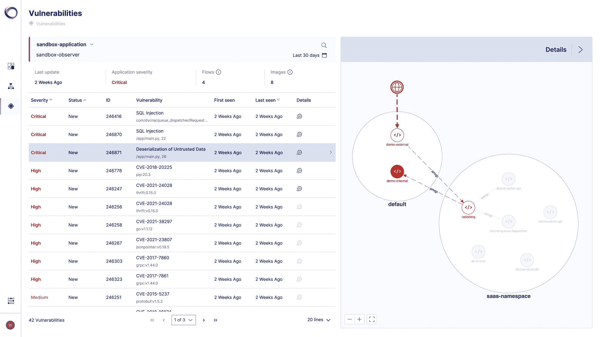

# Oxeye 为软件安全测试带来多层方法

> 原文：<https://thenewstack.io/oxeye-brings-multilayer-approach-to-software-security-testing/>

总部位于以色列的 [Oxeye](https://www.oxeye.io/) 的联合创始人 [Dean Agron](https://www.linkedin.com/in/dean-agron/?originalSubdomain=il) 表示，在云原生环境中，通常的应用程序安全测试工具的字母汤不再适用，该公司正在打造一条不同的道路。

他指的是 SAST(静态应用安全测试)、DAST(动态应用安全测试)、IAST(交互式应用安全测试)和 SCA(软件组合分析)。

“应用程序安全测试的前景，今天是非常分散的，”他说。“你不可能只有一个解决方案。你需要一个静态的和动态的。你可能需要一个交互式的……所以你需要一整套产品。”

Oxeye 将这些功能整合到一个工具中，并回答了开发人员最常问的问题:“我到底在哪一行代码中找到漏洞？”

这家 15 人的初创公司于 2021 年初成立，于 11 月推出了云原生应用安全测试(CNAST)平台，并于最近在西班牙瓦伦西亚的 [KubeCon EU](https://events.linuxfoundation.org/kubecon-cloudnativecon-europe/) 宣布全面上市。

因为现代应用程序是分布式的，它们有许多由不同时间的多个团队构建的组件在不同时间部署。他在 KubeCon EU 的一次采访中解释说，今天的解决方案不是为分布式环境设计的，这导致缺乏可见性和太多噪音。

“缺乏可见性意味着今天的应用工程师和经理应该控制应用的风险，但他们并不真正了解构建模块的全貌。最重要的是，当您在高度[分布式应用程序](https://www.oxeye.io/blog/takeaways-for-cloud-native-application-security-testing)上使用静态扫描器时，结果是您看到许多理论上可能存在的漏洞，但它们在现实生活中并不存在，因为代码没有被执行，或者无法从互联网访问，或者安全措施是在应用程序的不同路径中实现的。由于缺乏可见性，漏洞的噪音最终会造成很多挫折，”该公司首席执行官 Agron 说。

## 多层

Oxeye 作为一个容器被部署为一个守护进程集，使用一个 Kubectl 命令进入您的测试或登台环境。您不必在代码、第三方包或基础设施配置中做任何更改。这个名为 Oxeye Observer 的容器从客户的环境中收集数据。

首席技术官兼联合创始人 [Ron Vider](https://www.linkedin.com/in/ron-vider/) 解释了以下多步流程:

第一步是从基础设施的角度理解应用程序的构建方式:容器、集群和云。

第二步是检测和定位开发人员和第三方包编写的自定义代码中的潜在安全问题。

“观察者将解释环境中每一种不同的微服务，然后使用基于文件系统上的文件的静态方法，检测安全问题，”他解释道。

第三步，因为现代应用程序通常构建在微服务架构上，所以要提供流跟踪并理解微服务之间的通信方式。为此，它使用了云本地计算基金会项目[开放遥测](https://www.cncf.io/projects/opentelemetry/)。

“一个示例[流](https://www.oxeye.io/blog/when-cloud-native-security-testing-fails)可以从暴露于互联网的外部 API 开始，然后经过不同的第三方组件，如 Kafka、Rabbit MQ、SQS、s3 buckets 等消息队列，甚至是使用 HTTP 或 gRPC 的直接连接，”Vider 说。

在第四步中，在前三步的基础上，它将主动有效负载发送到环境，以分析应用程序在运行时的行为，自动创建和执行安全测试，以在报告之前验证漏洞。

他说:“它将所有这些数据发送到我们的 SaaS 平台，该平台负责将这些数据整合在一起，并通过暴露整个应用程序与微服务和基础设施层之间的上下文，根据实际风险对漏洞进行优先排序。”

最后一步是将结果交给最终用户，如果是开发者，可能是 Slack 上的一条消息、GitHub 上的一个问题或吉拉的一张票。它指出了漏洞所在的确切代码行。或者，web 应用程序安全团队有一个专用的仪表板，他们可以在其中了解他们的云原生应用程序中存在哪些漏洞。

因为 Oxeye 分析应用程序，所以它提供了完整的依赖关系树，包括哪些包和服务正在运行，它们是何时开发的，由谁开发的，在什么许可证下开发的，这是一个完整的动态软件材料清单(SBOM)。

## 运行时可见性

当被问及“向左转移”这一陈词滥调以及运行时是否是关注漏洞的时候时，Agron 采取了“到处转移”的立场——安全应该是每个阶段的重点。

“一方面，应该有一个关于安全编码的政策代码，或者供开发人员部署或提交给代码库。另一方面，在分布式环境中寻找漏洞时，如果不了解组件之间关系的上下文，就会迷失方向，因为会有太多的漏洞，”他说。

“所以我们的立场相当激进。我并不是说直接进入生产环境，而是当您拥有生产前环境、试运行环境和运行时环境时，您就可以关注可利用的漏洞，因为您能够找到并指出它们。这就是我们的现状。”

[https://www.youtube.com/embed/Fymxo5A44pw?feature=oembed](https://www.youtube.com/embed/Fymxo5A44pw?feature=oembed)

视频

他们指出竞争对手 [Snyk](https://thenewstack.io/snyk-rethinks-static-application-security-testing-for-developers/) 、 [Checkmarx](https://checkmarx.com/) 和 [Synopsis](https://www.synopsys.com/software-integrity/security-testing.html) 是他们最接近的竞争对手，尽管他们认为它们“基本上是静态的”，而一些像 [StackHawk](https://www.stackhawk.com/) 这样的后起之秀更专注于动态测试。

“我们的颠覆性方法是我们在多个阶段工作，从静态开始，然后在此基础上，我们添加额外的层。我们添加了应用程序流跟踪；我们添加了基础架构分析，这是云原生层；最终，我们提供动态的部分，这提供了比静态或动态更全面的分析，这是我们的核心优势，”Agron 说。

## 发布开源工具

Agron 和 Vider 在 2021 年初成立了这家总部位于特拉维夫的公司。Agron 曾在 KayHut、Imperva 和 Check Point Software 担任安全分析师和软件工程师。Vider 之前是 Orca Security 和以色列情报局的安全研究员。

Oxeye 于 11 月从秘密行动中出现，并宣布了由以色列种子阶段风险投资基金 MoreVC 牵头的 530 万美元的种子轮投资。

今年 1 月，该公司发布了 [Ox4Shell](https://github.com/ox-eye/Ox4Shell) ，这是在 Log4J 漏洞利用之后发布的开源工具，它揭露了隐藏的有效载荷被用来混淆安全保护工具和安全团队。它旨在帮助安全团队更清楚地了解威胁参与者试图实现的目标以及他们可以做些什么来挫败它们。

据说这是该公司今年将发布的几款此类工具中的第一款。

<svg xmlns:xlink="http://www.w3.org/1999/xlink" viewBox="0 0 68 31" version="1.1"><title>Group</title> <desc>Created with Sketch.</desc></svg>