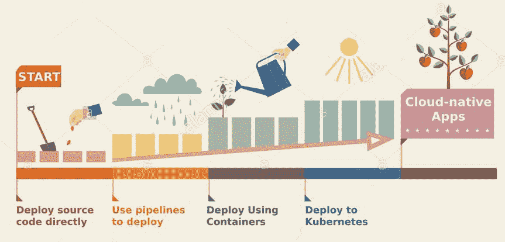

# PaaS 还是 Fail？平台即服务的优势

> 原文：<https://thenewstack.io/paas-or-fail-the-advantages-of-platform-as-a-service/>

[云代工厂](https://www.cloudfoundry.org/)赞助本帖。

软件工程团队行为的一个常见模式可以总结如下:

1.  总是从部署到 Heroku 开始。如果没有，使用 Firebase。
2.  只有当您快速扩展时，才能使用 Docker 进行容器化，并部署到您的基础架构中。
3.  如果你在周日凌晨 3 点担心你的集装箱的困境，只有在那时才是时候换成 Kubernetes 了。

【T2

无论如何，对于任何软件开发团队来说，这都是一条合理的道路。他们尽可能减少每个阶段的工作量，同时在管理基础设施方面爬上成熟度模型。

不同规模的团队都是如此。他们可能是创业规模的，代理开发人员，或者是在大型组织中启动项目的小团队。每个人都想走这条阻力最小的路。

然而，在这个过程的每一个阶段，容易被忽略的是积累的大量技术债务。这转化为整体开发人员体验中的摩擦。显然，这些团队(尤其是小团队)的偏好是继续专注于解决业务问题。任何背离这一点的行为都是在浪费开发人员宝贵的时间和精力。

反对 Kubernetes 的论点是，部署相当复杂，只有当工程团队用尽 Docker 的能力时，这种权衡才是可以接受的。随着工程团队开始意识到 Kubernetes 可以使具有不同规模和部署速度的团队受益，这种观点正在慢慢失去支持。跳到 Kubernetes 优先的部署方法有很多好处。

 这些工程团队是否可以找到一条道路，为不断发展的基础设施需求和趋势提供动态接口？

事实证明，有很多选择。有些是久经考验的——比如 Cloud Foundry 和 OpenShift。有些是最近的，如谷歌 Kf、Waypoint 和应用平台——它们通常对小众受众很有效。所有这些选项都旨在提供一样东西:为开发人员提供简化的体验。另外，他们都支持部署到 Kubernetes。

 [拉姆·艾扬格

Ram 实际上是一名工程师，本质上是一名教育家。在他作为一名开发人员的旅程中，他被推上了技术福音传道者的位置，并且从那以后再也没有回头看！他喜欢帮助世界各地的工程团队发现新的和创造性的工作方式。](https://www.linkedin.com/in/ramanujank/) 

本文将重点讨论 Cloud Foundry 如何能够提供卓越的开发人员体验，同时按照现代标准部署应用程序(阅读 Kubernetes)，并使用完全开源的组件实现所有这些。你可能会问，为什么要云铸造？原因有很多，下面会详细介绍；但主要是因为它是厂商中立的，由一个庞大而活跃的开源社区支持，并且有着全球规模部署的历史。

从历史上看，Cloud Foundry 一直将简化开发人员体验作为其使命的核心。Cloud Foundry 社区已经在虚拟机和容器环境中引导了该项目，而没有影响其简化的开发人员体验。

今天，有了 [CF-for-K8s](http://cf-for-k8s.io) (和 [KubeCF](https://kubecf.io/) )，Cloud Foundry 为任何团队采用 Kubernetes 进行部署提供了一条开始 Kube 惯用道路的简单途径；同时利用简化的 Cloud Foundry 开发人员体验。这样，工程团队就不会被迫在复杂性和部署最佳实践之间做出选择。

让我们从三个不同的维度来研究云铸造的优势:

1.  简单部署
2.  (Sm)所有团队
3.  开放源码

## 承诺

 Cloud Foundry 为开发者部署他们的应用提供了一个简单的接口。这种简单性并不以控制为代价。开发人员可以在需要时使用一些额外的声明性语法对他们的部署进行细微的修改。与 Kubernetes API 的交互被完全混淆，取而代之的是 *cf* PaaS 体验。

服务代理可以创建、绑定和删除服务。单独的子系统可用于 UAA(用户帐户和身份验证)、RBAC(基于角色的访问控制)、监控、日志记录和网络。其中一些是对 Kubernetes 组件的覆盖，而另一些是 Cloud Foundry 的原生组件。云铸造体验中内置了多租户功能。需要多租户 Kubernetes 架构的团队不必构建自己的平台，只需利用开箱即用的功能即可。类似地，这些子系统允许开发人员部署应用程序，而不必通过大量的部署清单。

## 一刀切？

大多数工程团队都有定制需求，并使用自主开发的技术将他们的软件部署到生产环境中。Cloud Foundry 可以在基本 cf 推送体验的下游适应所有这些变化。

对管道、基础设施、打包和发布的更改都可以通过合理的工作量来适应，并且不会影响开发人员的体验。可以选择不同的语言和框架进行开发，而不用担心任何额外的开销。这在很大程度上要归功于 Buildpacks 的使用，Buildpacks 设计用于任何编程语言，并为部署生成不可变的工件。小团队可以保持敏捷，而大(r)团队可以保持合规。

## 自带基础设施

Cloud Foundry 的开源特性使得它对于寻求透明性和治理的团队非常有利。Cloud Foundry 可以部署到公共云、私有云或混合云；并且还可以与许多本地开发环境一起工作。所有这些不同的部署都提供了统一的开发人员体验。CF-for-K8s 的许多子系统来自云计算本地计算基金会项目，这些项目本身是开源的。Istio、Fluentd 和 Envoy 是 CF-for-K8s 内部使用的几个值得注意的开源项目。

知道 CF-for-K8s 项目的主要贡献者来自 VMware、SUSE、IBM 和 SAP 等，具有风险意识的工程团队将从中受益。还有一个活跃的系统集成商生态系统，当需要有经验的承包商时，他们可以帮助部署。

底线是从来没有解决世界上所有部署需求的灵丹妙药。每个工程团队都创建了自己的文化，关于如何配置开发环境、CI/CD 管道、部署节奏等。然而，从观察软件发展的大量经验和从我们的成功案例中学习，我们可以有把握地说，Cloud Foundry 的经验只会为您当前的开发和交付实践增加积极的价值。

AWS、CNCF、VMware、Red Hat 和 SAP 是新体系的赞助商。

通过 Pixabay 的特征图像

<svg xmlns:xlink="http://www.w3.org/1999/xlink" viewBox="0 0 68 31" version="1.1"><title>Group</title> <desc>Created with Sketch.</desc></svg>